# Fist of Ilmater — Play Notes

Sessions 31–178, cleaned from the original Google-Docs export by scripts/generate-foi-seed.ts.
Images live in [images/](images/) and in the app's entity-images storage bucket.

## Session 31 — Awakening at the Guild

Woke up in the guild.

We have been gone for three weeks. We were found in a cave by Verrick and his group. They found other people too (Heartsvale’s group, Gnome Dimmadome, and who else?), but Lau-Wong didn’t make it.

Karn told us that he came from Mirabar and remembers working for Forgeback (the dwarf whom Corym told us about). He thinks he is about 100 years old, but only gained sentience about 50 years ago. He wants to research this further. Wan Shi Tong proposed having someone send a message to someone in Mirabar to, for example, find out if Forgeback’s shop is still up and running.

The clown we encountered in the hospital == **blackspider** - was banished to the Dollmother’s domain of dread 1500 years ago.  
Weaver was part of banishment

Iarno set up the leaders of Helm's Hold to attack the heroes guild by spreading false rumours that we worshipped devils and whatnot.

Fynn and Prosperyne had a little thingy, after she and her group woke up.

Gay marriage is a thing among humankind. Homosexuality is pretty much accepted. Also fey are pretty progressive. Drow don’t like it.

Tillem sent a message to Gundren, to which he then replied that he was (still) held at a castle. Sildar’s body was found about two days travel from Helm’s Hold. He was escorting Iarno. We decided to continue on our quest, after a little rest and downtime. To provide us with money, we threw all our valuable stuff on a pile to be sold.

Fynn received a discount on some paper and ink and decided to take a day or two to decide whether or not to stay with the guild.

## Session 32 — The Funeral of Long Wang

“Long wang is overleden”

| Platebody = 1500 gold Karn - 699 Theothor - 535 1500 - (699 + 535) = 266 266 / 4 = 66.5g for each group member that is not Karn or Theothor. |
| :---- |

Tillem used to be part of some group of merchants(?)

We got stopped by a little girl called Fringila, who admired us and could even produce a little flame. A lot of other people in Triboar were thankful of our help with liberating the town during the Battle of Triboar.

Platebody has been bought

Fynn had a little pow-wow with Gnome Dimmadome.Gnome Dimmedome is the good guy all along,

Gauntlets of baby ogre power have been bought at **a (scam) price**. This was done after a group vote.

We have been in contact with Phatina(?) and her new owner (Carly) she also has a brother called Simon.

Flowers have been bought for the ceremony

Fynn acquired materials for his learning

We were invited for drinks by three old geezers at the Talking Troll. They turned out to be ratfolk and a tavern brawl ensued.

Tillem The Coin Tosser gave his signature to the barkeep. It was likely given to one of the ratfolk that attacked us. That person is still at large.

We were urged to sneakily leave the city after the funeral of Long Wang.

Long Wang had a dope funeral, but there were only two groups there.

Fynn decided to join the party and has confirmed this at the guild. We went on our way on horseback after the funeral.

Just outside Triboar we stumbled upon a merchant from the desert. He mentioned a golem in the citadel Felbar that has a similar ‘aura’ to Karn. A dwarf owned this golem.

Wom slit his own throat. But it wasn’t Wom, it was a ratman. Turns out he was the baddy. Wom is held hostage somewhere. We are to meet them in Longsaddle.

Tillem received a piece of paper with the text: *“Ray Jackson and group. In ten days, meet us in the back of Ostever’s Slaughterhouse in Longsaddle. You know who. If not, your real brother will become the next scandal for the slaughterhouse.”*

## Session 33 — The Road to Gragmaw Castle

We are in Conyberry, a town left in ruins after being attacked by barbarians. It is night. The date is Kythorn 29.

Tillem sent Wom a message asking about his condition and whereabouts  
Wom’s head hurts. He is in the dark and doesn’t know where he is.

Tillem explained that he used to be some sort of merchant delivery boy working for an organization called “Trade Off”, working out of Longsaddle. He eventually found out that, unbeknownst to him, he was actually a smuggler. He found this out when he overheard guards talking about a scalp that went missing (presumably stolen), that Tillem had in his possession. Wom didn’t know anything about this.

Tillem and Fynn wanted to turn around to head to Longsaddle to go save Wom, but Karn, Mort and Theothor voted to save Gundren first. Tillem sent a message to the guild to let them know what happened to Wom. The Guild would send other people if we weren’t back in Triboar within 8 days. (Flamerule 7)

We set up camp and stayed the night.

The following day (Kythorn 30?) we went on to set up camp near Gragmaw Hideout, where, during the night Mort stumbled upon a goblin hanging in a tree to take a shit.

Then on Flamerule 1 we entered the castle, where we fought some foes, including two guards and an Owlbear in the south-east tower. Presumably the South Tower is unguarded according to a conversation between guards we overheard

## Session 34 — The Sun and Moon Keys

We went to the North-East tower, whose door was locked and had two keyholes with symbols of a sun and a moon above it. Mort tried to unlock it, but failed. Theothor let out a roar and attempted to kick the door in, but also failed. Karn identified it to probably be locked by magical means. We gave up and went towards the South-West corner of the castle, where Tillem went into the kitchen disguised as a hobgoblin. His plan failed and we went in, fighting Yegg and his helpers. After defeating them, Yegg dropped a “sun”-key and we also took two hostages. We interrogated one of them and found out that the woman in heels that we saw through the door earlier may have been affiliated with the Black Spider. We also learned that someone names Gruul was the king of the Gragmaw and lastly that Lhupo would have the other key. So we went searching for Lhupo, who we found along with a big ass snake (Grick) and some acolytes. We killed them all and found the key within a sock.  
Met a guy named Grekk, we’ve given him fake names after extracting information from him and sending him on his way:  
Karn = Raxe  
Theothor = Robert  
Tillem = Roger  
Mort = Bonny St. Claire  
Fynn = Fred

Grekk confirmed that the lady in heels is (part of) the Black Spider, a drow priestess to be precise.

“This one's for Theoterrence!”

- Theothor fighting a hobgoblin, loredrop

## Session 35 — Rescue of Gundren Rockseeker

*Flamerule 1*

*Flamerule 1*  
After a short rest, we walked through the castle, when a white dragon flew over us, raining out-of-season snow down upon us. We went to “the room” where we found Gundren, the King, a wolf and the Drow priestess called **Vyerith**. She wanted to find out the location of the **Wave Echo Cave** for the Black Spider, which she succeeded in. She also killed a Rockseeker brother, we don’t know which one.

There was also someone else on their way to Phandalin called **Oliver Goodhil**l. He also knows about the location of the mines and is searching for the Silver City (where water could cure every disease). The Black Spider knows of his existence, but doesn’t know his name.

Gundren’s Lore Drop:  
His brothers and him, all part of **Rockseeker Industries**, fixed mines and were looking for a lost mine supposedly containing the **Forge of Spells** in the **Wave Echo Cave**. Three months ago they found a map in a library about the Forge, but it was written in code. Oliver Goodhill deciphered the code and they decided to meet up with each other in Phandelin.  
There is someone in Phandelin called **Sister Garrell** who is able to heal. Gundren wants to go there to recover. We decided to accompany him.

King Grol’s Interrogation:  
Karn promised Grol protection from the Black Spider and us. He told us the story of how the Gragmaw were nomads before and were searching for a place to settle, until they found the castle.

Ultimately we let Gundren decide the fate of Grol. Gundren came up with the idea of having the goblins become the new militia of Phandelin. Karn and Theothor opposed this idea, while Fynn supported it. The Guild agreed to the plan. Grol offered up his own life and let **Targor Bloodsword** take his place. We decided to take Gundren and Targor to Phandelin on horseback and let the other goblins walk.

Flamerule 2  
On the way we crossed paths with a centaur. Home village got taken over by wereboars who had religious ground where the centaur and his people built their homes. He offered us a shield buried in the hill. We said we’d give him an answer in a week. He joined us as we arrived in Phandelin that very evening. Centaur name = Peter.

## Session 36 — Visions in Phandalin

*Flamerule 2*

Flamerule 2  
Fynn spoke with Targor about possibly proving to the world that goblins aren’t as bad as they seem and making places a little bit better by helping people.  
We arrived in Phandalin in the evening where we were met by Harbin Wester. He gave us 5PP for something, told us he had a dog named Pussy, asked us to bring a letter about orcs to Lord Protector Dorathra Shendrel in Triboar for which he paid us another 5PP, accepted our plan of bringing the goblins to Phandelin to serve as militia.  
Tillem sent a message to Tharden (one of the brothers of Gundren), but no response. Possibly dead. Will send a message to the other brother next morning.  
Gundren gave us 125GP as thanks for saving him, went to the Shrine of Luck, dedicated to the goddess Tymora.  
Peter/Zenth gave Mort flowers. Was weird.  
Sister Garaele gave us three healing potions and promised us three more if we completed her earlier request to retrieve a spellbook in Conyberry.  
We went to the inn where we met up with Navi, who gave us a Potion of Advantage as a thanks for saving them. Ate and slept in the inn for free that night.  
During the night Tillem and Karn had an out-of-body experience where they saw a snowy mountain where Reidoth shattered into frozen pieces along with dozens of frozen orcs. A dragon came from the ice and said: “Too soon. You will meet me in time”. They went on to pray to Tymora.

Flamerule 3  
Sent message to Nundro, sounded gagged, but alive,  
Sent a message to Oliver, replied with a resounding “howdy”, sounded nice and said he was being protected by the Curator. “Oliver, you are in danger. The Black Spider is coming to get you. Go to Phandalin, Gundren is there. Trust nobody. Except us. By-Bye”

Karn is a bit of (a) dick. It’s what his character would do.

Flamerule 3  
Karn and Fynn have a conversation about sympathy and morals. Tillem and Karn also told the rest of the group about their shared vision.

Flamerule 5  
We arrived in Triboar and delivered the letter to Lord Protector Shendrel. It said something about Harbin Wester demanding better patrols of the area between Triboar and Phandalin because of an orc infestation. She said it was his own fault.

Karn was hitting on Theothor on our way to the guild.  
We’re met at the guild by a cat girl called Minoushka Mamia, she likes lasagne. She’s part of the **Elite Four** and she’s filling in for Wan Shi Tong as he’s on family business.  
**Bradley** is also part of the elite four. They met when Minoushka was working as a waitress in Baldur’s Gate and Bradley fell through the roof of the tavern she worked at as he was fighting a dragon/tempest(?). Before that, Minoushka was captured by slave traders, but she (accidentally) destroyed the ship she was on as she found out she had magical powers. She spent a long time adrift on the ocean before coming to Baldur’s Gate.

The Guild has a system where the first 10K GP you make is tax free, after that you pay contribution.

## Session 37 — Giants on the Longsaddle Road

*Flamerule 6*

Flamerule 5 Still  
Weaver will be back ~Flamerule 17, is on business in the north, Wan Shi Tong is on family business. We went back to Minoushka to check if she’s not actually one of the Trade Off thugs in disguise. Fynn found out she’s the real deal., or well.. she’s actually a cat person.

Flamerule 6  
We had a nice breakfast and took some bread for the road. Got on our horses and traveled towards Longsaddle. Came across very large footprints on the road that eventually led into the woods. There we found a dead Hill Giant, and Theothor found a crushed human body underneath its massive body. He also found smite burns on its body.

We followed the tracks and came across another Paladin named **Sir Jordath Tavilson**. He was wearing mithril splint armor. He came from West Sword Coast, Knight of Tia(?), from Mirabar, believer in Swift Justice. He slayed the giant and the crushed human was his squier. We agreed to help him kill the other two giants. In return he would scout Longsaddle for us. Unfortunately he died in the battle. Left Theothor a sweet flail though. Also left Fynn a Potion of not-having-to-sleep, which he used to learn three new spells.

Flamerule 7  
We rode past a cart that only Tillem noticed to be disappearing right as it passed us. Quite strange. Once in Longsaddle we stabled our horses and Tillem was approached by a person called **Boldo Swigbottle**. He told him to meet in the **Gambling Golem**.

We also found a wanted poster for Worvil Forkbeard a.k.a. Weevil. Wanted for 5000GP by the Marchion of Mirabar.

We then went on to the Gambling Golem, where Tillem went in, disguised, on his own. The rest of us stayed outside, hanging out in an alleyway. We were supposed to come in later, pretending not to know Tillem. Inside, Tillem was approached by a dwarf named **Brottor Ironbeard**, the owner of the establishment. The green-eyed gnome named Boldo then joined Tillem at a table and was just about to make him a proposal.

## Session 37.5 — The Circle of Thunder

We decided to help Peter with his wereboar infestation.

About the wereboars:  
Wereboars were around for a while, but docile, until they suddenly attacked the hill. Master told them he could summon a god on that specific hill. One of the wereboar bosses is called **Narux**(?). Wereboars can be of all races.

Circle of stones on top of the hill, probably meaning something. 60ft wide forest clearing in the Starmetal Hills, giant pine tree ravaged by fire. Dolls of twigs tied to the base. Peter: “Hit by lightning a couple months ago, don’t know what the dolls are about”. The dolls seemed to have a beating heart, smell like death, blood seeping out. Has something bad happened to the wereboars? What’s with the dolls? We don’t know.

**Kortak the Thunderboar** is being summoned. We encountered a group of boarfolk under the leadership of **Yargath**.

## Session 38 — Kriv's Ultimatum

*Flamerule 8*

**Kriv** (leader of Trade Off) wants to have Tillem killed, because he ran away from the company (literally called out “off with his head”). **Boldo**’s proposition is: do some work with your group in exchange for your life and Wom’s.

Tillem decided to try to capture Boldo just to give us some time and leverage, but he got away. Tillem later sent a message to Kriv, whom told Tillem to meet at the same place, same time. Then he sent a message to Boldo who seemingly died “on the phone”.

Flamerule 8  
We spent the night in the woods. The next noon went to the slaughterhouse, where we saw a very banged up Wom, missing a horn and two thumbs. We also met Kriv, who gave us the same offer as Boldo did. We accepted.

We then messaged Weaver for advice. He told us to stop Trade Off, kill Kriv, pack Lightning Resistance, don’t take prisoners and to be very afraid of the bounty hunters Jackie and Athos.

We’re currently somewhere in the woods contemplating what to do.

## Session 39 — The Leonin's Blessing

The day is still Flamerule 8. During the previous session we met Kriv around noon. We started thinking of ideas to gain Lightning Resistance, as advised by Weaver. We decided to go to the wereboars in hopes of help.

On our way there, we came across **Farme Grip** (top hat-  curly mustache - curly eyebrows), who turned out to work for Kriv. Was killed by way of flying flower pot. He said he sold potions. We looted six potions of him, four of which were “identified” by Fynn:

- **Blue**: Truth Serum  
- **Red**: Potion of Healing  
- **Green**: stinky potion that hurt everyone  
- **Purple**: instantly evaporated  
- **Yellow**: *t.b.d.*  
- **Orange**: *t.b.d.*

Our horses got nicked by **ratfolk**, who all turned out to wear Iron Manes **Runes**. There was also a Leonin from the **Iron Manes**, the rival tribe of the **Grey Manes** of which Theother is/was a member. This Leonin gave Theothor lightning resistance and Theothor gave it to the rest of us. Was to last approx. six hours. The Leonin then disappeared, telling Theothor “it wasn’t the time for meeting him yet”.

We then had some minor trouble waking up our horses, after Tillem lured them back to us.

Lastly we traveled back to Longsaddle, where Tillem went cart-shopping. We hatched the plan to let Mort create a distraction at the Trade Off headquarters, while the rest of us wait in a cart outside the Slaughterhouse to save Wom.

## Session 40 — Fire at the Trade Off

*Flamerule 8*

Still Flamerule 8.

Mort had some minor trouble getting to his target building unnoticed, but eventually succeeded after scaring a kid and barely evading its mother. Near the Trade-Off HQ, he encountered a vaguely humanoid slime creature, which he evaded. He then entered the HQ and set it ablaze, only to, on the way out, stumble upon **Penelope Harpell.** He told her that Kriv wanted the Harpell’s dead, after which Penelope made the HQ go boom.

Also somewhere Mort stumbled upon a talking skull, whom called itself **Xzar the Demi-lich**. Might be relevant later, idk.

We then stormed the slaughterhouse, killed a fake Kriv, killed a bunch of rogues, found and entered through a trap door underneath a box and wound up in a dungeon. There we encountered an illusionary Iron Golem, the first of the two bounty hunters (**Jackie**), whom let us past him without hassle, strangely. Only to have Tillem shot by the other bounty hunter (**Athos**) a little bit later on. Karn is also carrying an **amulet** of sorts and Tillem found a **deck of illusions**

## Session 41 — Beyond the Blue Barrier

*Flamerule 8*

Still Flamerule 8

The poisonous gas has started to spread as we delve further into the dungeon. We defeated both Jackie and Athos, or rather, hurt them to the point of them giving up as disappearing into nothingness as we got stuck before a blue barrier of energy.

Tillem found out that the room with numbers to the north is connected to the barrier.

Fynn teleported past the barrier, where he, in search of a way to disable the barrier, pushed a panic button that might’ve unleashed something bad. Also found Kriv and Wom. Wom was in some sort of trance, being held upright on top of a mountain of treasure. Kriv said something about soon being part of his ranks.

After receiving a hat from Athos, Mort was talking about some number we found on some box. He, together with Tillem and Theothor put the number sequence into the keypad. The gas that was filling up the dungeon dissipated instantly. The barrier disappeared as well.

We all heard and saw some slimy creature creep up on us.

## Session 42 — One Beating Heart

*Flamerule 8*

Still Flamerule 8

We went after Kriv and his companions, trying to save Wom. Tillem got teleported next to Wom and they both got surrounded by a barrier and got told “the barrier will only be lifted when one heart inside it is beating”.

It turned out Wom was possessed by an Ooze. We defeated everyone and Wom fell unconscious. We even got helped by Athos.

We all met Xzar the Demi-lich

## Session 43 — Athos Settles the Score

*Flamerule 9*

*Still fucking* **Flamerule 8**

Athos used a non-lethal bullet on Wom, but a *very* lethal bullet on Kriv, just in case. He then left.

Wom was found to be still alive, but lacking his magic source. Karn found his crystal, but when touched, it emitted a sense of dread. Tillem’s drum started glowing after touching the crystal. We briefly contemplated going to the water filled tunnel, but decided to go back where we came from.

Ran into Penelope Harpel. Penelope: Don’t mention the Black Spider for about 3 days to anyone outside the Guild. Want to talk to the Harpel’s and the Guild. Penelope would pay for a night’s rest at the Gilded Horseshoe.

Illusion Dome: Upheld by Harpel’s and Trade Off. Somehow connected to Kriv. Used to more easily smuggle. For Harpel’s magical defence system. A larger dome around the smaller dome used to monitor Trade Off.

Penelope = married to **Dowel Harpel**. **Catti-Brie** = ???  
Penelope is well liked in Longsaddle.

**Flamerule 9**  
Next day, **Monteron** was waiting for us outside, looking for his “friend” Xzar. Supposedly Monteron and Mort know each other, though Mort denies this. Even calls him Pascal. According to Monteron, Mort works for **The Shadow Thieves** and had an assignment to rescue Xzar. Mort says he doesn’t remember anything about this organization.

We received bottles of milk from **Melon** from the stable.

Went back to fulfill our promise to the Wereboars at the Circle of Thunder. We were greeted by **Flens** and **Naruks**, their leaders. We took them with us on horses and carriage.

**Flamerule 10**  
We arrive back in Triboar. We were told by Minoushka that we might be able to start our own branch of the guild and have the Wereboars as our adventurers. Also a healer would arrive for Wom later.

## Session 44 — Tillem's Farewell

*Flamerule 11*

**Flamerule 11**  
**Spring Mustachio** (male, blue skin, muscular, plate armor, barely a mustache) woke us up, informing us that his cleric - **Zorgarp** (male Loxodon, wearing robes) - was preparing a healing ritual. Went into a dark room within the Guild (healing room). Zorgarp took some blood from Tillem. Wom’s crystal corrupted by the domain of dread-ish energy. **Briar (female)** lit the room after the ritual completed.  
Zorgarp: *“The boy will live, but only if he’s kept in a safe environment. [His corruption] needs to be countered by deep love”*.  
Wom’s magic could possibly regain his magic powers.

After the ritual, Tillem told us he will be leaving the guild (for now) to care for Wom back home in the **High Forest**. Tillem stayed with Wom while the rest went shopping for magic items where we bought a Spellbook, an Orb of Time and Plate Armor for Karn. During that time, Wom woke up.

Minoushka told us that Wan Shi Tong is stuck in Limbo, because his fortress is under attack by fiends led by a **red tiefling**. Something about the **Reincarnated Mephistopheles**? Also her endless mug of coffee failed on her thrice. AND a ship of supplies went missing at Waterdeep. She told this to Mort, while Fynn was peeing (yellow mist filled the room, Fynn only pees once a month).  
Also Minoushka’s group is currently at Olostin’s Hold investigating something about horseback riding ghosts or something?

Weaver returned from his meeting with the Lord’s Alliance. We are allowed to set up more bases across Northern Faerun. Bad news: a rift opened near **Icewind Dale**, devil’s came out. Also in the Feywild.  
Weaver also mentioned we need more heroes, he gave us an empty Signet Ring. He also asked us to get in touch with Gundren, because the Forge of Spells could be of use to the Guild.

Tillem & Wom went their ways. We all cried like little girls.

## Session 45 — Orcs on the Conyberry Road

*Flamerule 14*

**Flamerule 14**  
Discussed where we want to set up our new base. Either we go south or we check out the Kingdom of Many Arrows

Bought some horses at “The Cart and Coin”.

Found Ed in the bushes along the path a few hours east of Triboar.

Conyberry: Set up camp, got attacked by Orcs. Captured one alive. Came from the Kingdom of Many Arrows, but fled for devils.  
Ice Spire Hold, Orcs found a place there, but got chased away by a white dragon (probably Cryovain).

Orc, when interrogated, freed himself and poofed away in a cloud of smoke. We decided to ride through the night, in order to not get jumped on by a large group of orcs and ogres.

**Flamerule 16**  
Evening: Arrived in Phandelin. Ran into Gundren, who mentioned Sister Garell, who might be able to send a message through arcane means.

## Session 46 — The Tower of Storms

*Flamerule 17*

**Flamerule 17**  
We stayed the night in Phandalin (Stonehill Inn, run by Toblen + Navi). Mort barfed in the room. In the morning we passed by **Colleen Odderleaf** and her Xbox-playing son **Karp** (who turned out to be a centaur/halfling combo) to buy some horse feed.

On our way from Phandalin to the Tower of Storms we came across two Waterdeep Guards looking for a red tiefling names **Amnem Hope** (possible relation to Prosperine?), who supposedly raided a vault about two weeks ago. Told them we’d keep an eye open.

Arrived @ lighthouse, storm brewing above it. Low tide. A green light came from the tower and some sort of heartbeat. We spoke to a talking crab named **Martijn**, whose master **Miraal** (the previous owner of the lighthouse) was haunting a rock outside. Got killed by **Moesko**, who took over the Tower of Storms. Promised Miraal to bring back his conch.

On our way up to the lighthouse fought some Harpees, after which we found Moesko in the lighthouse. Defeated him, he turned into a crab cake and we cleared the rest of the building. On our way out it turned out he wasn’t dead after all.

It was all a ruse.

Lightning Bolt on the Doors, Altar that catches lightning. Markings on the walls of the shrine.

## Session 47 — The Heart of the Storm

Repeated flavor text of the tower: Partly open to elements. Floating still beating heart emanates the light.

Karn ran up the stairs to check out the beating heart in the tower. Karn stabbed it, while Theothor and Mort chased after Moesko. Moesko suddenly collapsed and fell off the island. After which, the storm subsided and everything went back to normal.

We took a one hour short rest.

Saw a shark in the water on our way down to Miraal. Gave the conch back to him, he went to heaven but left the conch, which no longer had any magical powers. We wanted to give it to Martijn, but he didn’t want it. He did get some treasure for us from one of the ships though. There were five ships: The Starcrossed Lover, The Sea Urchin, The Vain Glory, The Golden Gull and The Orca. We chose the Sea Urchin and received a nine inch tall blue quartz statuette of a mermaid.

We went into the waters ourselves and swam towards the shipwrecks. Retrieved a Wand and a Blue Book named “Captain’s Spells”, containing some spells. We fought Daggermaw and two sharks and retrieved 120EP, 6 pearls (100GP ea), a cloak of Many Fashions and a +1 Warhammer.

## Session 48 — Secrets of the Dragon Barrow

We spent the night at the Tower of Storms. Karn decided to “sleep” at the horses, while Mort, Ed, (Theothor) and Fynn spent the night inside of the lighthouse. Ed attempted to make a fire, but it blew up in his face. As Ed watched the sunset, Mort and Fynn fell asleep, but Fynn woke up from Ed’s loud snoring and went to sleep downstairs.

The next morning, Ed had died in his sleep and after some inspection, we found out Ed’s leg was purple and had probably been in the process of dying for a while. We gave Ed a proper burial at sea.

We then rode on to **Dragon Barrow**, where Mirin went in to scout. Mirin came across a halfling fellow, who later turned out to be **Oliver Goodhill**. He got into a fight with some Wil’o’Wisps inside the cave near the Barrow, and we helped him out.  
  
Mort found a skeletal horse and he also got stuck. Found two sarcophagi and we set off one of the traps, filling the room with acidic dust. Explored further and found the room where **Lady Tannemin Alegandor the Dragon Slayer** was buried together with her squier. She defeated **Azdraka**, as one could tell by the sword still stuck in the dragon’s head.

As Mort took all of Lady Alegandor’s stuff, her spirit came to us and she brought the skeleton of Asdrake to life.

## Session 49 — The Dragon Slayer's Rest

*Flamerule 18*

**Flamerule 18**  
We killed Azdraka and Lady Alegondar. However, Lady Alegondar was reanimated. The Sword Coast would, according to a prophecy, be torn apart by a white dragon, but Azdraka was black. They thought that maybe Azdraka could change colors (but we think it's probably Cryovein). Her spirit moved on.

We went back up to the surface to recuperate. We learned that Oliver is from far south, the Calim Desert to be precise. He still has a mother and a sister there, called Ledana and Julia respectively. He travels the world to uncover secrets of the world. He showed Fynn an ice cube that never melts that he found in the desert. It came from genies that froze the desert once.  
We also learned that Fynn grew up with foster parents and a dozen siblings in Silverymoon, where he, as a child, killed his foster parents. He doesn’t remember exactly how it happened.

Karn received a sending from Weaver, who instructed us to take care of the orc bandids ASAP. Everyone except Fynn and Karn went back down into the Dragon Burrow to quickly explore the last bit that we left undiscovered.

We found the burial place of the adventuring party that was with Lady Alegondar (one of them is called Yeti). Found some loot.

As the boys downstairs opened the sarcophagus, Fynn and Karn were suddenly woken up from their studying / tinkering by an enormous explosion.

## Session 50 — The Thing in the Veins

*Flamerule 18*

**Flamerule 18**  
After the explosion, part of the catacombs collapsed. Theothor, Mort and Oliver were trapped under the rubble. They found light, they found a red room with veins running through its walls and ceiling. There was a wet ball kind of thing dangling from the ceiling, which contracted when poked with a stick. Also made a “boing” kind of sound.

Karn and Fynn found veins as well. Fynn cast Identify and found out it’s a creature that has been polymorphed into what it is now. It gave a sense of dread and notice our presence, because an eye suddenly appeared, which Karn poked with a spear. That created a hole, through which we found the rest. Pulled them through the hole.

**Flamerule 19**  
Arrived in Conyberry, where we heard a fight in the Town Hall. Five Orcs – of which one was twice as large as the others – were fighting a large ape. Turned out to be Prosperine. Teamed up with her and defeated the Orcs. She told us her group had some time off. She wasn’t supposed to be here. Told us something about the Shrine of Savras.

Also Weaver may have been angry with us, according to Prosperine.

## Session 51 — Storming the Shrine of Savras

**Flamerule 19 - Night**  
We have arrived at the Orc Camp at the Shrine of Savras. We spent a lot of time making plans. We eventually settled on Fynn heading west of the camp to create a large fire to draw the Orcs out of the camp. Fynn headed out, started a fire and created the sound of a dragon’s roar, which not only led the orcs to hide in the shrine, but also caused the rest of the group to go to Fynn, because they thought he was in trouble.

We then decided to have Theothor and Prosperine stage a fight outside of the camp. For a second it seemed to have lured some orcs out of the camp, but they didn't buy into the ruse and went back inside, after which we decided to just storm the place.

Against all odds, we emerged victorious.

“Should’ve just come home”, said Mort’s adversary before he died.

## Session 52 — Agatha's Answer

**Still Flamerule 19 - Late Night**  
This Shrine for Savras, God of Divination and Fate, Conyberry, was attacked by barbarians and the people of the shrine foresaw that. Conyberry people came to the Shrine. Orcs killed everyone in the Shrine. All the Gold and Riches are yet to be found.

Priest Seer’s Sanctuary (East) where the Priest Seers lived, cooked, slept.  
Visitors’ Sanctuary (West) Some beds and chairs. Guestroom.  
	Thick hairs scattered around, throughout the entire room.

Theothor had a vision: floated over dozens of frozen Orc Corpses. Arrives at Ice Spire Hold white dragon asleep on Fortress’ Rooftop. Wakes up, roars, glows white. Changes into the shape of an elderly man. Awakes too fast to recognize his face. Also found some stuffs underneath the altar.

Tillem: “Fynn, greetings nice to hear from you. Dream, was at night. Karn and I both had it instead of regular sleep. Don’t know what caused it. Glad you called, did you get my gifts?”

Told Tillem we hadn’t gotten around to opening the gifts yet. We opened them. Pretty awesome stuff.

Found out the bell in the Shrine was actually a golden bell painted with copper paints (because Theothor threw a javelin at it and it made a weird sound). Dropped it and took it with us.

Prosperin pointed out that we should have a talk about what we can do, because we seemed pretty unhinged to her. We did that for a little bit, which escalated into a deep discussion about morality.

We were reminded by God to trade a comb for information near Conyberry. Decided to camp in Conyberry that night.

**Flamerule 20 - Morning**  
Oliver caught a boar. Cooked it for us. Tasted really good. Oliver learned how to cook at the boy scouts. Road to Agatha’s Lair is colder than in Conyberry. Dome made from branches with a doorway. Found Agatha.

We got to ask one question to Agatha:  
“What is all the info you know about the spellbook that belonged to Bowgentle?”  
Don't know current location. Was in the ownership. She lived in Gragmaw Castle, where she  
traded the spellbook with necromancer “**Tsernoth**” from **Iriaebor** some 100+ years ago. Harpers are also looking for it.

Huiswerk: Kijk naar je eigen skills en maak wat notities over wat je wil bespreken.

## Session 53 — The Necromancer of Old Owl Well

Decided to head to Old Owl Well, because it’s on the way and one of the last side quests we still have laying around.  
Ruins of old watch tower. Old place, courtyard, colorful tent in the middle  
Old owl well was built thousands of years ago by a vanished empire. In the courtyard is an old well, in the hills.  
Inside tent: Black tattoo, stout person, hastily putting on shoes, red cloak. Name = **Hammon Cost.** Human(oid). Grabbed a wand. Deathly odor from tower, after wand also in the tent.  
Tattoo = necromantic symbol. Vibe = threatening  
Undead are his guards of sorts. Comes from the land of Thay, where his entire life was full of magic. Red Wizards of Thay. Red Magic Cult. Thay = Nation of Death, ruled by undead activity. Old Owl Well might be the source of ancient **netherese magic**. The Neth were ancient humans of **Netheril**. Large part of Faerun is cultural/ethnic descendent of Netherese.

Karn and Mort started a ruse, which led to them grappling Hammon, subduing him and gagging him. We started a vote on what to do with him: kill him (Mort’s idea), cut out his tongue to make sure he can’t cast spells anymore (Karn) or take him to Phandalin unconscious (Oliver). Ultimately it was a tie to Oliver and Mort’s idea and Karn, as the Decisionist, decided to kill him, which Mort did swiftly.

Then undead swarmed us from out of the ground, after a large circular symbol appeared around the body of Hammon.

Red lightning storm took away Hammon’s body after we defeated all zombies. Found some loot, inspected the well, but didn’t find anything.

After everything, we offered Oliver the guild ring. He wanted to think about it, he hadn’t considered it yet. We closed off the session with a warm embrace between Oliver and Karn in the tower at the Old Owl Well.

## Session 54 — Into Wave Echo Cave

*Flamerule 20*

**Flamerule 20**  
Candlekeep maybe read about Netherese magic? Briefly debated helping an old friend with their lost stuff in the Gragmaw Hideout, but decided against it, heading straight to Phandalin instead.

Oliver is searching for a city. A magic city. An entire Ergentiel. Silver City. Old lost city made by divine creatures/gods. Supposed to have strong magic. Oliver owns a small silver skull that he is certain is from there. Karn checked it out, and confirmed there is a strong magical presence around it. Oliver is helping Gundren find the Forge of Spells and Gundren is in turn helping Oliver find the Silver City, in a way.

Evening  
There is a circus tent in Phandalin. Man in red & green approaches us = humble servant 3. Aroon Family Pepper Challenge. Eat peppers, win magical potions. Fynn and Oliver agreed to compete. Spicy Brothers = Kasem and Vi Aroon = bosses. Guy leaves, identical person enters the room inside the tent with Gundren. We did the challenge, together with Gundren, and Oliver (even though he was very nervous) won, together with Karn.  
Stonehill Inn. Called us “Fist” and made the entire tent and everything disappear. Chairs gone, tent gone, employees gone, we’re in the town square. Crowd is still here with us. Met up with Navi. Doblen has modernised Stonehill Inn.

Oliver was in the boy scouts and joined a group of people who searched stuff in the desert. He wants to find everything in the world.

**Flamerule 21**  
Karn went to Daran to speak about the undead. High Netherese was above the continent, only Low Netherese lived around here.  
The rest of us went to speak with Sister Garell. Harpers were searching for her. She’ll put in a good word with the Harpers.

Went to Mines of Phandelver. Dwarvers made pact around Wave Echo Cave. 500 years ago. Dwarves and gnomes. Great forge = Forge of spells. Magic items could be crafted. Phandalin prospered. Disaster -\> Orcs destroyed everything. Evil mercenary wizards & orcs attacked wave echo cave. Battle in defense destroyed the cave mostly. Wace Echo Cave was lost. Centuries rumors spread, no-one ever located the mines. Recently, Rockseeker Brothers & Oliver uncovered an entrance to the cave.  
Narrow tunnel –\> Large cavern, three stalagmites. West three bedrolls, supplies, etc.  
Amid supplies, the body of the dwarf miner dead for weeks.

Found Tharden inside the entrance of the cave, dead. Two brothers in the mine, both in their tomb. Three brothers, one made a detour. Nundro was taken deeper. A slow and painful death, paralyzed by a spider, the blackest of all.

Went down into the cave, found Nundro’s boots. Fought a Cave Fisher swiftly.

## Session 55 — The Flameskull's Vigil

*Flamerule 21*

**Flamerule 21**  
The group decided to give Nundro’s boots to Theothor for the moment, as he could make good use of them. A split path led to a door on the right and a barrier that resembled the ones in the Trade Off hideout on the left. Oliver noticed traps in front of the barrier, so the group decided to throw stuff at it instead. The traps didn’t go off; Mort caught a fish and threw it against the barrier, whilst Theothor rolled a boulder through the barrier. We deducted that living creatures were unable to pass through.

The noise the boulder made alerted some creatures behind the door. We decided to blitzkrieg the room, but weren’t as successful as we had hoped. We managed to kill two guards, but a priestess managed to teleport away. We tried to follow her through a door at the back of the room, but were quickly halted when Theothor stepped on a trapped floor tile, triggering a strange explosion. Purple lightning surrounded Theothor, after which a huge smoke cloud erupted. The explosion was, however, silent. Mort decided that it would be a good idea to stand next to Theothor, triggering a second explosion. Having decided that this was not enough, Mort walked forward once more, causing a third explosion to trigger. Oliver found out that certain floor tiles were trapped, and after we healed our wounds he guided us past the remaining trap tile.

In the next room, we found a huge furnace that, according to Gundren, was probably used by the previous occupants of the Wave Echo Cave to melt down their mined ore to refine ingots of silver, gold, and platinum. We were greeted by a floating skull with a green, flaming aura, who told us that his job was to protect this cavern from intruders. He seemed to think that the orc attack from hundreds of years ago was still ongoing. After we told him that we were looking for the Forge of Spells, he decided that we too were intruders. He raised eight dwarves from the dead to attack us, but we defeated them without too much trouble. The skull itself wielded strong magic, but he too fell to a mighty smite. We found a dried up channel in this room and Karn sent Gorgel to investigate where the channel would lead. Gorgel found a huge room filled with water, but nothing of interest.

We went the other way, and soon came to a next room with a chasm in the middle. At the bottom, we could see bugbears mining, while at the other end of the room, a drow was giving them commands. We decided that jumping down to attack them was a bit too high, so we tried to converse with them to ask about the Forge of Spells. This turned out to be a bad idea; these guys knew about us and attacked us after having extracted some information about our goals. One of the bugbears chucked a keg filled with gunpowder at us, causing the rocky outing we were standing on to slide down to their level. We easily fought off the bugbears, but the drow was another matter. He seemed to be able to puppeteer our bodies, causing us to attack each other. Theothor smashed Karn into the ground, causing Gorgel to retaliate. In the end, the Drow was taken care of, but not before we found out that he wasn’t actually an elf. He was a doppelganger! We found a pair of magical gloves underneath some rubble and noticed that the corridors at the end of this room were also blocked off by magical barriers, so we sat down to strategize.

## Session 56 — The Black Spider Unmasked

*Flamerule 21*

**Flamerule 21**  
abj and conj  
barriers made by a powerful magic user (9th lvl spell). Magic in the floor. Not a spell I would’ve learned, but have heard of Glyph of Warding. Spell used to create a trap for later. Glyphs stay until they are dispelled or triggered.  
Glyphs have been used by Jarno Albrek before in the Red Brand Hideout.  
6 cracked marble pillar 9ft statue dwarf on throe, stone warhammer, large emeralds in eyes, dust and debri wiped, bedrolls and packs. Wooden table. Two bugbears, dark elf in black, black staff with carved spider at the top

Nazznar, the Black Spider.  
Sword Spider turned into ashes as it died, leaving no bones or anything.  
Nazzar was pretty easily defeated, turned into rats when he died. The Iarno revealed himself and we fought him

Iarno tattoo on his body: containing among other things the school of abjuration. Same kind of tattoo as Hammon Cost, but different school of magic.

## Session 57 — The Archdevil's Disguise

*Flamerule 21*

**Flamerule 21**  
We decapitated Iarno for a second time. His head reattached again and he tried to retread. Then suddenly Iarno pleaded with someone, panicking, saying “Please, I’ll do anything. I can defeat them”. Then he dissolved into ashes. “Don’t think you can deal with them” a voice said. His ashes were pulled into the bonfire, dousing the bonfire. A circle with pentagram appeared on the floor, after which the bonfire relighted. Then the clown person appeared in the room. Something about “needing things for the upcoming snow”. We couldn’t move. “Theothor: haven’t quite made the connection yet”.  
“I am the black spider, but that’s just a disguise. Not **Mephistopheles**. In the decades to come burn down the multiverse”. He took a single sheet of paper from a table, which then disappeared. We presumably helped him escape the domain of dread. Then he left us. He called us “useful vessels”.

Found a bottle of wine with a note: Parting gift. Then found something more disturbing: the head of Wan Shi Tong. **Mephistopheles is an archdevil and the lord of Cania, the eighth layer of the Nine Hells of Baator.**

Karn, as the only person, saw the bonfire in the room be relit. None of us saw that. Again, as the only person, he saw the pillars turn into the stasis tubes we saw in the hospital of dread. Bodies floating in a strange red liquid. He sees the reflection of Corym in the glass of the stasis tube. As he looks around, sees himself in the hospital of dread. Mephistopheles is also there, says: “You are the vessels I so desperately seek” (flashback to earlier encounter). Back to reality. *Oops there goes gravity.* 20 minutes passed while Karn stood there having the vision.

Nazznar has been in the mines for about a day or two since we rescued Gundren. While mining, ran into some problems (spitting spider, floating skull, zombies, skeletons and something that resembled a **beholder**, supposedly guarding a location that guarded the forge of spells). Oliver knows a story/rumor about a *friendly* beholder called **Large Luigi** that runs a space bar. Oliver said it was probably just a children’s story.

We made the plan to search for Gundren, rest, send word to the guild about Wan Shi Tong and then gather information about beholders and about Mephistopheles or at least see from there. Before we left, Mort gathered two gems from the dwarf statue’s eyes.

While backtracking, we found Nundro in a little side room. Apparently Gundren really likes nachos. Nundro recognized Karn to be built by Forgeback. “Were you the one that left Mirabar on his own”. Their father was a friend of Forgeback, looking for a way to keep doing what he was doing. Forgeback got lost in research. Karn gurgled and spit some oil on the ground.

Forgeback ran a shop, made and sold magical items. Karn was also taught about magical items. He left Mirabar after Master Forgeback died and things got hostile. Karn thought that maybe the other Forgeback family members thought that he had something to do with the Master’s death. He left Mirabar without regret and thinks of his arrival at Triboar as the actual start of his life. He wasn’t always as sentient and smart as he is now. It was a gradual process. Never knew about people being used for their souls or anything. Him regurgitating oil on the floor earlier was a sign of disrespect towards dwarfs. He didn’t want to elaborate on his disposition against dwarves right now.

We went to sleep for a long rest in the small room where we found Nundro.

## Session 58 — A Party Divided

*Flamerule 22*

**Flamerule 22**  
Nundro has been here for weeks. There has been a discussion between Fynn and the rest of the group as to whether to continue down the mine or head out to investigate both Beholders and Mephistopheles.

We sent a message to Tillem to send a message to Weaver to tell him about Wan Shi Tong, Mephistopheles and ask about beholders. Told us lesser Beholders (less eyestalks) we could take, greater ones would be deadly (more or no eyestalks). They would investigate the archdevil.

The discussion between Fynn and the rest landed in Fynn splitting from the group to go research Mephistopheles while the rest continued down the mines. As Fynn tried to storm out angrily, he heard voices and Mort found out it was the Black Spider Priest from earlier leading some skeletons. Mort successfully deceived the approaching enemy group that he was among the skeleton troops.

Conjuration magic flames on the skeletons. We defeated the enemies successfully.

## Session 59 — The Forge of Spells

*Flamerule 22*

**Flamerule 22**  
Everything in this next bit of cave is charred, splintered, destroyed by a blast of sorts.

Small brazier, eerie green flame. Everything was scorched. Spherical creature. Four eye stalks. Guardian of the Forge of Spells. Name irrelevant and inefficient. Guarding from anyone who dares steal the magic of the forge, orcs, evil of the universe.  
Beholder, to Karn: *“Are you a child?”. “You are called a child and not a child”.* **The Guardian** knows Mephistopheles and had dreams about him. *“The Forge of Spells should be reawakened and the miners should return. How long since the orcs took the mine? There was a battle. The humans, wizards were defending the forge. Died one by one. For months I saw them dying over and over again. Then silence. The orcs, dwarves, humans, everyone was gone, so I guarded. Sometimes there would be skeletons, zombies. A creature with the body of metal and a mind of flesh.“*

Mort and Fynn went and got Gundren and Nundro, because the guardian wanted to speak with them.

Karn was helped up by the Guardian. *“There is a mind, a soul, locked behind bars. Perhaps you are two creatures in one body or one creature in a new body.”* The Guardian is very interested in whether we are good or evil. According to the Guardian, the Shields of the Crying God is a small hero guild in the world. According to Gundren, we are the last surviving hero guild. The rest got wiped out by the SpellPlague.

*“This mine was once rich in magic. I fear this is no longer true. This brazier is the source of the magic. Has waned over the years. Could permanently enchant items before, but can’t seem to make it work.”* The Guardian knows of no way to reinstate the true power of the Forge.

We received new powers! **WE FOUND THE FORGE!**

**Mormesk** the Wraith: *“My treasures. Your presence is not welcome here. Forfeit your life(?)”. Mormesk = last spirit of the wizards that defended these mines. Last living creature in the Phendelver’s Pact. Wants money, all of the riches to be his. **Forge was created by Netherese Magic**.”* He raised all the undead to guard the place.  
Defeated Mormesk, but left him alive. Turned out he wasn’t a spirit after all. As if he was glued together. His skin is trying to flee. Neck is now more squishy, doesn’t feel like a body anymore, more wraithy. We mercy killed Mormesk, who was in great pain. The skin crawled away. Konigstiger grappled it and Fynn tried to communicate with it. It at least heard Fynn, but decided not to respond and to attack Konigstiger instead, after which we killed it.

In Mormesk’s building: Found a map of the part of the **Evermoors** (close to Silverymoon). Red cross near the town of **Rivermoot**. A scribble says: “The hag’s eye looks out over a Rivermoot south. Beware of the **Babalizaga**”. Druidic for **Babalizaga**, a mythical hag, the mother of all hags, living in a living hut.

There are some magically preserved tomes. One of them is about Night Hags. The book is called “The Heartstone: and how it cures all. A Night Hag guide.” It contains chapters on:

- History about Night Hags;  
- Items of Night Hags;  
- Motherhood;  
- Dark Bargains;  
- Strengths and Weaknesses of Night Hags;

Another book is about how mining works. “Mining for experts: Long lost Dwarven Crafts Last book is on gems.

*Afspraak met de Guardian: Opstellen nieuwe Phandelver Pact samen met de dwarfs om de mijn weer op te starten, maar in ruil daarvoor moet de mijn geleegd worden. Wanneer operatief, krijgt de guild een % van de opbrengsten.*

## Session 60 — Zombies in the Fungal Dark

Puff Balls. Lots of Fungi. Decided to go around, due to gas filling the air, poisoning Mort. Found skeletons, including some elepthant-like bones, but with thicker tails and without tusks. Spoke about this in the whisper jar. Hear from the darker side of the cavern an eerie growl. Fought some zombies, as well as a clot of hundreds of zombie parts. Radiant damage did extra damage. Defeated them.

Went on, found a relatively safe storage room. Then found a room with a whole bunch of teethy fuckers hanging from the ceiling, which Mort sealed off with a fake, illusionary wall. We then went on to fight more zombies and an Ogre in another room. Defeated them.

A hand comes through the wall, grabs Mort’s skull and pulls him through.

## Session 61 — The Tamer of Demons

Mort was grabbed by a half dragon and dragged into the southern cavern. Carvings on the walls of miners. Many skeletons on the floor. Brass lanterns, but none are lit.

“Better than I hoped for”. **The Tamer**. “I tame demons for the black spider”. He said “fall”, after which a whole bunch of creatures fell on top of Theothor.  
17 does not hit on The Tamer.

*Wretched (some of the creatures that came from the ceiling) are common, low-form demons. If a bad person dies, they have a chance to become a wretched in a demon army under any demon lord.*

A room filled with charred bones. Shapes on the floor, much like a skeleton was there, but then stood up. Multiple shapes. Center: a ritual circle used to summon the undead life into the skeletons.

Mort was made undead by an object. He cannot recall the how or why of this specific day. As if the moment he had been returned to life has faded from his memory. Isn’t sure if he wants to know what happened.

We “closed” off the room to make sure no other skeletons that might get resurrected in that room gets out. Well.. we actually placed another illusion of a wall on the door and closed the door. We then continued and found some sort of office room with some administrative papers written in dwarvish and a iron lock box.

Cleared all of the mine, inaugurated Oliver into the guild and made an agreement with the Guardian and the dwarfs about our share of the Forge of Spells. Guardian still had the request to dispel the remaining traps and barriers. We decided to send some guild people to do that.

Important: Oliver has never seen a naked female body.

Also, we leveled up!! #poggers

Spoke to Wan Shi Tong’s head:

1. How did you die?  
   *1491DR, Meph, Red eyes, two tailed- tiefling, shot through the heart. Something about a fortress, defending a city, **Proserpine also has two tales.***  
2. How did he stop Meph from stopping the world?  
   *He didn’t.*  
3. Does Meph have weak spots?  
   *Brilliant, patient, sophisticated when he speaks, cold impervious, very hot, body emanates hell flames, wizard of balthor, evocation wizard, all spell, no divine magic.*  
4. What does Amnem Hope have to do with Mephistopheles?  
   *He is the brother of Prosperine, seems to be a criminal of some kind who has recently been seen in various places around the sword coast stealing demonic* effigies.  
5. Who ask for help?  
   *Weaver.*

## Session 62 — Cryovain's Ultimatum

Theothor came across someone who calls himself **Wild Tiger** and is just as cocky as Theothor. They both wanted golden sunglasses, asked Mort who looked better, Theothor won.

Entering the Stonehill Inn, it’s busy. Some tabaxi, some people we know. The only 8 person table was occupied by 4 tabaxi.  
As Oliver and Fynn both claim a 4-person table each, Oliver was approached by someone called **Chloreline** travelling the Sword Coast trying to spread the furry love. They gave Oliver a yellow collar. Theothor almost had a foursome. Fynn had too much to drink.

Next day, we wanted to divy up all our earnings, when Mort came with the idea to invest in real estate. He and Karn went to talk to Harbin Wester about houses or establishments for sale. Told us buying land was preferred.

Three hours on our way to Triboar came across a group of seven dwarfs, whom some of us met before. Snow started falling as a white dragon flies straight over you in the direction of Phandelin. Snow disappears and melts quickly. (Cryovain?). Turned back to Phandelin. Feel uneasy.

Snowing in Phandelin. Doors frozen shut. Harbin on his knees on the ground in the town square. Elderly man came into town. Claimed to be our new king. Harbin told him “nah”. Eldedrly man summoned a huge block of ice. Crushed the Edermath farm/orchard, crushed the house. Harbin wanted to go there, but feet were frozen in place. Man’s name was Cryovain. Ordered to gather all treasures in the town’s square. Harbin would have to bring it to a temple in the Sword Mountains.

**RESEARCH:** Dragons able to shapeshift. Or people able to shapeshift into dragons. Research Cryovain.

As we traveled to the Edermath Orchard, Wild Tiger’s head was found by Theothor, encapsulated in a block of ice. Found two Hobgoblins laying down on the grass partly frozen, unconscious, barely breathing. Healed one of them. Ground beneath the old man froze. Long white/gray beard, white suit, walking stick/cane. Knocked the hobgoblins out by just looking at them. Didn’t say anything to the hobgoblins. One of them saw the guy before. Has been to the Gragmaw Castle, where he had a meeting with King Grol. Targor might know more. Or (idea by Oliver) go back to the castle to talk to Grol’s corpse.

@The Orchard: splash of blood, trail of blood leading south. **Darren Edermath’s** top half at the end of it. (Owner of the Orchard). The house was crushed by a giant ice cube almost exactly the size of the house. Darren was part of the **Order of the Gauntlet**. (Order of the Gauntlet is a group of knights, paladins, clerics, destroy powers of evil, strong in faith, use faith against evil forces, nowadays few, used to be part of a big order).  
Speak to Dead @ Darren:

- Doesn’t know who Cryovain is.  
- **Jarl Storvald** caught a mating pair of white dragons that had escaped afterwards.  
- We can find Jarl Storvald (Jarl = title of king-like person amongst frost giants) in Svardborg, Sea of Moving Ice. Most of his time is spent on his warship Krigvind.  
- Last thing he saw: Suddenly got cold, told daughter to get inside, looked to see what was happening, old man freezing the guards. Ran inside to get weapons.  
- Did he see the old man before? Don’t know who he is, but reminded him of someone; a little less than 20 years ago Daren was part of the **War Effort. War against the Black Spider.** When you looked at the Black Spider, you felt dread and smelled rotten glass. **Darren also smelled rotten glass as he looked at the old man.**

We made the plan to have Harbin make the people comply to Cryovain’s demands. In the meantime we’ll try to get to Triboar as fast as we can. Late in the afternoon when we, once again, ride towards Triboar.

## Session 63 — The Road to Triboar

*Flamerule 24*

**Flamerule 24**  
hier typt Karn

Kivan is terug te vinden door het Neverwinter bos in te gaan en het geluid van een wortel te maken. (Hij woont in de buurt van Gauntlgrym).

Onderweg naar Triboar. Goblin brug was er ook nog. Gragmaw Hideout was er ook, maar geen tijd om te raiden. Opeens allemaal stervende mensen, op één na. Dit waren bandieten, zeiden: Man met een kar probeerden ze te raiden, maar gingen bijna allemaal dood. Aantal ervan geheald en ze beloofden beterschap.

Man met kar gevonden: **Shirkan Molenmaker**. Zat op een paard, niet op de kar. De kar dreef zichzelf. Het werd nacht, kar bouwde zich om niet unlike een transformer. Mort heeft elven boots gekocht.  
a  
Volgende ochtend door naar Triboar, naar Weaver, Wan Shi Tong z’n hoofd afgeleverd. Emotioneel moment. Weaver loredrop. Samenvatting: demonen en duivels vochten, toen was er balans. Meph heeft ervoor gezorgd dat (sommige) demonen en duivels samen vechten en heeft de balans verstoord.

Shirkan Molenmaker was ook mee naar het gilde. Had bericht aan Weaver: chaos fage, Slaad fever, kan niet meer gerevived worden. Bedacht door een evil luitenant genaamd wiens naam we zijn vergeten.

Weaver was trots op onze aanpak met de de draak die gespot is in Phandelin.

Zijn supplies gaan halen (o.a. Potion of Cold Resistance), waarna Karn bronwater over zijn hoofd gooide. Heeft een sixpack flesjes bronwater gekocht. Wou mooie winterkleding maken van beaver pelts, maar dat kon hij zelf niet maken. Naar een vakman gegaan, goeie dwarven vakmanschap. 10/10 would buy again.

We hebben Shirkan al deze tijd meegenomen met Oliver op zijn schouders. Kar is bij het gilde blijven staan.

Bij de voet van de Ice Spire Peak zagen wij een trol en daarin zat een popje, kapotte dwergen helmen en drie healing potions. Er is ons gevraagd om Cryovain te vangen (levend), maar dood is ook goed.

## Session 64 — Secrets of Ice Spire Hold

*Flamerule 25*

**Flamerule 25**  
We are on a ridge. Clouds partly obscure a stone fortress, snow covered mountain = Ice Spire Peak. Enormous mountain visible from Phandalin. Stone bridge, two structures. Only one path. Unwelcome path, but the cold is even worse. The wind is so loud that we can’t hear each other.

Wooden doors fitted with rusty hinges and handles. 15ft high arched ceilings. Darkvision needed inside. Found four well fed and cared for horses. People have probably seen us coming from the arrow slits.

Came across a group of four people held up in a smal room. Intel from them after paying them 100GP: Two Spectral Beings guarded the hoard: looked like huge cloaked humanoids, instead of having a body they looked like they were made from snow and ice particles, glowing a little bit, blinded them. Description didn’t mean anything to us.

Crossed the bridge, came into a room with some old tapestries, humanoid skeletons (not injured). Tower struck by a golden bolt of lightning on a shield shaped crest on the floor.  
Ice Spire Hold was a well protected fortress.

The shield is the crest of **Delsendra Amzarr** who built the fortress, lived there and kept the orcs here at bay. Orcs cut off the supply chain and starved Amzarr. Soldiers rebelled, committed suicide. It is the emblem of Delsendra Amzarr.

Three stirges fly around. *Stirges have less than 2HP.* Killed them.

Next room was completely destroyed. Moved on. Dead guard. Secret stairway downstairs, three doors, CRYPTS chiseled above each door. Skipped it. Went upstairs instead. Room decorated with the spoils of war. Destroyed, but fancy furniture. Rotten heads of dwarves, humans and orcs as well as other trophies. A severed right hand, probably orcisch, clutching a great-axe. Bat went through an opening that once was a door to the outside. Found a rooftop. 3ft high battlement, chimneys 5ft, entire rooftop is covered in slippery ice. Stacked between two chimneys there is a large pile of coins, items, gems, etc. It’s being guarded by an old man, who Fynn, nor the bat recognize.

Want to know mostly about Mephestophelis. Went up the stairs, found **Reidoth** there. His riches are. “My husband told me he was working with a heroes guild”. Husband wore the Reidoth disguise out of fear for venomfang. We are talking to the spouse of Cryovain the White Dragon. She is actually an elven woman called **Isendraug**. She is the wife of Cryovain. Captures by a Jarl of the ice giants, forced to mate to give the ice giants mounts. They still ride young white dragons. One day a man with a top hat appeared (Iarno), telling them he could save them if they were to help them out. He broke them out and they left with them. Told them to wait there. A green dragon there also appeared trying to claim the place. The dragons were severely weakened during their time with the ice giants. They would meet the top hat guy, so she did, leaving her husband behind. When she got back she saw a group of heroes fighting the green dragon (us). She found her dead husband in the shack they stayed in and helped us. She decided to wear the skin her husband wore to take revenge on everyone.

Fynn tried to convince her not to pick the side of Meph, to which she replied: “Now that my husband is dead, I want the world to burn”. *It is now the evening of Flamerule 25*

## Session 65 — Let the World Burn

“I no longer have a reason to live”. “I will take this world with me”. Children are just wyrmlings. They know no love. After us comes a new world. This world has gone to shit.

We tried everything to convince Isendraug of not destroying the world, but she chose to fight us, possibly after Fynn (mistakenly?) telling her that - apart from her husband dying - she didn’t have that much to whine about.

*Why did Isendraug attack Phandelin and collect all the riches if she has a death wish anyway?*

- *Works for Meph who instructed her to collect riches to bribe people, in their search for destruction?*

The session ended with Karn being taken down the mountain together with half of the building.

## Session 66 — Down the Mountain

Karn is landsliding down the mountain, holding on to a wall, standing on a broken piece of floor. He managed to pick up Gorgel’s heart on his way down.

*Only Karn knows this: As Karn fell, he was caught by some sort of web. He saw a young girl (Corym?), before losing consciousness. He heard a familiar female voice saying “If only it were that easy”.*  
*Also saw Forgeback’s face everytime he lost consciousness. “How can you remember what you haven’t yet experienced”.*  
*Karn flasheds back into the domain of dread, having memories of events past. Deals, dolls, strings, skeletons, a flesh creature, webs. You are Karn, but not just Karn. Corym too. Another inside of you, creeping, lurking, watching, waiting.*

Theothor slayed the dragon. Then Theothor went down a rope in search of Karn and stepped off using his Mask of Spider Climbing. Oliver went after him, climbing down the rope, but didn’t find him. Climbed back up.  
Found a slide down the mountain.

Theothor found his way down the mountain, where he found a pile of rubble surrounded by three creatures: a goliath, a loxodon, a construct, firbolg and blue elf. Theothor enganged them in conversation. They’re the “Bombee Squad”, part of the guild. Found Karn!! He’s alive!! Gorgel as well! Karn stayed in a magical tower at the bottom of the mountain (safe), while Theothor went back up, but not before having the robot friend send a message to Mort, which got widely misinterpreted by Fynn and Kivan, who thought Mort went insane.

Theothor found a dismantled tobogen in the undercroft of the fortress. We raced the Super Mario 64 penguin down the mountain.

## Session 67 — The Stolen Dragon

*Only Karn knows this: Glyph of Warding put at the ground floor of the tower Karn is in. Chaotic Neutral 2x, 1x lawful evil. Not **Warforged** but **Anvilwrought**. Bombee Squad are the clean-up crew. Fixers, cleaners, assassins. Solve problems that other groups leave behind.*

We won the race from the penguin. His name is Frank. Found Karn at the tower.

We divided some of the valuable items we looted. Theothor told us he found the wing of the dragon on his way down, but never found the body. Decided to take a long rest in the tower, which got interrupted by the fact that we suddenly noticed that Kivan was missing, which apparently we lost during the shortcut we took during the race.

Found a message written in the snow in the shortcut: “We forgot the horses, I’ll bring them to you tomorrow morning, Kivan.”  
Took that long rest after all.

Next morning got awoken by Kivan, who took off to Triboar, but not before asking to send his regards to Harbin Wester. Asked us to, as a reward, buy something from him when we return to Triboar. We went off searching for the dragon’s body, splitting up the group. Oliver found a cave with his floating eye. Blue light inside and long-haired people hoisting a dragon body up with ropes. Person in charge: Long hair all around his face; looks like Theothor, scar down one eye, red eyes. Shouting orders to others. Saw the Dragon’s body dragged onto a Teleportation Circle and disappear. Outfits remind a bit of Karn. They wear armor that shouldn’t exist; way too futuristic. Shot the eye with a very small thing looked like a crossbow.  
Working with Meph.

Two groups met up again, where Oliver and Fynn fell into a hole. Got confronted by Jannes and Yassir, who are after Gorgel.

## Session 68 — Runes of the Iron Manes

According to Jacob:  
Wij zijn-.. nou-.. ja… Een aanzienlijk deel van de party zat in een gat in de grond.

Everyone escaped the pit except for Fynn, who fell unconscious. Fought robots, beasts, a cactus. Defeated them ultimately. Karn was stronk.  
After defeating the Rukkerts, we continued to Phandelin and returned all the stolen items to the villagers, except for the giant hockey puck.

Made a drawing of the sigils of the teleportation circle, which Theother recognized of runes used by the Ironmanes. Wanted to research the Iron Manes and their runes. See if we can find a destination tied to the teleportation circle.

Ran into Gundren in Phandelin. Gundren asked us if we should make a teleportation circle between the Mines and Triboar. Needs daily upkeep for a year, after which it becomes permanent.

Sidenote: Harbin Wester wasn’t wearing his pants correctly.

Sidesidenote: A conversation between Karn and Oliver revealed that Karn desires to learn more about the person named Corym.

## Session 69 — Demons at the Bridge

*Flamerule 27*

**Flamerule 27**  
We wake up in the Stonehill Inn and received a nice breakfast from Navi. Their plans for the future? Stay here, because it’s bound to get busier now the mine’s reopened.

Left for Triboar. Passed some travelers. Overheard some talking about wanting to work for Rockseeker Industries, settling down and earning money. We pass a little sidepath on the road, leading to the Cragmaw Hideout. After that, we found the bridge we fought goblins at earlier. A bright light and a crack appeared before Theothor above the bridge, and 10 feet high, 2 feet wide, yellow eyes, beyond that, only darkness inside. Look into it’s eyes, a dozen creatures come from the crack. Grey bodies, sharp teeth, drool, amount of eyes varies.

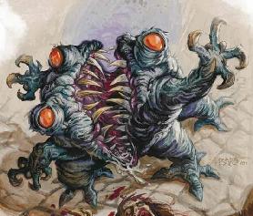

The yellow eyed creature is a Bulezau, a diseased animalistic manifestation of rage. It’s a type of demon:  
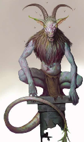  
Combat ensued. (Bulezau is apparently not a humanoid). Defeated everyone, almost burned the bridge, but managed to save and fix it. Fynn lied about being responsible about setting the bridge ablaze. Mort got poisoned, so we headed to Gragmaw Hideout to let him rest. Karn, Theothor and Fynn discussed the demonic ambush. Decided to keep a better watch at night/while resting:  
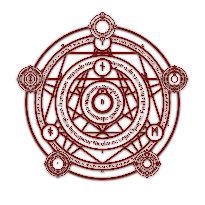

The rune in the center can mean Goddess, or Birth  
The top rune can stand for Shadow, Friction or Needs  
The left rune means Mouth, or Divine Breath, but can also stand for God or Ancestors  
The right rune means Divine Union or Manifestation

*“At the beginning of your end step, exile up to one target artifact or creature you control, then return that card to the battlefield under its owner's control.”*

Not sure yet what it means exactly.

## Session 70 — Campfire Confessions

*Flamerule 28*

Oliver healed Mort  
Karn met a talking bear who comes to the Gragmaw Hideout regularly to eat the spoiled meat in there. Apparently the bear – which we dubbed “Master Bear”, but was actually called **Harry** – and Theothor know eachother. Met when Theothor first came into our realm of existence.  
According to the bear,, Theothor was with two church guys of the Church of Sune before he joined the guild.

We set up camp in Conyberry once more and during our stay there we spoke amongst ourselves.  
	Theothor: Church of Sune → Devoted to preventing damage from ancient tech. They brought him here. He agreed to it, but at a terrible cost: it’s been kind of a blur, especially just after arriving here. When Theothor thinks or dreams about it, he sees a lot of his brethren die. There was a big battle.  
	Fynn shared his story about his blackout at school, presumably causing the entire school to burn down, with a lot of students in it.  
	*Private convo:* Oliver went for a walk with Karn and attempted to cast Identify on him. Magic is currently affecting him, but it doesn’t seem to be a spell. Seems to flow through him like blood normally would. According to Karn, most automata are fueled by magic of sorts, so it makes sense to him. Karn’s recollection of Corym: little human girl, bald, skin reminded him of the southern desert people who visited Mirabar. During his tumbling down the mountain, he felt like something other than Corym was inside him, something dark, something that smells or felt like rotten glass.

**Flamerule 28**  
Spoke to Weaver, who also isn’t sure how to proceed from here. Normally devils infight a lot and Meph tried to take over the hells before, but failed. We’re not sure if all the archdevils are on his side. We have very little information on what Meph is doing, how large his army is or how they operate. Waterdeep has some sort of mega dungeon underneath it, underneath the Yawning Portal Inn. Is actually another realm ruled by someone known as the Mad Mage.

Could we find a Cult of Asmodeus? There is a group called the Chosen of Asmodeus. Asmodeus is the arch enemy of Meph. Ruler of all the devil, overlord of the Nine Hells.  
According to Theother, every Leonin other than Theothor will probably be an Iron Mane.

Weaver: Runes at the teleportation circle look like goliath Gol-Kaa language. Perhaps a Goliath tribe is working with Meph as well?  
The teleportation circle runes can be used to teleport to the location the dragon corpse was taken, however, we’d need someone to make a circle to go back to. This isn’t without risk; the target location could be anti-magic-ed, so that we cannot teleport back.

Weaver gave us five quest options. Apparently it was a bad thing we gave Xzar the demi-lich to Monteron

## Session 71 — The Gates of Yartar

*Flamerule 28*

**Flamerule 28**  
We stepped into Kivan’s room in the guild. Bought some stuff. Kyvan was kinda apprehensive about us going to a Night Hag for a Hearthstone. He wasn’t sure about us being in the right.

Karn and Fynn went shopping at the apothecary. Oliver made a new friend (**Dandelion**).

Went on our way north and ran into a warrior person wanting to meet person called **Minsc** with his hamster companion **Boo**

Minsc wants to restore the order of the Knights of Bahamut. Metallic dragons. A single knight could win a battle. **Suldil** is the only remaining Knight. They want to ally themselves with the guild.

Went on to Yartar, where we had to pass through gates and guard inspection at midnight. Karn and Gorgel faced a weird wizard kinda fellow with an oversized wizard hat.  
The named Inns that I could write down: One Foot in the Boat, Belderbar Rest, Coin Toss, Wide Winged Griffith  
“Regards for the Kraken Society”.  
**Gerlin** was the guard that helped us in. Stay longer than 3 days in Yartar, have to apply for that. Coin Toss = Near the Fish Yard, the marketplace. It’s a red tavern. Run of the mill. Quiet, cloistered clientele. Unremarkable, but clean.

“There’s a door down stairs with chains all over it, don’t open it”. Said the Innkneeper  **Tanataskar Moonwind.** Fynn tried to charm him, but it failed. Gotta be gone by noon.  
“Fucking Kraken Society bastards” after Karn said something about it.

Ended the session closing the door behind us in the inn.

## Session 72 — Shadows in Mornbryn's Shield

*Flamerule 29*

***Cutscene time:***  
**Kerymnaar**, the ruins of an ancient settlement of aerlan period. Settlement was banadoned 882 DR, long abandoned except gnolls, goblins or bears. In 1374DR **Nar Kerymhoarth** a.k.a. the **Namelesss Dungeon** had its protection disspelled causing almost 2.000 **fey’ri** (another plane) to be released.

*("The fey’ri are to elves as tieflings are to humans and tanarukks are to orcs") → In the sense that they are elvish, but with fiendish blood.ruins*

Most Fey’ri chose to settle in the ruins. bringing new life to the town of Kerymnaar. Though Gnomes and other common races settled in Kerymnaar as well, most settlers came from the Feywild (including Satyrs).  
Minoushka has long traveled to bring the Tillem and Wom to their home. They fought creatures. Tillem remembered the High Forest more peaceful.  
Wom got excited at the prospect of seeing their parents again. So did Tillem, as they reached the gates of Kerymnaar, the walls rebuilt. **Arthur** recognized them immediately.  
The Twins’ parents own a herbstore, decorated by colorful flowers. Drinks were drunk as a celebration of the brothers’ return. Apparently Minoushka isn’t old enough to drink (15?!). Mother examined Wom and concluded that his magical gift is gone. Wom apparently had the **Gift of Senegos** (*whatever that is*). According to his father, Wom’s body was stolen and switched for a fake, instead of just a crystal stolen. He feels a different magic in Wom’s body. He thinks its time for us to enter the Nameless Dungeon once more →  It holds a portal to the Feywilds.

Fynn read Babalysaga book:

*“Baba Lysaga is a mythical witch from the Dread Domain of Barovia; a dark valley which is said to be one of the oldest Domains of Dread. The entire valley was once part of a forgotten world of the Prime Material Plane, but it was transported to the Shadowfell by mists controlled by the Dark Powers. The realm is a prison for its darklord, the vampire Strahd von Zarovich, as well as the entire population of the valley.*

*“Baba Lysaga, a devout follower of Mother Night, was midwife for queen Ravenovia van Roeyen, Strahd’s biological mother. The queen raised her son, but Baba Lysaga sensed a potential for greatness and darkness in Strahd surpassing that of any other mortal and fed this potential from the shadows.”*

*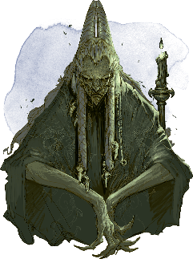*

Outside the inn, Fynn tried smoking his pipe, which he didn’t quite enjoy. He used a cantrip to light it, which apparently didn’t go over well with the guards, who watched him in the alleyway. Couple minutes after Fynn re-entered the inn, 5 guards gathered outside to keep watch.

**Flamerule 29**  
Got up for breakfast, Theothor got served pig instead of venison. Apparently Prosperine sprinkles ashes on top of her food.

**Winter Winds** is a shop run by two human brothers named Felassal and Thuorn. Bought some magical clothes.

Went out through the gates, which closed directly behind us. Crumbling tower on top of a hill a little ways up the way, circled by four hawks (**Bloodhawks** according to Dandelion). Large boulder blocks the tower’s entrance. Oliver sneaked past the boulder and inside he found a Hill Giant inside the tower called Moog. **Chief Guh** kidnapped her husband, because she wanted all the men for herself. **Grudd Hauk** is where Chief Guh, where Moog is from as well. Husband is called **Hruk** (or Hill Giant Servant 2).

In the evening, arrived at **Mornbryn’s Shield**  
Got name from horseshoe ridge, protecting from the flood in the spring (we’re just past that point). North-eaast small stone keep with fiery catapults facing the evermoors. Legend speaks of a treasure filled tomb. **Quartet of bone devils** climbed over the ridge east of town and walked through the town, causing some minor damage, leaving the citizens scared. Apparently some heroes rode in before, staying at the **Troll in Flames Inn,** four muscular people standing outside of the inn; kenku, minotaur, dwarf, elf. Bear the symbol of **Zhentarim.** Look shady. Heavily armored horses (nine of them). Minotaur walks inside. Another elf takes a small human inside the inn. We follow inside, after Theothor storms after them (Fynn wanted Oliver to divinate first).

## Session 73 — The Black Network Strikes

Mort knows something about the **Zhentarim**:  
Zhentarim a.k.a. **The Black Network** is a mercenary company +300 years old. Served dork gods like Bane and Cyrik for a long time. Have a history of thieves, spies, assassins and malevolent wizards. As of now, the Zenterim appears everywhere (tattoo’s, merchants bearing the mark, etc.) but never has Mort seen a group of people bearing the symbol. Mort’s not sure why he remembers this symbol, but feels like they may have something to do with what happened to him.

Human looks deathly afraid, but doesn’t seem hurt. In front of the big man is a book clad in black leather. He was writing something in there, before we came in. Some bread on the table, flasks and a handaxe.

Talked to them, but weren’t very keen on letting us in. Went outside as well. Fynn tried to send a message to the scared human, but no response. Oliver sent his invisible eye inside and the human had a head wound and was unconscious (2 mins after we left). Some of them went outside.

We cast Darkness inside the room, Oliver created a pit outside of the entrance and Prosperine had a devil fly in and grab the human, which we then quickly took out of the city on our horses. As far as we know, we were unseen. We took the human, named **Karel**, north of Mornbryn’s Shield to find out what happened to him, but he had a gap in his memory. His latest memory being at home and waking up with us. Oliver, Proserpine and Fynn got their horses stuck in the swamp, Mort went on to try to bring Karel home.

Rest of us got surrounded and had to fight them (after Fynn tried to cast Charm Person on one of them, which kind of killed the parlaying mood). Mort had to fight the boss on his own. We defeated the people, but found Mort unconscious and Karel killed at the hand of the leader of the group.

That’s where we ended the session.

## Session 74 — A Heart Gone Missing

*Flamerule 30*

Oboth surrendered. We shackled him and took him back to the Inn in Mornbryn’s Shield. Shortly after the Bone Devils were seen, the mercs came into town saying they would get rid of them, started interrogating people, violently sometimes.  
At first interrogations was about Bone Devils, then more and more about Mornbryn, the ranger that the town was named after. Tomb would contain treasure.

Staying at the inn, Fynn read the rest of the Baba Lysaga book (see Wiki). Karn read the book that Oboth carried. They were indeed after the treasure left by Mornbryn, specifically an ancient magical artifact (**Gauntlets of Vonindod**). According to the book, Karel heard a story of an ancient wizard using the Gauntlets to make himself bigger and stronger, being able to punch a ship.

**Flamerule 30**  
Had breakfast, discussed the plan for going to Baba Lysaga (we have none), buried Karel. Prosperine wanted set off to take Oboth back to Triboar, but not before asking us to find a specific whistle carved from crystal and looks like a dragon curled up like a snail. Proserpine went to fetch Oboth, but found him dead in the closet we locked him in. He was wearing a Dread Helm.  
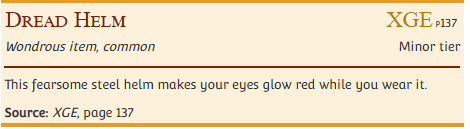  
Upon inspecting his body, we found a hole in his torso where his heart used to be. Seems to be fresh. However, his heart is never to be found, Proserpine’s specter (who was guarding Oboth) didn’t see anything and he was still wearing his armor. So that was weird.

Found some tracks in the swamp, while we rode northward. One set of horsetracks got joined by eight others, until we lost track of them because of the standing water. A couple of Griffons flew by. There is a place called Griffon’s Nest nearby, so that could explain.

Mort and Theothor felt watched while travelling. Theothor heard the sound of hooves. “So you thought you could escape the Zhentarim. But you will be hunted down until the end of your days”.

## Session 75 — Death at Nesmé

WHAT HAPPENED?!

Started off in the swamp and went on our way north, where we encountered a giant snail, which we swiftly felled, because it ran over Theothor.

North we found the ruins of Nesmé, where we found a large group of horseback riders. We hid in the shrubbery and found out that the people made a pact to do evil things. Leader was called the Eater of Hope. We decided to nope the fuck out of there, which we did without any stealthiness.

We failed to cross the river with Oliver’s water walking, because the Eater of Hope chased us and he created a water barrier around us. Once the water barrier dropped, Karn got murdered by a barrage of arrows shot by devils called Nupperibo. In his death, he heard someone tell him he might be able to be repaired.

Fylo Nelgorn is the leader of the Zentharim. He started eating the Eater of Hope after it died. Made a blood cloud.

## Session 76 — A Shield One Last Time

Karn must give up his body later on to have a secret compartment opened by some being that will save his life. He shot up out of the water in a blaze of subnautic flames. Karn chucked Gorgel toward the group. “I will be a shield of the crying god one last time”. Thanked the group for the best time they could’ve given him and Corym.

He went all out and died again. Karn’s last thought was “Suck a fat cock, dwarf scum”’. Corym’s last thought was an image of her standing on a hill, looking down at her hut camp of her tribe. She then wakes up in a cell. Two other cells. One cell containing the lifeless body of a dwarf, the other cell the remains of Karn. She looks up and sees a door(?). The room is filling up with blood and oil.

Karn came back and exploded, taking out a lot of the enemies. We defeated everyone ultimately. We found Karn’s shattered body floating in the river. Fynn tried mending him together. Oliver tried revivify. Nothing worked.  
Decided to gather the pieces. Fynn took the ruby, felt warm, filled with love.

Made some sort of gravesite, where Fynn hung his Glamerweave Robe on a tree, with a pattern of Karn trying to sleep. We decided to leave some of Karn’s stuff at the gravesite. We also drank some sweet water to his name, said some words and poured the rest of the sweet water all over the gravesite, where we laid Karn’s remains. We took his Ruby, Signet Ring, Gauntlets of Ogre Power, Ring of Water Walking and Bag of Holding with us.

Sending stone: “Floop, it’s Fynn. Karn has been killed by Zhentarim soldiers and Nupperibo. Let Weaver know. We will continue to Rivermoot.”

Night sets in. Mort scouted the ruins of Nesmé, which, apart for some horses, is pretty cleared out at this point. He also found some notes on a table. Zhentarim were stationed here to look for the location of the Gauntlets of Vonindod. They found out that a group of fiends working for Meph were looking for the gauntlets as well. They’d meet here to discuss a cooperation. Fylo wrote a list of things/demands they’d ask from the fiends. Most were crossed out (e.g. Free Snacks for a Lifetime). Two are not crossed out: fiends will not attack non-troll settlements or parts thereof without the black networks consent (Moongleam tower for example). They also wanted the fiends’ help in breaking a dwarf prisoner out of his prison in Revel’s End (a high security prison in the North, known by Mort).

We wake up the next day, on **Midsummer**, a day between two months.

Sending Stone: “Floop, it’s Fynn, Zhentarim and Mephestophelis working together to find Gauntlets of Vonindod. Planning to break a dwarf out of Revel’s End. Let Weaver know.”  
Checked on Karn’s grave and continued our way towards Rivermoot. Built on stilts, in between two rivers. Canoe tied to the cottages. Small village. The tavern is called “The Tavern”. Eastward, one with the big chimney. Basically a house turned into a tavern. Three women and a man sitting alone. Two empty tables, take one of them. Old man as an tavern keeper. Asked him about Babalyzaga; years ago a group of adventurers found a map leading to a place south of here. Found a scarecrow in a tree at the location; it told them it would lead them to the hag. Went here first to find out more. They stocked up here, headed back out to the scarecrow. Haven’t seen them since.  
The orange wine with lime juice from this establishment tastes like banana. Barkeep is called **Gregory.** He leads us to our house that will be ours for the night. That’s where we ended the session.

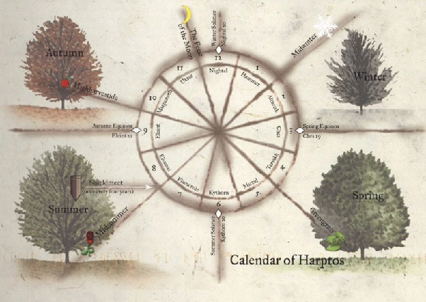

## Session 77 — Into the Mists

*Eleasis 1*

**Eleasis 1**  
Woke up in the cottage, went to get breakfast. Gregory remembered group armored; sword of one guy gave him the shivers (Cold sword?). Dwarven belt, probably magical, 5 or 6 guys. Maybe a woman, isn’t sure.

Door kicked in by a grey dwarf. He rushed Fynn, got protected by Theothor who blocked the hit. Fynn tried Hold Person but failed. Dwarf has a giant lizard mount called Balthazar. **Barend Battlegore** from the city of Gragelstugh(?) aka City of Blades.  
Barend got some of his stuff stolen by a troll. Asking us to join his crew to take it back and we can keep other treasure. Agreed on helping him as long as he helps us. Any loot we find is split.

Traveled south with Barend into the Evermoors. Lots of fogs, winds, bogs. There are some prospectors and shephards. Lots of (Netherese) burial mounds (with maybe magical treasure?). Traveled to the troll’s lair. While travelling, Fynn and Barend spoke. Barend is from the underdark and was exiled. Not on speaking terms with family. No long term plans. He is a duergar. Duergar don’t rely on magic.

Found and fought the troll and two giant crayfish. Won of course. Barend took all the riches (and also a big chest full of half-eaten animals). Took a short rest and then went on to find Baba Lysaga.

Found the scarecrow. Turned out to be a child. **Kid Clapperclaw.** Zijn oma kent Baba Lysaga. We wanted to meet the grandma, because grandma bakes good pies. Then suddenly the mist started swirling around us and we lost Kid. We walk around in the mist for what seems like hours. No landmarks or anything that helps guide us. Then suddenly we smell the smell of rotten glass. For as far as we could tell we traveled for four days, until we came upon a dreary town where only the sound of sobbing sounds.

That’s where we ended the session.

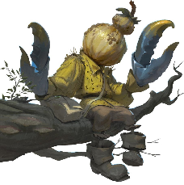  
*Clapperclaw*

## Session 78 — The Weeping Village

*Eleasis 5*

**Eleasis 5**  
Windows are boarded up, dirty streets, rats. Claw marks cover a lot of the walls of the houses. We decided to follow the sound of crying. All shops are permanently closed. One building doesn’t have a door. Mort went in to investigate, found the place stripped of anything valuable or useful. Found the corpse of an old man with three gaping claw wounds in his chest. His knees also seem blue. Decided to speak to the corpse. Didn’t work. Fynn tried casting Dancing Lights, worked, but before they were dispelled, the lights briefly turned into skulls before disappearing.  
Theothor sensed many undead. Mort went into the neighboring house (which according to Theothor contained undead) to investigate. Were attacked by three zombies, but no problem killing them.

Went back on our way to the sound. Some claw marks were by the zombies. Some of them were made by something like maybe a wolf. One large claw mark is unsure, but much larger than anything ever seen. Came across a building with light and curtains and a sign that says **Bildrath’s Mercantile.** Mort went inside; a bald man with glasses sits behind a small table. Walls lined with adventuring gear. **Bildrath Kantemir** is the guy’s name. Village of Borovia in the fine lands of Borovia. Lived here all his life. He is almost 38 years old. Bildrath told us about **Blood of the Vine tavern** and the existence of a mayor. Can’t go through the fog, you’ll choke to death. **Vistani** people are evil creatures according to Bildrath, followers of Strahd. Strahd is a vampire. Strahd has been here forever. Keeps pulling in adventurers in here to entertain himself. Has a powerful gaze. Everyone so far has died or disappeared. North-West: castle Ravenloft. A vampire can transform into a wolf, bat or even a cloud of fog. Vampires are weak against sunlight and running water. A wizard owns the tavern.  
According to Bildrath, the crying comes from **Mad Mary**, who has been crying for a week now. We continued to the house where the crying comes from. Something heavy falls on the floor. Door opened by a woman.

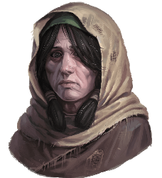  
***Mad Mary***

**Gertruda**, Mary’s daughter. “Told her not to go outside”. Gertruda is missing. Only thing Mary still has is a doll. Missing for about a week. Wizard haunts the foothill. Doll is not magical, Fynn made a sketch of it. Stitched into the dress is a frayed tag baring the words “Is no fun, is no blinsky”. **Gadof Blinksy** is the toy maker of **Vallaki.**  
Description Gertruda: Blue eyes, brown hair, long hair, very thin, 16, less than 5’10”, fair skin, hair curls around her side, hair normally down.

A cart pushed by two hunched people covered in rags. Going door to door. Sells pastries. A A temporary way out of a miserable life. Someone inside is called **Lucien**, possibly a kid who they call “granny”. **Isabella** is with granny. The parents sold Luchien to the granny in trade for 12 pastries. Fynn intervened and we decided to join granny to her mill (2-3 days travel) to check if the children the granny is supposedly taking care of are okay and also if maybe Gertruda is there. Granny’s name is **Morgantha.** There once was a kid called **Klaus**, who wanted to follow a butterfly (or bat), and so got out of the sack and ran into a werewolf, who bit his hands off, replaced his hands with some things I had on me. Bit of cart, made claws of it.

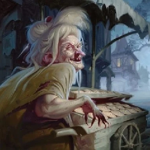  
*Morgantha*

*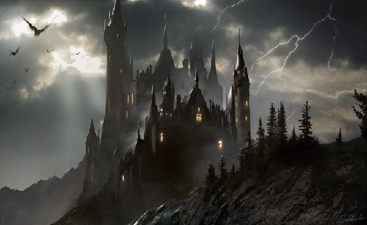*  
*Castle Ravenloft*

## Session 79 — Voices in the Fog

Woods are hunted by werecreatures and undead. Also lots of vampires. Deliberated among us, out of earshot of Morgantha. Fynn tried to sending stone to Floop, but a male voice responded with *“how did you get here? you need to help me”*.  
Oliver tried to send a sending message to Gertruda: *“Hi Gertruda! My name is Oliver! I’ve met your mother Mary. She’s worried sick! Where are you? We can come and get you. Please respond!”* but the same male voice responded (after white noise): *“Where did thou come from? Please. You have to kill her.”*  
Oliver then sent another message to the voice. It responded: *“I am the dark, the eternal night, I am the devil Strahd. I need you to kill Baba Lysaga”.*

Decided that we’re not sure about who’s evil: Strahd, Baba Lysaga or both. We figured we’d try to get information from Morgantha on the way to the mill. Fynn theorized Morgantha might be the granny Clapperclaw was talking about or possibly even Baba Lysaga herself. Bought some rations at Bildrath’s.

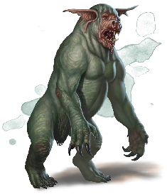  
*Morgantha’s “Horse”*

While on the road, we suddenly got joined by a person who looked like Barendd to Barendd, while looking like a regular guy to the rest of us. Was able to turn his head around 360 degrees. Melted to tar when Barendd touched him. Morgantha isn’t magical or anything in her cart. Tar wasn’t either. Strahd is a good looking fella according to Morgantha. He also killed her a while ago.

Strahd doesn’t respect Baba (she’s living in a “living in a walking house”). Morgantha doesn’t think Baba is a bad person, she is just bent on getting things the ways she wants. Lucien’s never seen clean water before.

Got ambushed by wolves. Fynn hid Lucien by making him invisible. After the battle we found Lucien hanging from a tree, dead, Oliver cast revivify on him. Fynn in his head: “Another child, you know how that feels don’t you? Children dying, CHILDREN DYING ALL AROUND YOU”. Fynn didn’t take it well, to say the least. Went on our way.

## Session 80 — Madam Eva's Fortune

*Eleasis 6*

**Eleasis 5** Still  
Crossroads with old wooden gallows to the left, frayed length of rope hanging from it. Small set of *eleven* graves surrounded by a wall. Vistani camp @ Tser Pool. Strahd is law according to Morgantha and is able to do anything to anyone at anytime. Five 10ft tents in different colors atop wagons. Also one bigger tent. Eight horses drink from the river. Footpath north between river and forest’s edge. Vistani. Shouldn’t steal from them. An earlier group got absolutely slaughtered after stealing from them. Twelve humans. Friendly, offered us drinks. Were just about to tell a story:

A Mighty wizard came to this land years ago. Stood exactly where you are standing (Mort). Very charismatic. Tried to make the people of Barovia revolt. Strahd appeared and almost everyone fled. Some stood their ground and never returned. Wizard and Strahd had a magical battle. He saw the battle with his own eyes. Lightning struck the wizard, but he stood strong. Was thrown a thousand feet to his death. Didn’t find his body.

Theothor also told a tale about the dragon we killed.  
Elevator broken. Vistani are people of stories who use a potion to travel out of Barovia. Might find this potion in Vallaki.  
We were suggested to meet with Madam Eva tonight by an older Vistani.  
But first we went to bury Lucien near the lake.  
Barendd went back to the camp to get a barrel of ale, because Theothor would perform an hour-long funeral rite. He had to tell the story of **Mumpena Fapplestamp** in exchange for the barrel.

Went inside the big tent. Crystal ball on the table. Hunched figure. Crackly voice: “At last, you have arrived [laughter]”. Already knew our names. Fortune teller.

**History**: The treasure you seek is hidden behind the sun, in the house of a saint.  
*This card tells of history. Knowledge of the ancient will help you better understand your enemy. → Found the Tome* ✅  
**Powerful force of good and protection:** The thing you seek lies with the dead. under mountains of gold coins. → For the Holy Symbol of Ravenkind. Lukdana.  
**Power/strength/weapon of vengeance:** Garden dusted with snow guarded by a scarecrow. Look not to the garden, but to the guardian. → *Found the Sunsword* ✅  
**One who will help you**: A man made by a man, ageless, made to be alone, haunts the towers of the castle.  
**Where your enemy is**:The mists obscure all.

Fynn, Oliver and Mort went to sleep. Theothor and Barendd joined the Vistani party. Oliver talked to Dandelion about his sister being sick. Fynn sent a message to Strahd. (message: drop the charade, we’re coming for you. response: good, looking forward to it).

**Eleasis 6**  
Next morning Mort found Theothor and Barendd in a pool of barf.

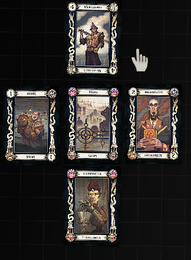  
*The cards Madam Eva drew to tell our fortune*

As breakfast, Fynn ate an entire pie/pastry from Morgantha and fell into a trance. Incapacitated, 0 speed, dream of a joyous world, being young, having some siblings/family. Supposed to last for 6 hours.

Fought a Druid and won. Drops:

- A staff (non-magical) with silver bells (magical)

## Session 81 — The Road to the Mill

*Eleasis 6*

**Eleasis 6**  
Fynn is still out of his mind. Stumbled upon an old grave, one of the few that’s intact.  
Mort never knew his parents. Fynn woke up. Set up camp. Fynn tried to steal pastries, while pretending to take a shit. Failed, went to sleep.

**Eleasis 7**  
Don’t feel rested. Crossed a bridge. Found a gate. Evil approached us. Hid from it, turned out to be an undead patrol, formerly part of Strahd’s guard but fled when he turned into vampire.

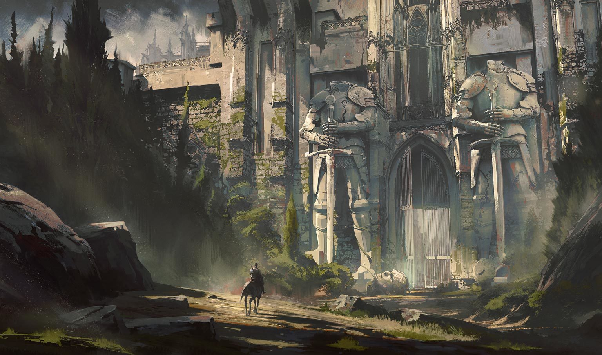  
*The Gates we traversed*

**Eleasis 8**  
After a rest, we encountered a skeletal fighter on a skeletal warhorse, who rode right towards us. Mort mirrored it’s movements and they rode past eachother. We also got out of its way and it just rode past us. We continued.

Arrived at the mill. Not as foggy here. Raven above the door. Hops about and squawks.  
Names of Morgantha’s children: Daniel, Jayden, Alexei, Sascha, Igor, Isabella, Tim, Donald, Katja, Natalia.

*\< Morgantha’s Mill*

Lots of mess and dirt everywhere inside the mill. A barrel filled with green sludge in the center of the mill smells horridly. It’s feed for the animals that carry the cart. It’s called ichor. Morgantha’s daughters care for the kids while she’s gone.

Floor is littered with small bones. Not much time to clean. Two ugly girls, wooden crates, wooden trapdoor “Bella” and “Ophalia”.

Also Morgantha is a witch.

## Session 82 — Burning the Witch's Mill

*\< Bella & Ophelia*

Capable of making black voids of their eyes, causing us to fall unconscious. Our shadows seem to be alive, moving on their own.

Morgantha became incorporeal. A monstrosity came from the barrel that Barend knocked over..

Fought everyone and leveld up to Level 9!!

Mill is now empty of any vile creatures. Fynn inspected the small bones on the floor, they’re small human bones. There’s also a chicken coop containing human nail clippings, rotting teeth and blood. Bag of flour → recipe for the pastries. They contained the children.

*Monstrosity that came out of the barrel \>*

Found a map of the lands of Barovia in the top of the mill. It marks the village of Krezk. Text on the back of the map: “*the treasure you seek is hidden behind the sun in the house of a saint.*” (Same as the Finstani prophecy). Also found a map in the basement, with a mark and the text: “*Baba’s house*”.

We decided to burn the mill down as the day turned into night.

## Session 83 — The Bleeding Moon

*Eleasis 9*

Cracks appeared on the moon, with blood seeping out of it, turning into a waterfall of blood in the night’s sky. Stumbled upon an obelisk. Studied it:

* Made out of not-quite obsidian. Black glass-like, covered in tiny runes.  
* One sentence is repeated over and over: *“Y'ai 'ng'ngah, Vecna h'ee - l'geb f'ai throdog uaaah.” →* I call death, Vecna answers - here they call trembling.  
* It was written in Netherese

Barendd encountered one of these obelisks in the Whorlstone Tunnels on his way to the surface from the underdark.

Fynn started reading the book on Netheril:  
*“Netheril was an ancient, magocratic human empire of Faerûn, whose influence was felt across the Realms for thousands of years. The Netherese people lived in a strict hierarchy for hundreds of years, split into the nobles of High Netheril, living in flying enclaves miles above Toril, and the commoners of Low Netheril settled in demesnes on the coast of the Narrow Sea. During its glory years before Dale Reckoning, the Empire of Magic would spread across a great stretch of Faerûn.*

*The empire was the pinnacle of human civilization during the first half of the Age of Humanity. Although they had humble roots as mere fishermen and farmers, the Netherese were introduced to the Art by the elves of Eaerlann, and came to harness this arcane power in ways that would shape Toril for generations. Over the next thousand years they discovered the long lost Nether Scrolls, developed the creation and use of mythallars and created the first of their flying cities, Xinlenal. The arrogance of Netheril grew to the point where they attempted to attain the divinity of magic, and wound up destroying the Weave. In the resulting maelstrom, the Faerûnian pantheon was altered and most of the flying cities of Netheril came crashing to the earth.*

*High Netheril was ruined in a matter of hours, while Low Netheril experienced a long, agonizing decline by the aberrant Phaerimm. The enclave of Thultanthar was transported to the Shadowfell by Telamont Tanthul, its ruler, where it remained for 1,700 years.”*

The Weave is where people get their magic from. During the Spell Plague, it was destroyed and that fucked up the world. Places disappeared, appeared elsewhere, shit got really wonky. The Weave was restored by Mistra (one of the successors of Mistrol), but took place only a few years ago (started about 14 years ago and was finished about 4 years ago).

During the night, Barendd, who stood guard, heard voices talking about dinner, snickering. Encounter these nice creatures:

| 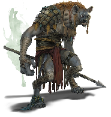 | 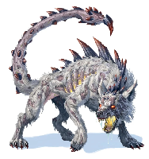 | 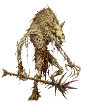 |
| :---- | :---- | :---- |
| *Gnoll* | *Shoosuva* | *Witherling* |

Theothor killed the Shoosuva with a critical hit, dealing 96 damage total. Savage! Savage! Savage! Chat disabled for 4 second(s).

Defeated them. One gnoll fled, but it’s body got thrown toward us through the mist, piece by piece. After that a woman on horseback came through the mist, carrying a sword in one hand and a scale in the other. She says: *“We have no use for weaklings. I apologize for their sudden try at an ambush. It wasn’t meant to happen.”*

Her name is **Arabeth**; avatar of Mephestopheles. She serves him. Here to gather power (in every world). Said Strahd might not have a thought anymore. Thought we were following here.

*Arabeth*

Every place that Arabeth’s horse stepped on is now dead. Looked through the corpses, found nothing of note. Went back to sleep.

**Eleasis 9**  
We wake up, finding the bleeding moon still to be there. Barendd fell asleep while on his look-out rock, so he tumbled off and we found him on the ground snoring.

Decided to go to the next obelisk. Exactly the same thing and same text. Third and fourth look exactly the same. The fourth one has a tiny crack in it though. Nothing we can seemingly do with the obelisk, nothing that moves or anything. No clue as to might what has caused the crack. Dispel Magic didn’t work.

Decided to cut north through the forest towards Vallaki, where we ended the sesh.

## Session 84 — The Gates of Vallaki

Oliver cast Identify on one of the obelisks: made by a spell, very old, has a magical charge, but no idea what spell it’s charged with.

We started getting a headache and nosebleeds. Area of Psychic Resonance, made by strong emotions + magic. Decided to head west to see if that alleviates the symptoms. Stepped into some Psychic Residue, a big puddle of black ooze. Which we killed. Headaches were then gone again.

We encountered the road, mountain berg, pallisade: Vallaki. Thick fog tries to get inside. Get back on the dirt road, which ends at a set of iron gates with shadowy figures. Pikes with wolves heads impailed on them. 50ft high, vertical logs held with ropes and mortar. Pointy! Two guards behind the gates wielding pikes. Had to pay them 5 copper to come in.

**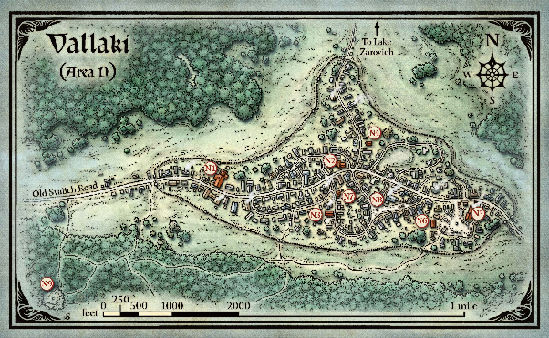**

**Map Legend:**  
N1: Church, N2: Inn, N3: Burger Master's Mansion, N4: Mansion of Rich people, N5: Stockyard ,N6: Coffin Maker, N7: Toy Maker, N8: Square, N9: Vistani Camp, N10: Shop with no location

Decided to go to the coffin maker’s place first, because Mort wanted to play a prank on them. Less scratches on the building here in Vallaki, though there is still thick fog. Dreary mood. Walk past the stockyard (several locked sheds, wooden sign, at the end (south): a carnival wagon)

Coffin Maker: smells like death, sign shaped like a coffin, all windows shut tight, silence surrounding it. Church bell on entrance. Place is almost empty, mainly coffins. Small man with a hunched back, bald spot center head. Followed the guy upstairs, where he suddenly stopped and sent Oliver and Fynn off. Mort stayed, pretending to be dead. Guy said “that was close”. Guy locked door, blew out all the light. “You can come down now”. Six men and women come down the stairs, cloaks, two spiked teeth corners of mouths. “Master Strahd promised you good business if you let us stay for two weeks”. Never really liked orcs. Planning to kill the entire town.  
Locks Mort inside of a coffin as the people went upstairs again.  
Oliver casted Arcane Eye, but couldn’t find a hole large enough. Oliver broke one of the wooden boards to get his Arcane Eye, while Fynn found Mort through the use of detect magic. We found him inside a coffin chucked outside. Oliver freed Mort.  
Arcane eye: one of the people is eating a cat. Figured they may be vampires. Got the heck out of there. Decided that without a proper rest, we wouldn’t be able to do anything.

Building in the middle of the road with a sign that says: “DEALS SO GOOD I'LL [$!$$] MYSELF!”. Pitchblack inside, but a familiar face. Session end.

## Session 85 — Festival of the Blazing Sun

Happy the Salesman, seems unable to tell us his real name (though that’s an assumption). Within Strahd’s castle is a great deal. A body that would make Theothor big.  
Namedropped the name “Mike”. Bought some stuff. Works for someone, doesn’t want to tell us who.

### Town Square

Square contains people locked in stocks wearing crude plaster donkey heads. Status of an impressive man facing west. There are notes posted all over saying:

*“Come one, come all,*  
*to the greatest celebration of the year:*  
*THE WOLF'S HEAD JAMBOREE!*  
*Attendance and children required.*  
*Pikes will be provided.*  
*ALL WILL BE WELL!*  
*—The Baron—”*

Asked someone about it called **Jan**. Wolf’s head jamboree was last week. Any moment they’re going to hang the new festival. New sad festival every week. Can’t say anything negative about the festival. Name of the Baron = Burger Master = **Vargas Vallakovich**.  
Huge bald man arrives with two town guards. Guards start posting new proclamations:

*“COME ONE, COME ALL,*  
*to the greatest celebration of the year:*  
*THE FESTIVAL OF THE BLAZING SUN!*  
*Attendance and children required. Rain or shine.*  
*ALL WILL BE WELL!*  
*—The Baron—”*

Bald man is called **Isaac**, right hand man of the Baron. 				       *Isaac*

Arrived at the inn. Stone foundation, sagging tile roof, ravens on top. Blue waterfall on sign.  
Fynn talked to the ravens: Last group died killed by Strahd. **Urwin Martikov** is the name of the innkeeper. Should probably not anger anyone inside the inn. Burger Master is an idiot. Thinks he’s making the town better, but isn’t. Some other people are trying to start a little revolution. The wachters (a rich family) are trying to start it. They’ve been rich forever, maybe in cahoots with Strahd. Back at the stockyard, some strange growls came from his carnival wagon.

Fynn read the rest of the book on Netheril:

*When Telamont Tanthul moved Thultanthar to the Plane of Shadow, their mythal was infused with the power of the Shadow Weave and protected by the goddess Shar. After centuries in the Plane of Shadow, the ruling class of the City of Shade became twisted, dark, humanoid creatures referred to as shades. Regardless of class, the souls of all Shadovar were changed by their centuries in the shadows.*

*Upon their return to Toril on Hammer 1 of the Year of Wild Magic, 1372 DR, Thultanthar returned to the Realms above the Dire Wood, later moving to hover over the Shoal of Thirst in the Anauroch desert. The Shadovar people rapidly joined the fight against the terrible phaerimm, that had left the elven city of Evereska under siege. Over the course of months, the folk of the Realms came to view the Shadovar as benevolent saviors, while others were still distrusting of their intent. The auspicious circumstances of the Shadovar's return were soon tarnished when their new vision for Faerûn was revealed to neighboring heads of state.*

*The Shadovar revived the Empire and enthralled people of north Faerûn for over a hundred years. While they sought to fuse the Weave with the Shadowfell, the Shade Enclave was brought crashing down over the renewed realm of Myth Drannor, supposedly ending the Empire once more.*

While Fynn was upstairs reading/falling asleep, the rest of the group discussed Fynn’s ability in combat, his trustworthiness and their worries about him.

### Inside the Inn:

Wolf heads, two hunters who look angry, two fancy guys slightly drunk, innkeeper (big red nose, big mustache), one strange fellow.  

| 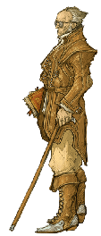 | 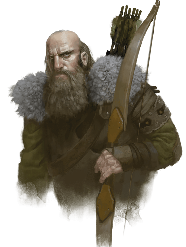 | 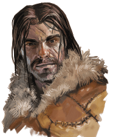 |
| :---- | :---- | :---- |
| *Rictavio* | *Szoldar Szoldarovich*  | *Yevgeni Krushkin* |

**Rudolph van Richten** is a witch hunter last seen in the Village of Barovia. Were told about him by the **Wolf Hunters (Szoldar and Yevgeni)**. Rudolph has been hunting for Strahd for a year or two. Has outlived the Mad Wizard.

Oliver decided to speak to **Rictavio**, the person sitting at the bar. Knew Baba and said not to trust her. Killed his sentient sword. Also had a monkey friend, but gave him to the local toy maker. De Wachters might be in cahoots with Strahd according to Rictavio. He’s a carnival ring master. Wants us to play a show in the circus. **Keepers of the Feather** was namedropped. Went to the same school as Fynn. Oliver received a sending stone with which he could communicate.

## Session 86 — Riot at the Festival

*Eleasis 10*

**Eleasis 10**  
Wachter brothers think the festivals suck. **Karl Wachter** thinks his mother would be a way better mayor, because she’s a big friend with Strahd. Need rich woman like mother, trickle down economy. Not his plan, but his mother’s plan.

Our plan: go to the mother first to find out more about her plan. Then go to the mayor to inform him of both the Wachter Mother’s plan and the vampires who are trying to burn down the city.

Fynn gave the innkeeper 50GP.

Went to the Wachterhaus. Disgusted with itself. Saggy, bulging under the weight of vegetation. House groans. After knocking, an old man peeked through a slit. We were tested by the man. He opened the door, but specifically did not invite us in. Oliver remembered correctly that vampires can only enter a house when they’re invited.  
	Everything inside is in bad shape, but still elegant. Portrait of a smirking noble man. Several smaller portraits as well. One of them looks like the Wachter brother we talked to in the inn. Next to him, his brother. Next to him, a woman. Who was suddenly behind us. Her name is **Lady Fiona Wachter**. There’s talk between the townsfolk. Isaac Stradzni, the mayor’s right hand, is too strong to be killed. Maybe we could take care of that, and she would do the rest.  
Daughter = **Stella**. Was in love with the Baron’s son Victor. Wanted to marry. She went mad though. Fiona believes she was cursed by Isaac.  
	Fiona’s husband was killed by vampires. Told her about the vampires in the Coffin Maker’s shop and their plans. She provided us with some holy water. Also discussed the option with her of including the mayor in the efforts to stop the vampires. It was still a little dubious, because it could worsen her position as potential mayor. We were interrupted by the festival starting.  
	A wicker ball was placed by the mayor and everyone in the town needed to throw oil onto it. Just when the mayor wanted to light the ball with a torch, it started raining. The torch went out and one person laughed at the failure. Laugh comes from Lars, one of the town’s militia. Was immediately arrested for spite and tied by the neck to the horse of the mayor who dragged the man around the square, slowly killing him. Theothor interfered and cut off the rope. Speeched to the guards. Fynn charmed a higher ranking one. The mayor ran away, while Izek took the stage and attacked us.  
	We killed Izek, while the guards attacked one another. Afterwards Lady Fiona took the guards and charged after the fleeing Baron. We were left on the square amidst a dozen corpses, planning to take care of the other problem in Vallaki: the vampires holed up in the coffin maker’s shop.

## Session 87 — The Coffin Maker's Trap

Still **Eleasis10**  
Walked to the Coffin Maker’s house. We believe vampires are undead, but Theothor sensed no undead, fiends or other ungodly entities inside. We surrounded the place, while Mort sneaked inside. The door was open and the shopkeeper was inside. Fynn lured Mort back outside, telling him that the shopkeeper saw him being dead before. Mort went back in anyway and Fynn went in after him in an attempt to distract the shopkeeper. Mort sneaked up the staircase where he triggered a trap causing a fireball to erupt. Went into combat. Shopkeeper turned out to be a vampire.

## Session 88 — The Succubus Unmasked

Still **Eleasis10**  
Resumed our fight with the vampires. Which we killed. Rictavio entered the fight as well. Turned out to be Rudolph von Richten all along. Comes from **Darkon**. Is a vampire hunter because of what happened to his family. Darkon is another domain of dread. He is a mistwalker.  
Strahd cannot be killed by straight up confrontation, tried with the mad wizard. Rudolph snuck away. Strahd controls the mists, can turn invisible, has many allies (Vistani), even if you kill him and destroy his body, he keeps coming back. Only those with a soul can travel through the mists, and Rudolph says only about 1 in 25 people have a soul.  
We would need holy, radiant power to damage Strahd. He normally also plays with adventurers in a more intimidating way than seeming weak. Sounded strange to Rudolph.

Arrived at the mayor’s mansion, where mob wearing red MVGA hats gathered. Some of the windows have been broken. One man leading the mob: Yevgeni, trying to persuade the people that Lady Wachter should be the mayor. Oliver gave a speech. Entered the mansion through the upstairs window above the front door.

Found the body of the mayor in his study, holding a book, lying in a pool of blood. Has been stabbed in the throat, just underneath the beard multiple times. The book is the mayor’s diary. It has barely been used. Final page says: “I think she’s in here. I hear footsteps downstairs, unnatural, heavy. It seems my son was right. It seems that she is actually a succubus”. Also many drawn pictures of voluptuous women. “I don’t think Strahd is the most immediate threat”.

So we found lady Fiona in the next room over, where she acted like she had no idea what happened to the mayor, until Barendd found the mayor’s wife dead in the bed covered by bed sheets. Fiona was actually a succubus and attacked us, accompanied by an imp.

## Session 89 — All Is NOT Well

Still **Eleasis10**  
Izek came back with two strange shadowy hounds. One of his arms is now all scaly and strange.

Door in the attic: “All is NOT well”. **Victor Valakovic** (the baron’s son, 20-ish years old) was hiding in the attic. British accent, bit chubby, didn’t really seem to liked his parents. Lots of cats with him in the attic. Parents never let him go out, couldn’t go to parties apart from the festivals, disapproved of his crush (called “The One With The Red Hair And The Big Tits”) because she was beneath him. Not having his love accepted by his family struck a chord with Barendd, who proceeded to hug Victor. Doing research into spells in his attic. Most recently been trying to learn Teleportation Circle. Was incomplete though. Fynn tried to give some pointers. Traded his spellbook for some pages of Victor’s.

Fynn found a magical mirror. School of Conjuration, affixed to the wall, recently been shined and even more recently been bled on. Rest of the party didn’t really find it that interesting.

Oliver spoke to Victor’s cats. Said there are a lot of windows people could enter through. Said we should probably do a sweep of the house.

We're trying to think of a plan to get Victor to his hooker girlfriend.

## Session 90 — The Dusk Elves' Last King

*Eleasis 10*

**Still Eleasis 10**  
Plan: Theothor holds a speech to the mob and at a certain point he’s gonna say “Victory” and then Mort and Fynn will throw the mayor’s corpse out the window. Goal of this is to convince the mob that their quarrel with the baron is over and they can return home.

Rudolph wanted to discuss what happened. Came inside. Told him what happened. Not sure if the Wachter brothers are also succubi.

Hannah = name of hooker. Fiano Wachter turned out to be the owner of the brothel Hannah works at. Therefore decided it was not a good idea for Victor to go there.

One room of tiny little dolls within the mansion. All of the dolls look the same, apart from their clothing. The dolls in here look exactly like Gertruda (Mary’s missing daughter).  Back in Barovia, at Mary’s place was a doll, with the same tag “is no fun, is no blinsky”. That doll looked different though. These dolls belonged to Izek?! Victor found a hellfire longsword, which we bought off him.

Went to Vistani camp to get Victor a potion. People here are all human, except for this elvish man standing at the edge of the village. Vistani are busy looking for the leader’s daughter called **Arabel**. **Alexei** was supposed to watch the children, went for a toilet break, now she’s gone. *“We are more from here than the humans. Me and my brethren were the original owners of these lands, before Strahd took over 400 years ago”*. Secret knock = first line of mario theme.

Were led inside. Another dusk elf with a crown of twigs. **Kasimir Velikov, Last King of the Dusk Elves.** Figure appears behind Kasimir, after Fynn asks him on his position on Strahd. ‘He and his Finstani have ahold of all teleportation and communication magic”. Potions are made poisonous for the elves.

Agreed to keep a look out to Arabel at the north of Vallaki. Velikov’s throat was just slightly cut as we asked him how we could help him by the shadowy figure. He tried to say “kill”, but could only get “ki-” out of his mouth. Theothor got the message.

Whip, young man crying. Teenagers bound, back streaked with blood, being lashed, screams. “Easy brother, I think Alexei has learned his lesson”.

| 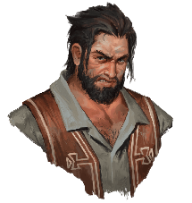 | 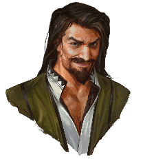 |
| :---- | :---- |
| Luvash (whipper) | Arrigal |

Potions are stored in the wagon with nice gold silk. Puff of grey smoke appears from behind the wagon. Couple wagons over, another puff of grey smoke appears. The brother’s feet disappear from the first puff and appear on the second puff. Second wagon seems to be more secured with iron padlocks. At another side of the camp the sound of padlocks being opened arises. Suddenly ravens block out vision. Man suddenly appeared again with a small wooden box. Dad of Arabel (guy with whip) would reward us exquisitely if we’d find Arabel. Twelve hours long mists cannot touch you when you traverse the mists. Mist is thin at: North of Lake Zarovich, but Svalich Woods are dangerous; South is also an option. Mist is like poisonous gas. You’ll suffocate. Takes days to die.  
Feels like he can sometimes help people here; people are dreary, they’re hopeless. They’re also the guardians of the elves here.  
**Luvash** = the whip guy's name, other guy = **Oregal**(?).  
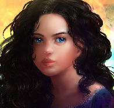  
Arabel

Decided to return to the Mayor’s place to clean it up, take care of lady Fiona’s corpse and her sons, visit the toy maker and then move northward to search for Arabel and drop Victor at the mistveil.

## Session 91 — The Mirror's Murderous Blade

*Eleasis 10*

According to Rudolph, the shadowy figure behind King Velikov is Vistani magic. The dusk elves are getting kept close by the Vistani. Vistani are the reason that the Mad Wizard lost support. They made the people believe that the outside world is worse than Barovia. Normally heroes are lured into Barovia by Strahd, but we weren’t initially. He wasn’t aware of us at first. That’s the reason Rudolph decided to follow us and not any of the other groups of heroes.

[Ik was hier even weg]: Apparently Rudolph has a Sabletooth Tiger?! The tiger has been trained to smell Vistani blood for half a year. Tiger’s been taken from another domain of dread.

	Cast Identify on the Magic Mirror in the mansion, revealing:  
Casting an identify spell on the mirror reveals that an assassin's ghost is magically bound to it. The spell also reveals the forgotten rhyme needed to summon the ghost:

*“Magic mirror on the wall,*  
*Summon forth your shade;*  
*Night's dark vengeance, heed my call*  
*And wield your murderous blade.”*

The entity in the mirror is the spirit of a nameless assassin who once belonged to a secret society called the Ba'al Verzi. If a creature speaks the rhyme while standing within 5 feet of the mirror and staring at its own reflection, the assassin's ghost appears nearby. The form that the spirit takes depends on the alignment of the one who summoned it.

In Darkon there was a sorority named **Ba’al Verzi**. Drink alot, projectile vomit, they’re descended from a wizard known as Mordenkainen, created a lot of useful and powerful spells. Comes from the planet **Oerth** (Earth).

Strahd has a very strong man as a butler called **Rahadin**.

Fynn said the rhyme, a handsome man with bloodshot eyes appears. He says: “Prove your worth”. Opens his cloak and reveals his scythe. Roll initiative. Proved ourselves worthy, defeated the ghost. Instructed it to kill Rahadin.

The group decided to sleep in the mansion, while Fynn wanted to stay in the inn. Stayed in the mansion anyway to great confusion of Rudolph and discomfort of Victor.

**Eleasis 11**  
Went on to go to the Wachter house, where we would meet Rudolph. House seems disgusted with itself. Roof and walls sag, moss on top. Fynn looked through bat’s eyes. Ground floor was clear of people. Upper floor: maid dusting bookshelves (north-west), the Wachter brothers (one sleeping, one getting dressed, north-east), someone in bed not sure if breathing (south-east), iron chest smells like treasure (south-west).

Knocked on the door and insisted to come in. Talked to the Wachter brothers inside the house. Told them about their mother. They didn’t take the news well, however it ended relatively well.

| Fynn: *“Do you know what my profession is?”* Karl Wachter: *“Cuckold?”*Fynn (deadpan): *“No. A wizard.”* |
| :---: |

Nikolai spoke of people in red robes and pointy hoods meeting Fiona in the cellars. Are they still in the cellar? Are they.. *friendly people,* Nikolai?! Nikolai takes out a little ball, a bead of a neckless of fireball, says “oh well” and explodes. After the smoke clears, both the brothers and the butler are dead, with Nikolai’s top half blown off and Karl’s arm ripped off. The butler is exploded beyond life. Managed to save the maid from upstairs and also recovered the body of the husband of Fiona Wachter. It has been hexed with the Gentle Repose spell, according to Rudolph. There is a feral woman running around upstairs on all fours. REALLY looks like Lady Fiona Wachter.

| Quote of the day: Barendd: *“If you were a cellar, where would you be?”* Mort: *“I think I would be downstairs”* |
| :---: |

Barendd and Mort found three more people in the basement. One of which told Barendd “you killed my wife, now you must pay”. End of session.

## Session 92 — Cultists Under Wachterhaus

*Eleasis 11 - Morning*

Fiona Wachter has been eating less and only red meat lately, according to the cook. Nothing else out of the ordinary. Cultist were holed up in a room with a summoning circle Some guy called Ernst was there and has now disappeared and reappeared as a incubus. Was supposedly the husband of the Fiona succubus. Searched all the dead cultists and found identical notes on all of them:

	*“CHANGE OF PLANS*  
*MEET UNDER WACHTERHAUS*  
*2 HOURS PAST MIDNIGHT*  
*WE WILL SUMMON HER BACK*  
*TO RULE VALLAKI*  
*FOR MOLIKROTH*  
*LORD OF HELLFIRE”*

Fiends don’t die, they go back to their home plane. A devil will only be killed when it’s killed in the Nine Hells, a demon in the Abyss, etc.  
“Lord of Hellfire” possibly refers to Mephistopheles, which makes sense, since [Arabeth](#session-83) already proclaimed that Meph is trying to gain power in Barovia. Not allowed in master bedroom for 4 weeks (40 days) now. Husband was given to the wizard of wines who would burn him and give his ashes to lady Fiona. Doesn’t live in Vallaki, but was coincidence that he was in town when Lord Wachter died. Lives in the east, south of Krezk. Family of the Martikovs (the owner of the inn here).  
	Oliver and Fynn casted Detect Thoughts and Identify on Lady Fiona Wachter respectively, to try to figure out what happened to her. Thought seem jumbled. Magically and mentally blocked by something. Some words keep repeating: “My husband, they can bring my husband back, please get him back, etc.”. Thinks she is a cat.  
	While Fynn was outside casting Identify, the rest of the group went inside to the sound of Haliq (one of the servants) crashing through the ceiling, leaving behind a metal chest, containing:

* A silk bag containing 180 ep, each coin bearing Strahd's stern visage in profile  
* A leather bag containing 110 gp  
* A wooden pipe that has been passed down through many generations of Wachter patriarchs  
* Five scrolls—notarized deeds for parcels of land given to the Wachter family by Count Strahd von Zarovich nearly four centuries ago  
* A blasphemous treatise bound in black leather titled The Grimoire of the Four Quarters, written by the infamous diabolist Devostas, who was drawn and quartered for his foul practices yet did not die (this is a forgery; the actual grimoire would drive a reader mad)  
* A very old letter to Lady Lovina Wachter (an ancestor) from one Lord Vasili von Holtz, thanking Lovina for her hospitality, loyalty, and friendship over the years

Identify reveals: cursed, two minds inside of her. There is the mind of a cat inside of her. Her own mind is trapped inside. Decided that Haliq would stay behind with Lady Fiona until tomorrow, since Oliver can only cure her curse the next day. Gave the other two workers money to stay at the inn.

Went to the toy maker. Guy sitting behind a desk working on a rocking horse. Pet monkey who apparently knows Rudolph. **Gadof Blinsky** is his name. Izek gave me inspiration. Apparently he started dreaming about a girl that looked like this. He said that one dream he was frolicking in a field with her. Said the girl felt like a daughter to Izek. Mary bought a doll from him 14 years ago. Model it after a children’s tale. Something about a shadowy figure who chased children in their nightmares and sweet girl (the doll).  
	There is a doll looking like a random woman we passed earlier near the Fistani camp. Will be here in a couple weeks to pick it up. Life size, made from human flesh. **Ireena Kolyana** was the name of the buyer. Gadof had a master called **Fritz von Weerg**, who’s dead now.

Outside, Rudolph told us Strahd tried to court Ireena Kolyana. She has trained to be strong enough to fight off Strahd. Doll could be a scheme to get away from Strahd.

Decided to go the the inn to talk to the innkeeper about his family member Wizard of Wines, try to cure Lady Fiona the next day and then probably head North.

## Session 93 — Wings Over the Blue Water

*Eleasis 11 - Early afternoon*

Arrive at the Blue Water Inn.  
Fynn drank a wine called Red Dragon Crush. Othe options was Grape Rash).  
Asked Urwin about Wizard of Wines:

* Urwin’s uncle  
* Grows grapes and makes wine, presumably using magic.  
* Was supposed to be here on the day of Mr. Wachter’s death, but never came.  
* Seen the Wizard last time three months ago, while he should be here once a month.  
*  One of the servants (Dhavit) seen him 4 weeks ago, but he smelt different. Like sulfur (like demons and devil). Also smelt like this in the basement recently

So we assume a devil or demon is impersonating the Wizard of Wines. He might be in trouble, like lady Fiona. Urwin wants to have a private chat with us after closing time (around midnight). Will let us stay at the inn for free tonight in exchange.  
Barendd went to take a nap upstairs, but investigated the shed of the inn first. Found a brown bag, out of which a giant goat appears from the bag. Gave the goat a carrot and left the goat in the shed and went to bed, but the goat followed him upstairs.  
Theothor never believed Fynn that there was a goat, narrowly missing it every time.  
Decided that Fynn would spend some time studying, while Theothor, Mort and Oliver went to the church to find leads about Babalysaga.

The book “Grimoire of the Four Quarters” contained:

*The grimoire revealed a number of rituals designed to summon devils from the Nine Hells of Baator. The work is full of notes on the different rituals written in the margins. Most of the devils in the book are crossed out with notes ranging from “unresponsive” to “non-complaint”. Three particular devils are circled: Vanath – imp Notes: “responsive” “eager” “possible replacement for Majesto” “likes shiny things”*

* *one quart blood of a virgin- half outlining pentagram and half in a polished goblet"*  
* *20 platinum or gold pieces arranged in a pentagram “may respond to well polished copper or silver”*  
* *invocation: “Vanath. Drink of the blood and serve.”*  
  *Erziran- barbed devil Notes: “responsive” “devious” “controllable” “desperately seeks its missing limb” “possible leverage”*  
* *the freshly slain corpse of an evil aligned humanoid “must have died sensing betrayal”*  
* *Blood arranged in pentagram*  
* *Invocation: “Erziran. Feast and hear my request.” “Requires three chanters”*  
  *Rig’thinaul- bone devil Notes: “responsive” “~~ambitious~~ dangerous”*  
* *the fresh corpse of an innocent “children preferred but not required- a simpleton or devout follower of the Morninglord may also work”*  
* *Entrails arranged in a pentagram*  
* *A magic item or scroll "doesn’t have to be of particular quality but must be functional"*  
* *ENSURE THERE ARE NO BREAKS IN THE SUMMONING CIRCLE. Do not allow him to leave the circle until properly bound.*  
* *Invocation: “Rig’thinaul. Take this offering and hear my plea.” “Requires five chanters”*  
  *Amongst the other devils, you find an incubus called "Larnak", with a heart drawn next to the name, and an imp called "Majesto", with the text "my dearest pet baby" written underneath it.*

Arriving at the church, we found a man sobbing. His name is **Father Petrovich.** Glowing bones of a saint were stolen, possibly by the gravekeeper called **Milivoj**. Strahd couldn’t enter the church and graveyard, because of the bones. So the bones being gone is a problem. They were in the crypt.  
Investigated the crypt, which door was forced. Walked around town to see if we could find Millevosh, but didn’t. Also Mort’s head was glowing.  
Fynn was trying to learn the Fly spell, which woke up Barendd. Attempted to make Barendd fly, but it failed, instead slowly turning Barendd into a goat. A Dispel Magic spell returned him to normal.  
The church boys arrived back at the inn, where they told Rudolph about the church and the bones, after which someone (Milivoj) attempted to sneak out of the inn. As he got outside, the boys found out it was Milivoj, but then went to get some drinks instead of going after Milivoj. Decided to find him working at night at the graveyard later.  
Oliver only has one living parent.

It is now night, nearing midnight. The inn is empty. Urwin told us there is strange magics from beyond at work, besides Strahd. He noticed while hunting a group of hyena-like creatures, but bipedal and wielding weapons.  
          Urwin followed them to a camp where dozens of tents were set up, a hundred or more of those creatures within it. Horses, both normal. skeletal and with flaming manes. Amongst the hyenas are also monsters, “vile blobs of humans, oozing pus”. Next day they were gone, camp broken up. He asked the others if they noticed anything similar and they did.  
He then changed into a were-raven. He isn’t the only one. They have been trying to protect Vallaki for some time, but they cannot take down the veil and lord Strahd himself. Only the wolves, bandits, etc. He asked us to take down Strahd, he and his brethren may be able to help fighting Strahd’s allies and armies.  
They visited the Wizard of Wines’ home and his family was there, but the Wizard wasn’t there. He was supposed to leave for Vallaki, but never arrived.  
There are around 20 were ravens willing and able to fight.  
Urwin: Babalysaga attacks Wizard of Wine often with scare crows. Makes spells, nasty woman. Often around his fields.  
	Barendd has a pouch of shiny rocks. There are embroidered hearts on the pouch.

Since it’s nighttime now, we decided to go to the graveyard to find Milivoj.

## Session 94 — The Corruption of Saint Andral

*Eleasis 11 - Late at night (around 11-ish)*

Blue bones laid underneath the body of Father Luccian, which Milivoj stabbed with a certain dagger, causing the body to melt and fuse together with the bones, DM was losing it and a creature appeared from the mixture. Milivoj said he heard the voice of the morning god.  Was instructed to strike when the town went into chaos (which we did). A vile creature accompanied them: “I was supposed to be the new saint”. It’s…

**The Corruption of Saint Andral**.  
Takes half damage of fire, psychic, magical bludgeoning, cold and thunder. Can create locusts.  
Mummies take double fire damage.  
Milivoj uses a dagger and throws acid, also takes double bludgeoning damage

Oliver received a curse causing him to be unable to regain HP. We split up to find a cure for whatever has felled Oliver.  
It says “I bring you from shadow into light” on the side of Rudolph’s wagon. He gave us a potion; the antidote for mummy rot.  
Found boy’s underwear in the priest’s drawer. Also some parchment with strange arcane words. It’s a scroll of Remove Curse.  
We used the potion on Oliver and kept the scroll.

Oliver snuck out at night to go to the brothel, while Fynn studied and Mort smoked a pipe. Got introduced to a lady called Zantri. I think she read him a story? Kind of a macabre story. Shim-shine.

Next day, Eleasis 12, we went to the Wachter house and cured Fiona. Apparently, her husband drank wine, fell ill and died shortly after. Wine Wizard imposter supposedly could bring him back. Turned her into a cat. Turned out to be an insufferable woman.

Got Victor and went north, with Victor on the back of Fynn’s horse.

## Session 95 — Bodies on the Lakeshore

*Eleasis 12 - Morning*

Decided to head north to the lake to the fishing docks north of Vallaki. Water is perfectly still, reflective. We look human in the reflections. Three row boats in the sand, one boat with one figure in it out on the lake.  
Found a kid’s body missing legs. Seemed to have washed ashore. Fist sized red circles covered their body. Fynn inspected the body. The legs were either crushed or pulled off.  
Further on we found a teacup from a children’s tea set stained with blood.  
Even further we found a small book of children’s nursery rhymes, followed by more little row boats on the shore. None of them are in a usable state anymore. Been destroyed by something.  
We set up camp a little further, where, during the night’s watch, a couple of pooping goblins slightly disturbed our camp a little. One of them was accidentally killed by Theothor. His name was **Ploempchuck** according to one of his friends who came looking for him. Apparently there is a group of about 70 or 80 goblins up in a gave over yonder. After Barendd agreed that we would help them search for Ploempchuck in the morning, he woke us all up and we quickly broke up camp to get going before they’d arrive back.

Next day, Eleasis 13, we went on our way, crossed a river by use of waterwalking and found another little girl’s corpse, containing no organs and also without arms and legs. A lit torch in the forest got our attention. Lead us to a ruined tower with light inside. Fynn sent the bat inside, only found a closed wooden chest inside, no creatures. Fynn went inside, no light inside except for a few rays of daylight. No-one there. Opened the chest, finding:

* Money (800GP, 500SP, 1200CP);  
* 5 potions of healing;  
* Dagger;

*There were zombies, but we killed them. Fynn was definitely there. Brave in many ways. He killed the zombies dead. With his powers of flame, arcane mumbles and coughs. Truly the hero the group needed. I love Fynn.*

## Session 96 — The Drunkard and the Kraken

*Eleasis 13 - Early Afternoon*

Got Victor to the veil. Fynn offered him Ury’s old cabin to stay in or told him to go to the guild in Triboar to offer his services. Human skull with red X painted across it, set on a stick at the veil.  
Fynn offered to go back to the lake to see if Arabel is connected to the mauled little girls who washed ashore. Rudolph’s tiger, while tracking Fistani scent, found multiple (4) bundles of Fistani clothes.  
Oliver interrogated a tree; apparently four Fistani people are were-turtles. They sneak here once a month when it’s full moon. Moon is all red and stuff past week. Put on colored bands on their heads and stuff. The tree told us that the thin part of the veil is a lie and  there is no way to leave this place. One of them is called “**Donnertelo**” or something.  
According to one of the trees, there is a monster in the water. Some octopus-like creature, which seemed consistent with the red marking on the girl’s bodies.  
We waved down a were-raven in the sky. He scouted out the person in the lake. Is a person in the boat is **Bluto**, a man from Vallaki. A fisherman. A drunk. Been acting very strange as of late: drinking a lot, disappearing for a while, then coming back to drink a lot. A guy drinking his grief away. There are two little girls in the boat with him right now.  
	Fynn cast fly on Theothor and Theothor flew to the boat. According to Bluto there is a “kraken” in the lake. Morgantha was apparently rowing onto the lake in the middle of the night. She offered little girls to kraken in exchange for peace.  
Bluto

Kraken got upset because Morgantha didn’t turn up to offer girls anymore. At the end, Bluto got resurrected and started fighting against us with the kraken.

## Session 97 — Arabel Saved from the Deep

*Eleasis 13 - Afternoon?*

Had a bit of a tough time with killing the Kraken, but we were victorious. Girl one is called Charlie. The other is Arabel.

**Eleasis 14**  
Decided to first bring Charlie home, hide Arabel in a chest and go to the Vistani camp to blackmail the Vistani.  
Charlie’s mom is the woman Oliver did the deed with. Ofcourse the rest of the group doesn’t know that. Received a Mind Crystal (Careful) as a reward.

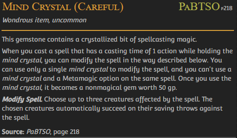

Dollmother Sanitarium was the name of the previous domain of dread we’ve been to. Rudolph has been there, but couldn’t go into the hospital. He was repelled by messages from ‘Blaidd’.  When we entered the hovel of the elven King Velikov who was friends with the guild master ‘Blaidd’ 400 years ago, but as far as we know Weaver has been the founder and leader of the Guild for always.

**Ideas:**

- Use our leverage (Arabel) to convince the Vistani to arrange a meeting at the Tser Falls (running water) (about 2 days travel from Vallaki)  
- Use the Truth Serum to have the Vistani give us information on items that could be used against Strahd.  
- Inform our raven friends to join as well.  
- Push Strahd into the waterfall.

**Alternative ideas:**

- Set up a fake meeting and sneak into Castle Ravenloft in search of helpful items and information

## Session 98 — Arrigal's Bargain

*Eleasis 14 - Afternoon*

Camp was empty apart from the father Arrigal. We decided to try to get a favor from Arrigal and some collateral so he has to keep his word. That way we have some time to plan and possibly try to get the Healing Stone from Babalysaga, find what is hidden in Krezk or go to the cellars of Castle Ravenloft.  
Arrigal said Strahd is not a good man, but is a lenient man. Also told us you need a potion to leave the domain, but Strahd must also allow you to leave. Arrigal sent Strahd a letter to let Victor leave. The Valaki can also only leave if Strahd allows them to.  
Before this place became shrouded in fog, the Vistani saved Strahd’s life.  
A carriage manned by skeletons will arrive at a point on the map named *“Point of no return?”* in a couple of days. That carriage will take us to Castle Ravenloft.  
Arrigal will send a letter to Strahd to set up the dinner. That is the only thing Arrigal could offer us, because he will not turn against Strahd. That would risk his people getting trapped here.

Szoldar Szoldarovich is running for mayor. Seems to be the only person, because he is the only one with a lot of posters hanging throughout the town of Vallaki. **Danika Martikov-Dorakova**, the wife of Urwin is welcoming us in the inn.

Urwin is actually also running for mayor.

Fynn spent some time studying and reading, Mort went to sleep, Oliver cast Scrying to check on the Wizard of Wines and saw many souls floating towards the moon(?), including the soul of the Wizard of Wines..

Urwin found hid father’s – The Wizard of Wines – body hidden in the bushes just outside of town.

Danika Martikov-Dorakova

The text Fynn read in the book about Teleportation 	Circles (but hasn’t told the group [yet]):

	*“Teleportation circles are 10-foot-diameter circles on the ground inscribed with sigils that link the circle’s location to a permanent teleportation circle of choice. Every permanent circle has a sigil sequence, and you have to know a circle’s sequence to link another circle to it. A teleportation circle can only link to circles on the same plane of existence.*

*To draw a teleportation circle, one needs rare chalks and inks infused with precious gems. A circle drawn with regular chalk will not work.*

*A non-permanent circle will remain open for around 6 seconds, during which anyone can enter the portal and instantly appear within 5 feet of the destination circle. Loose objects do not get teleported, but anything worn or carried will get transported.”*

**Eleasis 15**  
Rudolph didn’t quite like that the only thing we got from the Vistani was a dinner invitation with Strahd. Apparently he told us before that Strahd always invites adventurers to dinner. Rudolph stormed off angrily and we discussed what to do about it, going from killing the Vistani down to demanding something more tangible, possibly using intimidation.  
Arrigal name dropped **the Amber Temple**. Claims he doesn’t know what it does. It’s a dark place containing evil vestiges in the Belamock(?) Mountains, founded by wizards long ago. Dark secrets corrupted the wizards. Rumor: Amber Temple source of Strahd becoming a vampire.  
After the party was divided on whether to kill the Vistani or leave the camp, we narrowly landed on leaving. This made Rudolph very angry.

Wizard of Wines had scorch marks and was stabbed. Urwin already burned the body of his father and left it floating on the water. So we couldn’t investigate it.

Decided to go to the Ruins of Berez to find Babalysaga and then head further south to go to the Amber Temple. Will pick up next time traveling to The Ruins of Berez.

## Session 99 — The Walking House of Berez

*Eleasis 15 - Morning*

We started traveling. The bleeding moon has gotten ever so slightly larger again. Set up camp. Fynn read the rest of the book on teleportation circles:

*“Many major temples, guilds, and other important places have permanent teleportation circles inscribed somewhere within their confines. Each such circle includes a unique sigil sequence—a string of magical runes arranged in a particular pattern.*

*A permanent teleportation circle can be created by casting this spell in the same location every day for one year.*

*Interestingly, non-permanent teleportation circles stayed open for a lot longer before the Second Sundering. They functioned for slightly less than three hours, and this duration could even be extended by experienced casters.”*

**Eleasis 16**  
Black clouds of flies everywhere. The fog is thinner on the far side of the river where a light flashes. Arrived at the ruins. Small ruined cottages with a yard around them. Only the dirt road is intact (well-maintained).  
Decided to split up: Theothor and Mort took the right path and Barendd and Fynn the left. Various scarecrows stand in the fields. Fog is thick here. Theothor and Mort approached one of the scarecrows and Theothor kicked one. Only heard some strange rustling, but nothing of note happened. Except that, from a distance, Barendd and Fynn saw the scarecrow get back up again after Theothor and Mort walked to the next one. Barendd also struck one of them with his maul, ripping it open, showing organs and blood. Inside, between all the raven feathers is a working organ system. The head popped back onto the scarecrow. Fynn tried to back away, bumping against another scarecrow.  
Shadowy tendrils tried to grab Theothor’s leg as he tried to kick one. Its eyes start to glow red and it starts to grab Theothor. Combat ensued, periodically hearing an ominous roar and feeling tremors. The tremors were the appearance of a house emerging from the ground. A house on tree roots.  
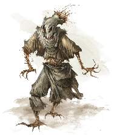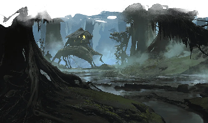  
Scarecrow			Baba Lysaga’s Walking House

There is a chest and an iron tub stained with blood. Ghastly wooden crib with a small angelic child sitting in it in the middle of the room. Everything but the crib is bolted to the floor. Light shines through the cracked floorboards underneath the crib.  
	“Killed” Baba Lysaga, throwing her off the hut. Baby turned out to be an illusion. Barendd found a gemstone “heart” powering the hut, but couldn’t take it out. Theothor narrowly escaped death, but not before taking out the [Heartstone](https://5e.tools/items.html#heartstone_mm) from the hut, causing the hut to collapse.

Baba Lysaga

Theothor also opened the chest, which contained:

* 1300gp  
* 1 chrysoberyl, 100gp  
* 1 garnet, 100gp  
* 1 pearl, 100gp  
* 1 spinel, 100gp  
* 1 tourmaline, 100gp  
* [a vial containing oil of sharpness](https://5e.tools/items.html#oil%20of%20sharpness_dmg)  
* [a spell scroll of mass cure wounds](https://5e.tools/spells.html#mass%20cure%20wounds_phb)  
* [a spell scroll of revivify](https://5e.tools/spells.html#revivify_phb)  
* [1 pouch containing ten +1 sling bullets](https://5e.tools/items.html#%2B1%20sling%20bullet_dmg)  
* [a set of pipes of haunting](https://5e.tools/items.html#pipes%20of%20haunting_dmg)  
* [a stone of good luck](https://5e.tools/items.html#stone%20of%20good%20luck_dmg)  
* A piece of paper containing the text:  
  * Ever since he was a babe, lord Strahd was my sole purpose in life;  
    His gift for the darkness was incredible.  
    But he ignored me.  
    Kept ignoring me.  
    Shunned me.  
    I was at my wits' end.  
    But this Mephistopheles…  
    I've never seen or heard of dark powers like his before.  
    Could he have been my true lord and savior all along?  
    He wants me to rule over this domain.  
    He will help me take over.  
    I will devote myself to him.

## Session 100 — Cold Road to the Amber Temple

*Eleasis 16*

There is a monument that strongly resembles Ireena Kolyana. The inscription on the base of the monument says Marina, Taken by the Mists. Also found a scroll of Puppet in the old church. Marina and Ireena could be twin sisters maybe? Or an ancestor?

went on our way toward the Amber Temple, set up camp. Fynn read the first half of the book on the Red Wizards of Thay:

*For centuries, the leaders of the Red Wizards and in fact all of Thay have been the Council of Zulkirs. The ruling body comprised eight of the most powerful Red Wizards, each of whom represents one of the schools of magic. Each of the zulkirs and their subordinates fomented intense rivalries with one another, leading to great feuds and near-crippling internal strife.*

*The Red Wizards have historically been fraught with in-fighting and turmoil. As the stakes rose over the years, these conflicts became more dramatic and impactful to their operations.*

*In the years before the mid–14th century DR, the Red Wizards divided themselves into two separate ideological groups. The influential Imperialists sought to conquer Faerûn, by military might, subterfuge, or any other means necessary. The Researchers took a more isolationist stance, preferring to focus on arcane research within the safety of the Thayan Plateau.*

Some strange dinosaur monster seems to reside in the Luna Lake. Paid it no mind.

**Eleasis 17**  
The path towards the temple got colder and colder, even snow appearing on the road. Arrived at the temple though.  
Body in the doorway, blood trail leading into temple. Body is an elf, probably dusk elf.  
Between his shoulderplades a single stab wound, quite small, maybe by a dagger. Around the wound; small black spots. Possibly poison? Also an exit wound in the front. Wound is made by quite a broad sword.

This elf is wearing pretty clothes, some type of butler or a rich man’s servant. Only found two silver and a crumpled up piece of paper that contains a small hand-drawn calendar with a couple of dates of this week. Yesterday (Eleasis 16 is circled). *”Need to head back to castle Ravenloft this day the latest.”* Pretty sure it was Rahadin, the guy we instructed the mirror assassin to kill. Also found a very small snake in his boot.  
The Body of Rahadin  
Also the nametag  “Rahadin” stitched into his underwear was kind of a giveaway.

Everything inside is dark and covered in amber, giving a golden shine to it. All the doors are from amber with iron hinges and fittings. Sense magical creatures behind the arrow slits. We turned around and went back up the stairs. Then we saw Mort getting shot at with chain lightning from the big statue.

Got attacked by two scary flying creatures. Statue kept blasting Fire Bolts. *“Did you stab my friend Rahadin?”*, Mort heard in his head. It also asked Mort if he tried to save Rahadin. Said it was too late for that. Then Mort got Hold Person’d.

One of the two creatures we fought →

## Session 101 — Secrets in Golden Amber

*Eleasis 17*

The statue’s head is covered in unexplainable darkness, a void. Mort broke down the statue, from which a creature fell. A fox-like creature.  
One of the man in the west room is called **Borg**. Seemed friendly. Even offered us to use their special healing flame. Wanted to set up camp here in the temple.  
The fox-like creature exploded, leaving ashes and small gold spectacles with pink crystal lenses as well as a Robe of Useful Items containing:

The Fox-like creature			          The items contained in the Robe of Useful Items

The people in the room, one of which is called **Helwa**, are dwelling the mountains, because they can live there in peace.  
Found a corpse clutching a staff. Fynn grabbed the staff. Until his next long rest had an extra flaw: *“I crave power above all else, and will do anything to obtain more of it.”* Turned out to be a Staff of Frost.  
Found a model of castle ravenloft.

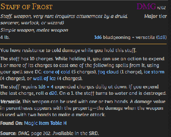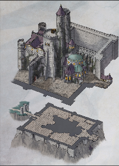

Found a book in a chest. It’s a Tome of Understanding. We took apart the model of Castle Ravenloft. Below are the prints of it:  
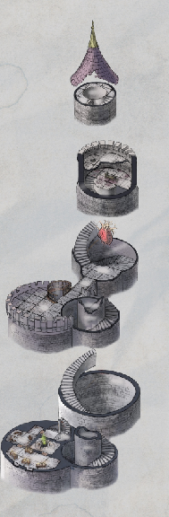  
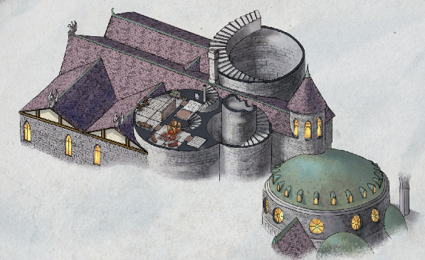  
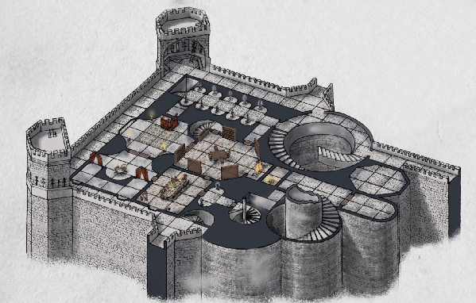  
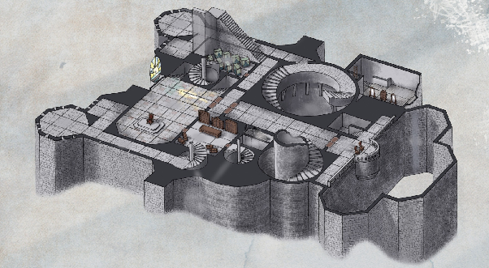  
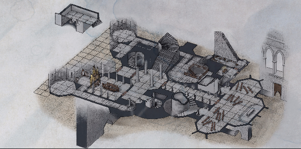

Black fluid starts flowing out of Fynn’s eyes when he touched a sarcophagus in the Amber Temple. Theothor sensed that this entire temple is evil as fuck. Fynn then got jumped by four creatures inside a small room.

## Session 102 — Whispers of the Nothics

*Eleasis 17*

Strahd Lore:  
*“I am the ancient, the lord. My beginnings are lost in the past. I was good and just, but the war years and killing years wore down my soul.” - Strahd (paraphrased)*

Strahd fought many battles for his people, with his brother Sergey at his side as his adviser. They lived together, but their relationship ended in resentment. Tatiana, Strahd’s muse, left him for Sergey, because Strahd turned dark. That led to Strahd killing Sergey, after which Tatiana killed herself.

That’s when Strahd became a vampire.

We fought Nothics, which Fynn remembered from his time in school as one of the most dangerous creatures, often used as a warning to students. They are wizards who dabbled in secrets, but failed and have ultimately gone mad. Fynn almost gave in to the urge to seek those secrets as well, causing his eyes to glow green. But fortunately, we fought the Nothics off.

Theothor then entered a seemingly empty room, but some sort of spirit threw books and other stuff at him. We fought the spirit, who caused Fynn to age 40 years (until next long rest). Barendd also aged 10 years. Found 15GP with Strahd’s head on it.

We then heard what sounded like large heavy footsteps somewhere in the temple.  
In one of the rooms we encountered what looked like a hole in the ceiling, except it didn’t have any depth. Almost like it was painted on

.	Corym Lore:  
*“It’s been a long time, Corym, since diamonds fell into your blood-filled cell.” - DM*

18.635 days have been etched into the walls before the walls were completely filled. Not seen the outside since she was just a small child. Then darkness. She shared a body, soul and mind with Karn, but ever since Karn died, she’s stuck here.

Bits of Karn lay in the cell. The other cell sometimes contain a dwarven skeleton, sometimes Forgeback. She doesn’t know why the bodies switch.

The only thing keeping her sane is a cornelian connecting her to Gorgel.

*“Sometimes you dream of a building; this place keeping powers, after which you always remember: The Gift of the Dark Star” - DM*

We found a journal containing traces of magic, but its contents were (magically?) erased long ago. We found a room filled with treasure. We then found out what caused the trembling earlier, as Theothor was promptly lifted up into the air by a giant Amber Golem.

## Session 103 — Zryngala, the Howling Storm

*Eleasis 17*

Decided to check out the crevice in the wall. Some murials depict tentacles encircling kings and queens in the room behind it, as well as a much bigger Amber Sarcophagus. Will swing around to it later from above. A voice comes from the south of the hallway.

Mort is from an orphanage?

Fought a witch and her animated broom as well as three flame skulls she tried to trap. Afterwards, Fynn ran into a room to touch a sarcophagus, after which a storm appeared inside, accompanied by a floating eye. Called Zryngala, the howling storm. I possess the power to create lightning. Touched the eye, as the world flashed white for a moment. Chose left. Left side of Fynn’s face has gone numb. Gained more power though. Fynn tried to continue touching sarcophagi, but was quickly subdued by Theothor and Barendd, after which Oliver put Fynn to sleep. Decided to sleep at the camping people, but not before Oliver sent out his Arcane Eye to scout the temple: another Amber Golem, bodied are still there except for the three flame skulls.

**Eleasis 18**  
Found a guy in a room. He and his master got attacked by Flame Skulls, stuck here for a week. His master was the great Jakarion, the master of the Staff of Frost. Guy was named Vilnius. Took his spellbook, but gave it back. Kept his amulet though. Escorted him out of the temple. Afterwards, another Amber Golem crept up behind us.

## Session 104 — Exethanter, Keeper of the Temple

*Eleasis 18*

Defeated the Amber golem and three fire skulls. Fynn summoned two hell hounds.  
One wall doesn’t have amber covering it.  
Shattered obsidian statue. Found a skeleton holding a mace with a wick, like a candle.  
Found a hidden staircase leading to a room with three sarcophagy, “guarded” by seven ghasts. These sarcophagy called out to Mort and Theothor. Mort resisted it, but Theothor heard whispers calling out to him, calling him the true king of Oreskos. “Do you want power fit for a king?” and sees a vision of the plains of Oreskos, seeing one of the many prides he technically rules over. Santras, the King Maker.

Found another obsidian faceless mane statue on the other side of the temple. As well as a chest attached to the ceiling, which Theothor opened, revealing a hidden wall. The room behind it was filled to the brim with human skulls. The floor of the room disappeared, throwing everyone except Theothor (hanging from the ceiling).

Found a very luxurious room. Standing in the room a skeleton with glowing red eyes. It doesn’t know its name. Doesn’t really remember anything. Has short term memory loss. Wanted us to read a book he wrote, because he can’t read anymore. Fynn picked up the book; it’s a spellbook titled: “The Incants of Exethanter”. As Fynn read the title aloud, a wall fell down revealing another room with an arm/hand clutching a box made of bone(?). The guy touched it, said it felt like a pulsating heart.  
The spell book contained spells of all 9 levels, including Power Word Kill. Fynn warned the rest of the group that he might be dangerous if he regains his memory. But could also be hidden here by Strahd. He vaguely remembered Strahd and knew that he had no alignment towards Strahd. Remember Strahd coming to the temple, asking for help. Help with a woman. Pointed him to the amber sarcophagy. Told him those might hold the power he needed. Doesn’t know if Strahd listened, but he does know that not long after he left a darkness swept over this temple and he hid himself away. “Since then I’ve rotted. Since then my muscles have thinned and faded away.” Lost his lust for knowledge. I am Exethanter, keeper of the Amber Temple.  
How did the powers get here? → Long before our world was born, evil was merely an energy roaming through the universe. Everything was energy. Then it took form, as did other things. But people didn’t like the evils, so they trapped the greatest evils in amber, thinking amber holy, but they were wrong. They made this temple to keep the evil hidden away, but instead the amber was corrupted by the evils. The sarcophagy each contain an arch evil. “Evil is the name we give the loser of any war, of any battle”. Some of these were simply the losers of their era. But some of these are still very much evil by today’s standards. Greatest evil of all tempted him. Same room he told Strahd to go. He will take us there, but assured us NOT to become tempted by the greater evils.  
A library here holds information on all the spells known to man. Cannot take the books out of the library though.  
Beyond the library there is a spiral staircase to a room. This is where we find the evil hidden in sarcophagy.

## Session 105 — Zhudun, the Corpse Star

*Eleasis 18*

In the Library:  
Book of evil that hurts when read. It disintegrated when hurled out of the room.  
Book that smells like the thing you love. For Mort, it was salted fries. For Oliver, it was cotton candy. For Barendd, it was Mumpena’s hair. Barendd kept sniffing the book.  
Book of flesh that whispers. It does not disintegrate and has knowledge about Exethanter:

The weakness of Exethanter the Lich.

1. Tickling.  
2. A strange, very well hidden box made of bone, which is his heart and phylactery.

Barendd saw a sarcophagus. It reminded him of Mumpena. He touched it.  
Darkness all around him. In here, torches keep lighting up around him. It is in the Underdark. A strange female voice keeps talking to him, asking him if he did not forget her. It turns out to be his mother. Apparently, they do not have a good bond.  
Barendd blames his mother for what happened to Mumpena. His mother does not like Mumpena.  
Barendd and Mumpena wanted to be merchants. Run a little shop together.

The voice changes - or another voice appears - as Barendd’s mother starts bleeding. The voice is telling she does not control Barendd. She promises him untold powers and freedom. The power to be with Barendd.  
Barendd can see the stars - which is weird in the Underdark.  
The voice reveals itself: Zhudun, the Corpse Star, a red star in the sky. It offers Barendd the power to bring one person back to life. It requires a part of the original body.  
Barendd refuses, but he stays there. It feels like months of nothing - no sleep. hunger or thirst. After a very long time, the Corpse Star starts growing. The world around him slowly changes, and seems to lose its shape and form.  
Barendd shouts to the sky. He still refuses! he is Barendd!  
The corpse star, after a long while, starts falling down, crashing down on Barendd.

Meanwhile, Mort and Oliver see Barendd Collapse. Several attempts are made to bring him back, but he seems to be more than gone. There is no pulse, but he seems to not even be a creature anymore.  
We then hear noise coming from the boxes. Mort kicks one, and a vampire jumps out. So do more. As we fight, Barendd comes back with a radiant explosion!  
We beat the vampires, but they do suck some of our HP.

After combat. Mort and Barendd are charmed by the sarcophagus. Oliver cast Suggestion on Mort, ro prevent it. Barendd still touches it, and dreams of Mort and Oliver taking his blood and teeth by force. Meanwhile, Oliver casts Greater Restoration on Barendd.

Upstairs, Theothor has learned to read. It is mostly about making things shiny.  
Barendd also shares about his experience with the sarcockagus. The star reminds him of the current moon. Mufasa nods.

Oliver’s history check:  
Strahd came here - 400 years ago -  
Rahadin was dead at the entrance of the temple. The squirrel knew Rahadin as a friend. The berserkers were here, but knew a lot about it. Vilnius was also here. Also a hag. Also Exethanter.  
The temple is rather busy.

We decided to rest in Exethanter’s room. He is confused about it.

## Session 106 — The Lycan Lance

*Eleasis 19*

Mort now only has one eye. Exethanter heard some noises in the library, like people moving boxes. Why would someone move boxes of vampires into this temple? Sometimes people performed rituals before the sarcophagi and received powers. Tiny bit of evil then leaked out of the sarcophagus. Reminder: the temple is a place where evil is locked up. Considered the possibility of sealing the entrance.

Decided to leave the temple behind us, with Fynn failing to seal the entrance and Barendd pretending to close up the passageway on the southwest side. Stacked up some rocks in front of the entrance and left some ball bearings in a desperate attempt to block passage.

Went on our way to the estate of the late Wizard of Wines. Along the path we encountered a wall lined with statues of demonic creatures. The iron portcullis we entered through before is now closed, with a green flame behind it. Fynn couldn’t dispel it. Theothor came up with the idea of using Fynn’s bat to try to find something in the guard tower.

Green eyed wolf’s head on the wall. A key fell out of it’s head when the bat hung from it’s lower jaw. When flying back, the rest of the group saw the statues on the top following the bat with their eyes/heads. Theothor threw a javelin at one of them, causing it and another one of them to attack us.

Vrocks are resistant to fire and lightning damage

After defeating the Vrocks, we remembered those weren’t there before. The soldier looking statues were, though. Fynn almost died due to being trapped between the portcullis and the fire. Theothor saved him though.

Investigated the guard tower. Went to the top. Statues of female knights holding lances on top here. One of the lances seems like it’s made of bones, teeth and claws. Everytime we get close to it, it seems to reappear in the hands of one of the other statues. Managed to take the lance. Turned out to be a Lycan Lance that might be useful against Strahd. Had a short rest.

Resumed onto the bridge, where Theothor saw the body of Vilius drop on top of the bridge. It was dropped by a giant bird.

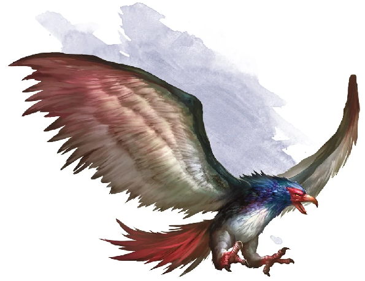

## Session 107 — Battle for the Vineyard

*Eleasis 19*

Defeated the Roc and the resurrected Vilnius  
Moon is still getting larger and still bleeding, but also seems more beautiful and enthralling than before.

**Eleasis 20**  
Nothing happened. Fynn read the rest of the book on the Wizards of Thay before bedtime:

*After Szass Tam seized power from the Council of Zulkirs, the Red Wizards underwent a more severe divide. Both the zulkirs and the Red Wizards loyal to their respective schools were forced to choose a faction in the growing conflict: either remain with those loyal to their Thayan way of life, or side with Szass Tam and his ever-expanding cabal of liches, vampires, and other undead spellcasters.*

*When the war ended, Szass Tam emerged victorious. He reshaped Thay into the domain of the undeath in Faerûn, and supplanted the fractured Council of Zulkirs with those loyalist undead wizards who had embraced his "way of life", as it were.*

**Eleasis 21**  
Arrived at the vineyard. There’s a man at the edge of the trees. Called us the “Fisticuff of the God’s Tears”.His name is Davian Martikov. “The trees might have ears”. Took us into the forest, in his 70’s, grey hair, muscular, big nose, big chin, big beard. With him, 4 children: one teenage boy, two younger boy and a young girl along with three man and woman. Most look similar, except for one adult man, who looks a bit more pompous.

Adrian, Elvia, Stephania, Dag, Claudiu, Martien, Vigio, Yolanda

Davian received a letter from Urwin (who is his nephew), informing him of the Wizard’s death. Graveyard has repeatedly been attacked by druids. Children cannot transform fully yet, but the entire family are were-ravens.

They deliver wine to all over Barovia. They’re the only vineyard. Think everyone deserves some form of joy and they deserve some money. For generations the druids have attacked the vineyard encouraged by Strahd. Baba Lysaga also sends some scarecrows from time to time.

We were founded by a mage whose name was buried. Fashioned magic items three, each one as big as a pine cone and planted them, which grew into grape trees.  
One of these gems was dug up and stolen 10 years ago, causing the family unable to grow the best vintage wine. Three weeks ago, another gem was found dug up and taken and I believe it to be in the possession of Baba Lysaga.  
And then 5 days ago Druids attacked and stole the final gem. The Martikov family launched a counterattack, but failed. 20 family and 50 workers to start with. 9 of the family remained, workers all died.  
Two days ago the druids returned with blights, taking over the vineyard and poisoning the preservation barrels. Asked us to defeat the druids and clear out the vineyard.  
Apparently the walking hut was just a baby and there is another hut that can also talk.

Inside there are probably 3 druids and 30 blights. Twig Blights could possibly be vulnerable to fire. Tougher ones not vulnerable to bludgeoning.

We almost got Rickety-fucking-rekt by the druids and the blights. And by almost I mean.. we still could…

## Session 108 — Victory Among the Vines

*Eleasis 21*

*Tree Blight* has no immunities, resistances or vulnerabilities. We turned the tides and defeated all enemies. Confiscated a weapon from one of the druids:

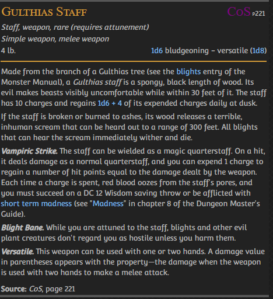

Also learned that the seeds/gems caused the vineyard to become a restful place. Those seeds are probably held by the arch druid (who wasn’t at the vineyard) at Yester Hill. We discussed at length our options, but opted to go to Yester Hill and devised the outline of the following plan:

* We scout out the premises extensively beforehand, if needed with the use of Fynn’s bat;  
* Mort will go in there to sneak the seeds out of there;  
* If shit hits the fan, we bail. If possible we’ll try to get Mort out of there, but no promises.

  
There are three seeds. Below are what the number of seeds would bring the Martikov’s:

* One seed: restful and poor wine;  
* Two seeds: at ease and better wine;  
* Three seeds: beautiful, able to make superior healing potions every 10 days.

Mort received a superior healing potion.

Went on our way south towards Yester Hill.

## Session 109 — Theft on Yester Hill

*Eleasis 22*

Slimy rocks 10ft high surround the hill. The earth around them looks soft as if someone has recently dug a hole there and filled it again. Look like graves. Each and every one of the rocks is the same. Dozens of these rock with the same pattern around them. A human man crawled out of one of the holes and walks over to the next rock, starts digging another man out of that hole. They say to eachother: *“How did you sleep? I sleep good, yes. How did you sleep? No quite bad dream. About what? Felt we were unsafe. Ah no, no, no, we are very safe here. There are dozens of us always sleeping here ready for action. And we can always call up hundreds of others.”*  
Lightning strikes the top of the hill. Specifically a statue. Statue of a cloaked man with fangs. It depicts Strahd. Roots grow around it. Hidden in the field are another 12 graves.  
Tiny flowers grow on the hill.  
Tree is unlike another other. Blood oozes like sap from its twisted trunk. Six needle blights, also a humanoid skeleton.

**In the mist to the west saw a white fortress on a hill atop a distant city and faintly heard church bells. Tens of miles away though.**

Humanoid → On its head a skull with large green glowing antlers → Arch Druid

Cast our spells on Mort and continued with our plan. Mort tried to burn the roots from the statue (where possibly the seed is in/around/under), but it didn’t work. Roots look like the big tree further on. Also the staff we found on the druid seems to be made from the same tree. Mort did find the seed embedded in the chest of the statue. Reached in and took the seed from the chest cavity. Instantly the statue crumbled, causing ***everyone*** to be alarmed. But Mort, with the help of the spells cast on him and his superior dexterity, as hundreds of blights appeared from the hill. Mort broke the staff, causing only some of them to wither, but hundreds still to remain, gathering on the location of the sound.

## Session 110 — The Blight Horde

*Eleasis 22*

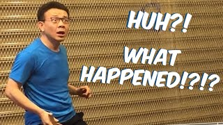

## Session 111 — The Pool of Saint Markovia

*Eleasis 22*

Wake up in bed. A warm bed.

Theothor’s sack is now canonically called “The Bag of Whatever”.

Fynn has eaten some Dutch Pea Soup with Sausage.

There is something called “The Abbey” in Krezk, so perhaps that’s the place we need to go. Davian gave us a piece of paper with his stamp and signature, so the people of Krezk might trust us a little more. If anyone asks us to drink from the pool at the shrine, we should. It’s apparently a pool that was blessed by **St. Markovia**. Supposed to defy corruption and evil cannot drink from it.

Theorized that perhaps it is possible to fly over the mist. Fynn sent his bat westwards to see what would happen. Told the Martikovs that the bat would find them if it survived to let them know that it is possible to fly over the mists. Fynn’s bat however, encountered another bat along the way. It’s a vampire though. It’s Strahd. Looks weaker than the images on the coins though. Fynn’s bat thought “My master can take this guy”.

**Eleasis 24 I guess**  
Arrived at Krezk. There is an abbey with a church bell further on beyong the walled settlement. A purple wagon with golden trims around wheels. Sign: keep out. No horses around. Poorly hidden behind a large boulder, covered in snow and mud. Took note, but ignored it for now. 20ft high walls, two towers, two iron bound wooden doors. One of the guards has an uncle who has a shop in Barovia.  
Mayor of Krezk = **Dmitry Kreskov.** Asked us some questions and we offered them an expensive bottle of wine we had with us. Ultimately allowed is in.

It’s just a scattering of wooden cottages surrounded by pine trees. Dirt roads only. Dimitri’s wife is called Anna. They used to have four children, but all of them died of illness. Last one called Ilya died seven days ago. Was only 14 years old. Old man Petrov died recently, we can stay at his house.

Offered us water from the pool. Little Shrine nearby. Shrine of the White Sun. Markovia was a priest of the Morning Lord and was hailed for storming castle Ravenloft (and dying). The Abbot arrived over a century ago and hasn’t aged since. The abbey’s bell rings all the time. Very annoying. Also heard some human screaming.

Statue of a man with amrs outstretched stands near the gazebo. A mournful bare-chested man with a six pack. Everything is in quite a bad shape. All texts here have long been faded. Beyond the magic of the group, Fynn detected evocation or abjuration magic on the pool. Might have healing powers? Theothor sensed that the pool is also consecrated. The statue has some faint traces of consecration. Drank from the pool. Has awesome effects.

Continued towards the abbey. Two weary creatures appeared from behind the walls. One of them is 4’5” tall, left of her face is covered with lizard scales, right with tufts of wolf fur. In between One of her eyes is cat-like and has cat paws. **Otto** is 4’9” tall, and is squatting. Looks like a beardless dwarfs with patches of donkey flesh, one human ear and one wolf ear. Legs and feet are leonin, hands and arms are human, part wolf fur on his body. They took us to the Abbot.

## Session 112 — The Abbot's Perfect Bride

*Eleasis 24*

They don’t want to talk about what they look like or how that came to be.

Bronze plaque read: *“May her light cure all illness”*. Scarecrows on top of the walls. Someone is tied to poles. Screams come from one of the sheds. Zygfrek said *“Those who need punished, shall be punished”.* Fynn asked if the people being punished were non-believers. In response, the person bolted to the poles screamed: *“Believers? No one believes here anymore. Belief is dead.”*

The Abbot is quite a dominant person, commanding a girl to leave and both Otto and Zygfrek being terrified, deathly afraid by a single remark. Says the screaming is self induced. All of the people here were once human. This place was taken by a curse long ago. A vampire has taken the land and made it his own, while also being his prison. Some people are content living in fear, some have hope and others try to do something about it.  
	The Abbot believes the answer to breaking the curse is love. He’s trying to create the perfect bride for Strahd after the image of Tatiana. He’s also looking for the woman bearing Tatiana’s soul. He found that woman, but she fled. He does have a bit of her auburn hair though. He’s experimenting with trying to change people, but has failed many times. Calls the woman “the ancestor”.  
	He wants to present the bride, but lacks a gown. He knows that the wife of the mayor there had a wedding gown. Vasilka bears traces of the soul of Tatiana. A replacement for Ireena. She is the true reincarnated soul of Tatiana. Guy is more than a hundred years old, but looks like an 18 year old God.  
Symbol sun above the hearth. Also a sun symbol on a chain around the Abbot’s neck.  
Found a hidden compartment in the wall above the hearth. Crystal and Electrum flask containing a Potion of Superior Healing. Next to the potion lies an ancient tome, titled “The Tome of Strahd”.

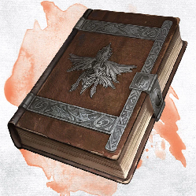

*“I am the ancient, I am the land…”*  
*“Only sun can kill me”*  
*“A stake through the heart would stop his movement.”*  
*“Sword that Sergey brought might be a threat to Strahd.”* → Do we have that sword?  
*“Seal shut the walls of the stairs, so nobody can disturb my true body.”*

Abbey was haunted by the spirits of the people who lived here before the current abbot.  
Found the Sunsword hidden inside a scarecrow. This was the sword mentioned in the dome.  
We then got abruptly jumped by these creatures:

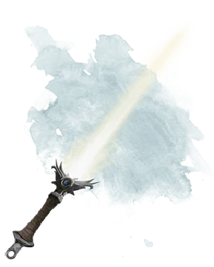  
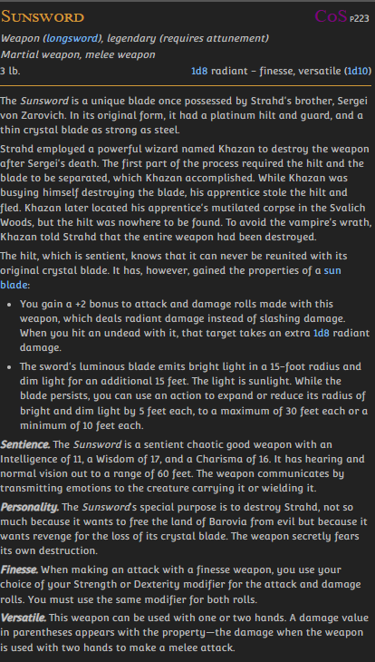

## Session 113 — Madness at the Abbey

*Eleasis 24*

Abbot still has the Tome of Strahd. Smoke from the Abbey. Only a single female scream remains coming from the Abbey. We busted through the gates. The courtyard is blackened, scorched. A disembodied Zygfred crawled towards us: “The Abbot went mad. He burned his daughter. He burned us. Flee before it’s…”. We barged into the room we were in before. We hear an orchestra playing, everything is black. The fireplace has exploded.  
Fynn and Mort confronted the Abbot, who said: “You, you came here for the tome, did you not? But the tome, it is not yours. It is mine to protect. It is mine to protect from those who seek to harm the Lord Strahd.”  
Theothor went up the stairs to try to find Vasilka. Theothor found out, using his Divine Sense, that this abbey is part of some deeper layer of dread domain. It is very faintly consecrated.  
Sometimes the walls turn black, sometimes the creature fades, sometimes his feet are burning hot. Found her underneath a cloth. Raised her hand as if waiting to give her a kiss on her hand. Instead, Theothor grabbed her hand and in response, Vasilka tried to grapple him. It did not work, but she is incredibly strong. Suddenly she turns into:

Fought the Abbot, Vasilka and some other creatures.

Brutus and Bone are no more 🥹

During a moment of clarity, the abbot said: ***“Don’t read the book. It is cursed to make you its protector once you read it.”*** Then phase two of combat ensued. Managed to defeated him once more.

The Tome of Strahd was left behind. Fynn took it with him. We checked the rest of the abbey, but found little more than rotten furniture and dead bodies. Until Mort found a living woman in one of the upstairs room. Her name is **Ezmerelda D’Avenir**. She’s a vampire hunter.  
	→ “Have you also found the symbol?”  
Her plan was to wait until the abbot lured Strahd here and then assassinate Strahd, after which she wanted to teleport using a teleportation circle. She is in possession of a Vorplan sword, which has a 5% chance to cut off the target’s head.

Fynn and Ezmerelda had a little thing together. Turns out she is Fistani from another domain of dread. Fistani are the people who can travel between the domains. She is from Darkon (same place as Rudolph). Her family kidnapped Rudolph’s teenage son Erasmus. Darkon was also ruled by a vampire, which liked to feed on children. Erasmus was fed to the vampire lord. Rudolph spared her parents after interrogating them. Then her parents kidnapped Rudolph’s other son. This pretty much explains his hatred for the Fistani.

Rudolph is traveling to the tower of the Wizard of Kazan, according to Ezmerelda. She’ll follow from a safe distance.

## Session 114 — The Cursed Tome

*Eleasis 24*

Decided to talk to the mayor before sleeping and leaving Krezk.

Got thinner, eyes lost their magic, glow, stopped playing with friends. Only stayed in his rooms. Spot on his arms, then shoulders, then rest of his body. Spots were variable in size, some pinpricks, others more like pimples (so overall pretty small). Dark blue, purple maybe. He also became cold to the touch. Then he slept less and less, stopped eating. All the children died when they turned fourteen. Parents feel like their bloodline is cursed.

Went to our house we had been allowed to stay in. We had to break in though. Found out the Tome of Strahd is Cursed and that Oliver is unable to break the curse. He can only cure someone affected by the spell by touching the book and casting Lift Curse.

Oliver scried to find out more about Gertruda:  
*“Delicately lit room, west wall heavy red drapery’s, tall white candles burn with bright steady light. Large bed against north wall. Carved into the headboard is a large Z, young woman in a nightgown. Arched double doors lead to the south and east. Look out of the window: Castle Ravenloft. Seems unhurt and oblivious of danger. She seems to have twisted her reality, as if she thinks this place is where she’d always been.”*

 *“Turns out Gertruda is a cutie.”* ~Fynn

**Eleasis 25**  
We set off due east. Encountered Demonfeed Spiders, which we swiftly defeated. The bridge to Krezk has collapsed behind us as we proceeded towards the tower.

## Session 115 — The Fall of Vallaki

*Eleasis 26*

Elian Odomir was revived, party has gone. Legs are numb, unusable, you fall over, grabbed by dragon into air. Armor crashed, bones broken. Venomfang looks at you. The dead should remain so. Opens mouth, green fire, skin burns, eyeballs melt and life flashes before eyes.  
	Open eyes, find myself in a dark room, prison cell of sort. Room almost completely empty, bed, mattress, no pillow blanket, adementine bars thick and narrow. Door embedded into bars. Door doesn’t seem to have a keyhole. No windows. end of hallway dead end, other end staircase leading.  
	Footsteps approach at one point. A creature comes into view; its silhouette. Humanoid in shape and size, lanky, wearing a large top hat. Tried magic, anti-magic field.  
	Person speaks (voice of Iarno Albrek): *“Seems we meet again, still using old tricks. Still using your name, your families reputation, your guild. What happened? The die is cast, done enough research to try to fill a vessel ahead of time. We don’t want to be late for the show. You’ll nail it.”* Everything turns black.

We arrived at the Khazan’s Tower. Griffin Statues. Rudolph’s **bloody** wagon is parked outside. Blood is dry. Knocked on the wagon, tiger inside started fucking going into a wild rage schratching the walls/door.

Tower = 80ft tall.  
Danced to open the door.  
Some crates, a curtain, 4 chains on pulleys around the indentation in the middle of the tower.. Next to chains, four tall clay statues.  
We decided to take the mounts inside with us, because we are scared for there lives, given the raging tiger inside the wagon. Didn’t work though. So we called out for Rudolph,  
Everyone in Vallaki is dead. Remember how we caused half of the guards in Vallaki to die. The hunter brothers who wanted to become mayor caused infighting among the people, causing some of the remaining guards to die. Werewolves took the opportunity to attack. Killed the man, brewed the women and kidnapped the children.  
Keepers of the Feather are also dead.

Rudolph knows Khazan as the wizard who worked under Strahd. He was also attacked by Fistani assassins about two hours after we left Vallaki. Rudolph then went to the Fistani camp to take revenge.

Each of the statues hold on to an iron chain. This chain is attached to the pulleys, attached to the platforms. When Barendd accidentally said “Lower the elevator”, the statues started lowering the elevator.  
Fynn flew up the hole in the ceiling. 2nd floor is in bad shape. Dusty and cobwebbed. The elevator platform broke and the statues fell over backwards. They felt attacked and then attacked us.

The uppermost floor has signs of recent use, with beds, desk and chair, bright tapestries and a stove with plenty of wood. Room is strangely cozy. Doesn’t feel safe, but it does feel like you could rest here. The source is not the room itself, but a strange little totem next to the bed. It’s a Totem of Safety.

Barendd found a severed head embalmed with magic oils inside a wooden chest. Is from a Fistani. Could Oliver be able to talk to it?

## Session 116 — The Hunter and the Witch

*Eleasis 26*

Ezmeralda was the one that killed Yan. Rudolph called her a witch. She and Rudolph traveled together for a while, she helped him a bit here and there. But he could never trust her entirely, which made her leave. They’ve not seen each other for over a year, and not for three or four domains of dread. She gave Rudolph readings to find certain artifacts in domains of dread. She might be the best fortune teller he’s ever seen.  
	They met after Ezmeralda approached him with information on who kidnapped his son. He caught them and killed them. Every domain of dread has its own rules. Barovia will just reset if you don’t kill Strahd in a certain way. Rudolph has heard that someone tried to use love to stop the domain, but Rudolph is skeptical. He also killed Strahd once before.

Barendd is a racist. And not the type that drives fast cars.

Heard Ezmerelda outside, warned us of incoming bandits. Or well… werewolves. We killed them, after which Rudolph and Ezmerelda had a bit of a confrontation.  
R: “You said don’t look for me”. “Why did you leave?” “Why did you follow me?”  
E: “I thought you’d kill me”  
R: “You were the only Fistana that didn’t try to kill me.”  
She was scared of Rudolph. She’s like a daughter to him. Apparently he’s in his 60s.  
E: “Don’t think I can do this”  
R: “You’re different. Other than other Fistana, but then you left.”

Encountered a dragon shooting orange fog that makes everything living shrivel. Fynn tried to lure the dragon away from the werewolf camp we encountered while running away from the dragon, while the rest of the party continued to save the day!

## Session 117 — Into the Wolf Den

*Eleasis 27*

Two sleeping werewolves at the entrance of the wolfden on a ledge about 5ft up. Sounds of dripping and faint crying of children somewhere far away. Oliver cast Pass Without Trace. Gash in the ceiling, 10ft deep pool.

Fynn dimension-doored away from the dragon and into the cave, miscalculating the distance, causing him to be dropped somewhere in the middle of the cave. One of the werewolves is holding a human child, who in turn is holding a doll clearly made by Blinsky. Decided to stealthily look for the rest of the group.

Meanwhile, Barendd and Theothor clobbered a sleeping werewolf. Combat ensued. Kid turned into a werewolf and was called Kellen. We killed them all. Mort killed the kid.

Barend is about 250 years old, as estimated by Fynn. We found wooden cages filled with dead people. Children and women alike. Statue of a wolf-headed woman with an incredible amount of treasure underneath it. It’s a depiction of Mother Night, not sure who that is, but so far we’ve only encountered baddies worshiping that god.

Went up the stairs to try to find the children, which we found within a ring of stones.  
A big werewolf we encountered in the den

 There was a magical barrier around the children, which we disspelled. Were put into sacks (and crates) and brought here. They had to fight each other. We decided to sleep in the cave, protecting the children with the Alarm spell and all of us enjoying a long rest.

## Session 118 — Baba Lysaga Lives

*Eleasis 28*

*Wom & Tillem lore drop:*  
*It’s all before episode one! The twins are in the shields of the Crying God.*  
*Wan Shi Tong invites them to a basement. To an empty hall, with only a large desk in the middle. They are introduced to **St. Ebenezer**, a large creature behind the desk. It seems half undead, half construct. He is the guardian of the teleportation portal. He owns hundreds of sending stones.*  
*He welcomes another adventuring party that comes in through the portal. Wom looks at their magic items. He compares it to his crystal shard.*

Agephobus, one of the kids, is very brave and scared of nothing! He checks the area, which seems safe,although Barrendd kinda tricks him. Mort increases his vision to also not see a dragon.  
Oliver casts Scrying to check where the dragon is:  
*It is in a forest, not unlike this one. It is close to the obsidian obelisks we’ve seen before. They are being lifted from the ground by the dragon, and a large group of gnolls and demons. The obelisks are pulled into portals. The groups made camp. In this camp are also scarecrow creatures.*  
*As Oliver focuses on the portals, he sees an icy landscape. Hellish. Oliver shivers just looking at it, but it is unfamiliar.*  
*A familiar face is leading these creatures: Arabeth!*  
*Arabeth seems relaxed and in control, giving clear commands. The gnolls are rushed and aggressive.*

Theothor has a chariot which will help us with moving the kids.  
Oliver casts Pass Without Trace, as we move to Krezk.  
We have to set up camp before we reach Krezk. We tell a story to the kids. Mort leads it. It’s about a princess. The ending is not right for kids.  
Before nightfall, Oliver casts scrying on Baba Lysaga, as requested  by Barendd.  
We see this scene: [*https://packaged-media.redd.it/v3iyg7gy4jgb1/pb/m2-res_1080p.mp4?m=DASHPlaylist.mpd\&v=1\&e=1711152000\&s=60b57b5def886bb456f6ec261e5267714e69e13a#t=0*](https://packaged-media.redd.it/v3iyg7gy4jgb1/pb/m2-res_1080p.mp4?m=DASHPlaylist.mpd&v=1&e=1711152000&s=60b57b5def886bb456f6ec261e5267714e69e13a#t=0)  
*Baba is sitting in the Throne. She is looking at the orb, meaning she can see it. It also means she is alive.*  
*“The jig is up. You had to find out some time. You are foolish, but not that foolish. I look forward to seeing you here, at **Castle Ravenloft**.”*

Barendd does not believe Oliver can cast scrying properly, so Oliver proves it by scrying on Barendd:  
Barendd and Mort make hand signs. Oliver proves it. Barendd now realises Baba Lysaga lives. It makes him sad and worried.

We rest and move to Krezk in the morning.  
In Krezk, we go to the mayor with the kids. With the mayor is Urwin! He lives!  
Dimitri, one of the kids' uncles, takes the kids home.

Note from Mort: The uncle, Dimitri, from Roumania, is only the brother of the father of the kid, and not, as was presupposed, the brother of the father *and* the mother.

## Session 119 — The Road to Ravenloft

*Eleasis 29*

Urwin is accompanied by a man with a great mustache, stern eyes, graying hair.  
Urwin told us:  
It was the evening, two days after you left. The two wolf hunters started threatening people, riling them up, causing fights and unrest. Then, we voted for who would be the new mayor. We partied afterwards, as this would be a new leaf for Vallaki. But then we heard a bell at the western town gate, followed by a cry that wolves approached the city. The wolf hunter brothers walked away to fight them. They did not return. Then, the wolves came. We tried to fight them, but houses started catching fire. Then the walls. We were trapped. They were out to destroy us. I tried to save me family, but I failed. My children were ripped apart in front of my eyes and my wife was taken. I only survived, because I was knocked out by accident due to collapsing rubble. When I woke, there was no-one left. So I flew to the winery. They were under attack by druids and a large army of blights. We were about to be overrun, until this man arrived.

**Vasily von Holz:**  
Nobleman of the Town of Barovia. Was in Vallaki by coincidence to meet a friend. Stayed at Urwin’s inn. When the attack happened, fought my way out of the city. Then decided to visit another friend, Dimitry Krezkof (the mayor of Krezk). Was then attacked by the dragon and forced south-west. Ran into Urwin again at the winery.

Apparently, dragons haven been seen here for a long time. And even then, the only dragon known here was a silver dragon, but it was slain by Strahd’s forces. [NOTE: The previous dragon we fought was white].

Strahd was born to a noble family and Baba Lysaga was indeed his midwife. She fed him darkness from a young age. Something greater/darker. But she was outgrown by Strahd’s lust for power and was discarded. She expected to be next to him when he was on the throne, to be an advisor. But Strahd, instead, banished her.

* When we last saw Strahd, he looked weak and sickly  
* He didn’t know we were in Barovia at first  
* Strahd is supposed to control all teleportation magic, but yet we’ve seen a portal being used by Arabeth.  
* Banished Baba Lysaga, but she’s now back in Castle Ravenloft

Are Teleportation and Communication Magic still unusable? → Message spell worked again!!  
Strahd seems to be still alive though, as he resisted an attempt at scrying.

Urwin and Vasily will join us. Hopefully Rudolph and Esmerelda too. We also know of a man made by a man in the towers of the castle. Von Holz heard a rumor that a duchess wanted to marry Strahd. She often took her fool Piddlewick. Was pushed down the stairs.

After enduring a dance rehearsed by the kids, we started riding towards Castle Ravenloft.  
On our way, we found a pouch made from flesh. Inside are ball bearings also made from flesh. Mort took them with him and now leaves a trail of blood. Turned out to be cursed.

Oliver found an old friend: Dandelion, who is now potless, capable of walking and able to fight with a sword. Sent a message to Rudolph; we’re meeting him at the west gate of Barovia.

Scried for Arabeth:  
Still screaming at gnolls, angrily. One obelisk still stands, the others are gone. Dragon lies asleep next to Arabeth’s tent. About 80 gnolls are training; fighting each other. Past them, several tents with sleeping gnolls stand. Camp is guarded by yet more gnolls, as well as doggish creatures not unlike Fynn’s hounds. Trails of blood and other slimy shit throughout the camp. The trees here have rotted and fleshy humps have been growing from where the obelisks have been torn from the ground. She says to herself: *“We’re almost done here. Can almost leave this dreaded place behind. This filthy world. Mephestopheles, you shall soon have the energy required for the next step of your plan.”*

Also scried for Ireena Kolyana:  
She lays wounded in the toy maker’s store in Vallaki. Barricaded herself. She can’t walk anymore. Heavy breathing for 10 minutes, doesn’t do much else.

Went to sleep. During first watch, Fynn noticed torchlight on the other side of the river. Wielded by Gnolls, accompanied by strange insectoid creatures and a drow woman.

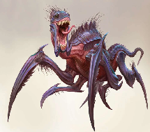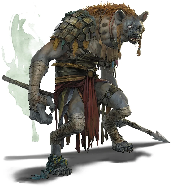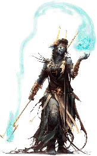

Drow woman is immune to Psychic Damage and Fire Damage. Defeated them.

## Session 120 — The Last Guard of Vallaki

*Eleasis 30*

Came across a tombstone. It said: *“No victory for the golden, no for the moon. No prize for the torment, the birth of a vow.”* A zombie came out, right before Mort and Oliver wanted to dig himself out. Called himself “Tomwald the Shovel Stealing Zombie”.

Sent a message to Strahd:

*“Hello.*  
*Fist here.*  
*We know Baba Lysaga's plan. Hate her too.*  
*Want to cooperate.*  
*Going to Ravenloft.*  
*Arriving in 5 days.*  
*How can we help?“*

Immediately afterwards it started raining and thunder cracked. Bats appeared. He replied:

*“Good evening,*

*Thank you for contacting me. If you reach the chariot in 5 days, I will have a messenger there for you.”*

All the bats disappeared and the rain stopped. Sent another message to clarify that we’d reach the chariot in four days instead of five. Received a spooky thumbs-up symbol as reply.

Fynn read the first part of the book on Mephestophelese’ses realm:

*“Mephistopehles's realm is the gloomy, frigid wasteland of Cania, a realm of cold indescribable with words,  so bitter that it is practically alive.  Cania outmatches the arctic sea of Stygia, which at least offers some relative form of comfort via the River Styx, in sheer harshness, the cold-hearted frost more like that of the Plane of Ice with the temperature in most areas being below −51 ℃.  Without magical protection, the merciless chill would quickly kill most life in hours, if not minutes, if not seconds, depending on how prepared they are. Any warm-blooded creature can only survive for a few hours by wearing cold-weather clothes, and going to sleep (or otherwise being unable to move) is a death sentence in most cases.”*

**Eleint 1**  
Arrived in Vallaki, or what is left of it. Came upon a campfire with a man in a chair sitting next to it. Wearing armor and a helmet. Name is **Rick; the last Town Guard of Vallaki**. Was in bed at the time of the attack. Had a bit of religious debate with him, after which he offered us lobster, which he called prawn.  
	He told us he saw some people with glowing eyes, rotting skin, zombie-like. He slew them. A huge blob of zombies fused as one, he described as well. Also a tall, lean skeleton, two red dots in the place of his eyes. Purple, red, blue, gold cloths and a hat with bells.

AS LUCK WOULD HAVE IT. AS LUCK WOULD HAVE IT. AS LUCK WOULD HAVE IT. AS LUCK WOULD HAVE IT. AS LUCK WOULD HAVE IT. AS LUCK WOULD HAVE IT. AS

Rick actually knows Ireena. Sort of the ex of one of his buddies. Was killed by Strahd.  
Decided to go save Ireena, but split up; group 1 = party, group 2 = NPC’s. Took our mounts.  
There’s not much left of Vallaki. We did encounter some zombies though. They turned out to be townsfolk we’ve seen before. They’re mostly docile.  
We did, however, encounter a corpse mound and some other more aggressive enemies. We felled them and ended up in front of the Toy Maker’s Store.

## Session 121 — Ireena Among the Dead

*Eleint 1*

Piles of zombies inside. The body of Gadof Blinsky blocked the door, holding zombie heads in both hands. Hole in the roof wherein a creature disappeared. Also a hole in a barricade made over/behind the desk, in which we found Ireena Kolyana. She refused help at first, because we’re uncertain if we’re aligned with or against Strahd. Explained everything to her.  
Then an earthquake happened. A cloud of souls surrounded the pulsating moon.

Convinced Ireena to join us. She asked us about the Elves who lived with the Fistani. Since we don’t know what happened to them, we decided to go see them, but we forgot that we were gonna fight the big skeleton man together with the NPCs. So we turned back and went to help our allies.

In the Town Square, we found the foretold skeleton. We acted like we were his allies, sending Mort to the guy, acting like a regular skeleton. Mort then tried to stab him, but missed. He then figured out our ruse and we entered combat.

It was a very close fight, with all of us running low and health. We almost lost Mort

## Session 122 — Shadow Over the Fistani

*Eleint 1*

Splits up with the NPCs once more, as they went east of town and we went to the Fistani camp via the southern path.

Mort had an encounter with a zombie called Tomato, the Skull-stealing Zombie, after stumbling upon a blank piece of paper in the middle of the road. Was killed by Tommeltje.

Fistani have been properly destroyed. Most Dusk Elves are dead as well, as they tried to help Rudolph defeat the Fistani. More and more elves collapsed and spewed black fluid from their orifices, leaving behind only husks. Kasimir is holding the looming threat at bay, fighting it for seven days straight.

Entered the building, which was shrouded in void defeated Strahd’s Shadow and its Shadow Fey Guardians. Kasimir coughed when the void disappeared.

## Session 123 — Ravens Before Ravenloft

*Eleint 1*

Kasimir Velikov, King of the Dusk Elves, has bruises all over his body, but it's mostly exhaustion. Decided to have a long rest in the building.

**Eleint 2**  
Received three potions from the Dusk Elves as reward:  
  
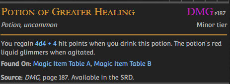  
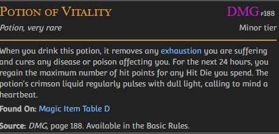

**Eleint 3**  
In the night, a raven lands next to Mort while he’s taking guard. It transforms into a man: Berislav. While we were sleeping, another five were ravens have arrived as well.

**Eleint 4**  
Traveled to the gates to the grounds of Castle Ravenloft, where we met up with Rudolph and Ezemerelda, who also had the two wolf hunters with them. Discussed plans to enter the castle. Either way, we decided to go to the cellar first in hopes of finding whatever armor or other helpful items we could find with the keygen. We settled on two plans, deciding to see which one seemed most favorable after entering the castle grounds proper and scouting ahead using Arcane Eye, Find Familiar and any other means of scouting:

1. Go in through the main entrance, turn right and then left immediately, take the staircase down to the cellar.  
2. Climb the walls up to the second floor using Theothor’s boots of spider climbing, which we would use one at a time, dropping them down to the next person. Then we would enter the large tower, taking an immediate right, followed by an immediate left, entering the square room, turning right into the spiral staircase which we would use to go down to the cellar.

## Session 124 — The Carriage of Flesh

*Eleint 4*

Decided to meet up with the carriage, because Strahd was going to give us information. Arrived at the carriage. Drawn by two horses. No rider. Looked inside: some luxurious seats, completely dark. Something sits in the far corner. Strange humanoid creature, barely a silhouette. Was sent by Strahd to help you get inside Castle Ravenloft. Able to alter the carriage. We have to go inside the carriage or be swarmed by a billion bats.  
As we started travelling, the carriage was filling up with yellow liquid. Room inside the carriage is made of flesh. Were inside of a stomach.  
Eventually we found our way outside, being shot outside, only to see the carriage below us, now with a hole in the top.  
A voice in our head went: “You were supposed to die in there, like the filth you are”. Turned out to be the larger version of Baba’s hut. Defeated it.

Mort is standing very handsomely after slaying the hut. We’re still at the crossroads.

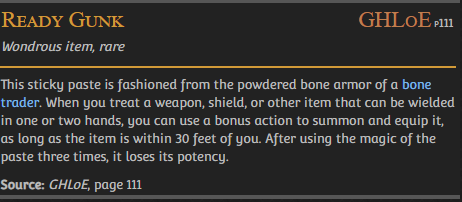

One bat separates from the rest, landing on top of the remains of the hut. It transformed into a beautiful lady. Her name is Helga. Wants to take us to Castle Ravenloft. Apparently these creatures destroyed the carriage and replaced it. She wants to take us to a secret entrance.  
	She said the bats wouldn’t hurt us without provocation.

Mort: “If someone didn’t have blood, would that be a deal breaker for you?”

## Session 125 — Helga's Secret Entrance

*Eleint 4*

Traveled for a day towards the castle, after deciding to trust Helga and take the secret entrance into the cellar.

Insights from Helga: possible defences:

* Aggressive bats  
* Undead  
* Skeletons  
* Wights = Special Undead  
* Straw people (scarecrows)  
* Hyenafolk (Gnolls)  
* Dragon  
* Ghosts  
* Strahd’s Animated Armors

Mort loredrop: hung with the wrong crowd, didn’t know his parents.

Oliver and Fynn spent some time crafting a gem encrusted bowl.

**Eleint 5**  
Oliver made a great feast with chicken, milk, beef and beans. [https://roll20.net/compendium/dnd5e/Heroes'%20Feast#content](https://roll20.net/compendium/dnd5e/Heroes'%20Feast#content)

Left Szoldar and Yevgeni behind to take care of the mounts.

Helga led us to the secret entrance. Barendd volunteered to stay outside for an hour to keep the entrance open. 22 corpses fell from the ceiling, one for everyone in the group. There wasn’t one of Helga.

According to Mort, we’re looking for a power suit in the basement of the castle.

Barendd loredrop: I come from a family of good standing, we had some scholars in the family, so I picked some stuff up here and there.

Got into the Castle proper. That’s where we left off.

## Session 126 — Kas the Betrayer

*Eleint 5*

We move through the secret tunnel, into the catacombs of Ravenloft. The keygen calls to Theothor, indicating where it wants to go. The keygen reminds him of rotten glass.  
It leads to two coffins in a chamber. Only Theothor could enter this chamber (due to his alignment). The keygen now points to the ceiling. Thethor uses his mask to spiderclimb up, and proceeds to smash the ceiling; breaking it and causing him to fall. The keygen starts to fly up as tons of tiny parasites come falling down. At this point, the rest can also enter the chamber. INITIATIVE!  
The parasites keep falling down. And they won’t stop coming.  
At some point, we hear a lock sound far above us? THE KEYGEN! What did it unlock? We’re unsure, but a roomsized pillar falls on our heads, crushing us.

We woke up in a weird place. We don’t know where we are but are trying to figure it out. **The door is now a jar.**  
After a short while a man greets us: **Kas**. Kas the Bloodyhanded.  
He explains  that we are in his prison. Vecna put him there.

*Vecna is not a god per se. He used to be a mighty sorcerer who tried to rule over the multiverse by killing gods and taking their place. He was thwarted by Heroes like Weaver.*  
*Vecna’s location is unknown.*  
*The obelisks mentioned Vecna.*

Kas assumes this is his chance to escape. Barendd stops him.  
*What did the first vampire eat?*  
*Us.*

Kas the Betrayer attacks us. INITIATIVE!

After a very, very, very long fight, Oliver manages to push him down into the abyss.  
The jar, **now a door again**, closes.  
Another door opens. Behind it is a piece of armor:

Theothor looks absolutely dashing in it.

!!1!!!!!SUDDENLY HAPPY DREAD  
SALESMAN!!1!!!1!

## Session 127 — The Dread Salesman

*Eleint 5?*

We bought some items from Happy the Dread Salesman. He also made statements hinting towards someone trying to communicate with us, such as: *“... can anyone hear me? Help...*  
*HUH??? WHAT?? NO, I DIDN'T HEAR ANYTHING JUST NOW!!!*  
*... BUT IT SOUNDED LIKE THEY WERE TALKING TO YOU.”*  
When Fynn cast Message on Happy and asked “I can hear you, can you hear me?”, Happy’s glowing red eyes momentarily became black, before returning to normal again.

Another pillar fell on top of us. We woke up. According to Rudolph we passed out after fighting the parasites and have been out for about 10 hours. We still have the items though.  
Rudolph knows Kas. Apparently shares a title with Strahd; both known to be the first vampire. Kas was one of Vecna’s most trusted generals, but he betrayed him. That’s why he was called the Betrayer. He was supposedly killed by Vecna.

Mort opened the door to a crypt. On the door it said: *“Sasha Ivliskova—Wife”.*  
Crypt filled with a lot of webs. A female voice in the dark said: “My love, have you come to set me free?” as someone rose up. “You are not my husband”.

**Crypt texts we’ve read:**

* Sasha Ivliskova—Wife  
  * Vampire  
* Artimus (Builder of the Keep): Thou standest amidst the monument to his life  
* Sir Erik Vonderbucks  
* Ireena Kolyana: Wife  
  * This crypt is empty, freshly engraved and recently cleaned.  
* Patrina Velikovna—Bride  
  * Spectral elf maiden wailing  
  * Found a fuckton of coins (250 pp, 1,100 gp, 2,300 ep, 5,200 sp, and 8,000 cp) and a leatherbound spellbook reinforced with an iron lock, which Mort picked open.  
* Stefan Gregorovich: First Counselor to King Barov von Zarovich  
  * A well polished skull amidst an old skeleton. The skull talked upon us entering. Polish = happy soaps. Used to be able to walk around.  
* Intree Sik-Valoo: He spurned wealth for the knowledge he could take to heaven  
* *[nameless crypt]*  
  * Filled with giant wolf spiders

## Session 128 — Ambush for the Cryptkeeper

*Eleint 5? I don’t know anymore*

Barovian calendar consists of 12 months (who all sound similar to the dutch months).

The Cryptkeeper keeps Stefan Gregorovich’s skull polished. Next time the crypt keeper will arrive is about 14 minutes. He has an Aura of Doom; causes you to be weaker and weaker, until their life force fades to black. Same for Greatsword and Javelin. Accidentally killed his own parents. Wants to see his son again.

Fynn told the group about his upbringing and him killing his foster parents. Mort dropped a hint that he also killed (one of) his parents.  
We hid in the crypts waiting for the crypt keeper, who we ambushed eventually. Fynn locked them in with a Wall of Force. We killed them.  
“Mike is calling for you?”

Barov is Strahd’s father. Gregorovich’s son’s name is Brunky. Had a thing for reaper scythes.

Spoke to Intree Sik-Valoo, who told us to:

* Kill baba  
* Chase out hellish army  
* Find Strahd’s true body

Took the skull of Stefan Gregorovich with us in Mort’s backpack.

## Session 129 — Waking the Royal Dead

*Eleint 5? I don’t know anymore*

When we decided to grant our allies a long rest within the catacombs, Moart disrupted the silence by yeeting a corpse out of its sarcophagus, awakening the bodies of King Barov and Queen Ravenovia.

The plan after the rest: go to the big tower with the heart in it, in order to find our ally.

But alas, our rest was interrupted twice. Once by the torso of a zombie crawling towards us, which Fynn one-shotted with a Fire Bolt, then an hour later again by a tiny dragon, who single handedly brought down Theothor, after which Fynn hurled a Fire Bolt at it. This brought out mommy dragon.

*Reminder: Fynn wanted to seal us off with Wall of Force as fast as possible.*

## Session 130 — Spider of the Shaft

*i AM LosT hhehhhelp me*

The big dragon was just an illusion. Went back to sleep. Woken up again by

The wall behind us closed and from holes in the walls containing Transmutation magic, water started pouring.

Adamantine in wall

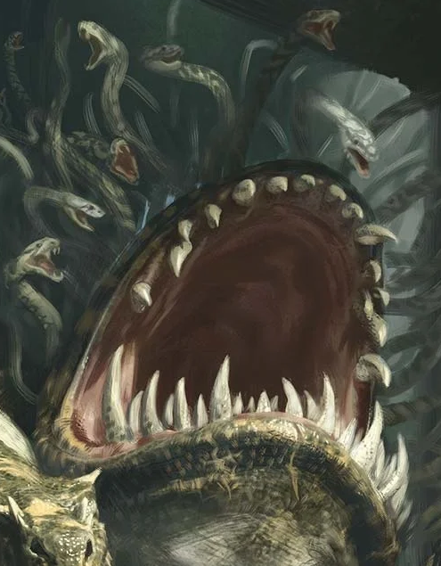  
Typhon

Spider of the Shaft. Quite friendly. Showed us a map of the shaft

Name of the guy we seek is **Pidlwick.** He is in this tower, but can be in two parts of the tower. The second part is the staircase west of the staircase we’re currently on.

On top of the tower we found a Clockwork Effigy: Pidlwick. He showed us a huge sword and a huge hammer.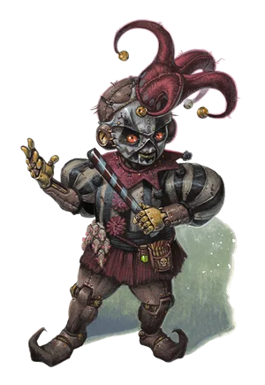

## Session 131 — Voice of the Morninglord

*Where am I? When am I?*

Altar with silver statuette of the icon of Ravenloft and a cloaked figure draped over the altar with a black mace at it’s feet. The statuette seems to be related to the Morninglord, which (together with Mother Night) is one of the gods, and not revered by evil people.  
Inspected the figure and turned out they died a long time ago, given the skeletal remains.

Why is there a chapel? Why is it not maintained? Why are there corpses in it?

Barend picked up the statuette. He felt a power surge through him as his eyes started glowing white. He took a great amount of damage as his mouth opened wide and glowed white as well. Barend spoke in someone else’s voice:

*“In the dawn, beauty reigns and the way is clearer. But yet, for dawn to come, you must first brave the night. Shields of the Crying God, I see you. I am the Morninglord. Or as you know me: Lathander. You have invoked me through sacred r… Wait. This isn’t quite the sacred rite I expected here. It seems Gustav Herrengast has given his life [the dead guy]. You have sacrificed much to be here, you have achieved your goals already and you could have chosen to find a way out, but instead you chose to help the people. Therefore this icon of Ravenloft is yours to keep. I pray that the icon will help you in your endeavors to help take down Baba Lysaga and Strahd. If you need me, call to me through the icon. Huzzah.”*

| Icon of Ravenloft  *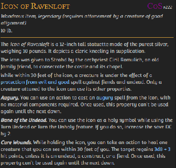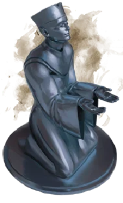* |
| :---- |

| Mace of Terror  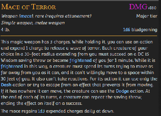 |
| :---- |

Piddlewick told us the statues in the hallway will strike us and we need to dodge them. Also scarecrows will come out of the statues. The hallway is dusty and filled with cobwebs. Shoved a bench into the hallway, triggering some of the statue’s glaives, but not the traps in the floor.  
Theothor carried Oliver across the ceiling of the hallway, but the door on the other side was trapped. So Fynn teleported with Mort across to the other side of the door to try to disarm the trap from the other side. Mort jammed his stick into the door and it turned out to be a mimic. Barendd was thrown by Piddlewick and he killed the mimic, which caused the scarecrows to appear.

Sad organ tones sound through the bronze doors in the south.

## Session 132 — The Symbol of Ravenkind

*There is no time. Only mist and darkness.*

Took a peak into the dining chamber. A caped figure is playing the organ. The table was set for 6 people.  
We rested in the hall for 5 minutes, then went down the stairs. Oliver, Theothor and Barendd were trapped into an elevator and propelled upwards to the first floor, while Fynn and Piddlewick were left down in the cellars. Decided to keep moving down to meet up with the allies and hope that the other three friends will go there as well.  
The three musketeers got jumped by a bunch of four-armed Chitines, while Fynn was sucked into a watery hole and dumped into a prison cell with 5 feet of water, with 3 feet of space to the ceiling. Vague light from the cell next to me and something touching his legs in the water. Glowing light came from a magical sword, which Fynn picked up, before escaping the room and its creepy occupant. It got Piddlewick though. Fynn was unable to save him.

After defeating the Chitines, the trio found themselves in a room with a tower inside of it, made of adamantine. Trap door on top of it. It was filled with treasure, among which the Symbol of Ravenkind! They tried to escape through a window.

## Session 133 — The Torture Chamber

*Piddlewick NOOOOOOO!!!!!*

Theothor, Oliver and Barendd landed on the roof of the chapel. Dangling from his ankles, held by Theothor, Barendd smashed through one of the windows and took Theothor inside with him. There, they encountered two zombies.  
Mort found Fynn and the lifeless body of Piddlewick II at the bottom of the stairs. Fynn was unable to convince Mort of what happened.  
We eventually met back up with each other again in the same place where the elevator thingy was. Fynn showed everyone the creature he and Piddlewick encountered. Oliver promised Mort to cast Zone of Truth on Fynn later.  
Oliver cast Arcane Eye into the room where the crying came from. Found someone hanging upside down from a pulley, skeletal remains of a dwarven fighter and a living person soaked in water. He is the one crying out for help.  
His name is **Emil Toranescu** and he is a werewolf from the band of werewolves in the cave near Vallaki (that we murdered). He is aligned with Strahd and believes we are a band of elite warriors employed by Strahd to defeat Baba Lysaga.  
We entered the room with the balcony, which turned out to be a large torture chamber. There we got ambushed by a bunch of zombies and a three headed skeleton.

## Session 134 — Vasily and the Iron Golems

We defeated the Torturer and the other enemies, and made our way up the balcony. Behind the curtains was a door, behind which was another room. Inside this room was a brazier with seven slots containing seven balls, each with a different color. Hanging from thick chains above the brazier was an hourglass with its sand seemingly defying the laws of physics by remaining inside of the top half. A poem was written on the brazier:

*Cast a stone into the fire:*  
*Violet leads to the mountain spire*  
*Orange to the castle's peak (Top of a tower?)*  
*Red if lore is what you seek (Amber Temple?)*  
*Green to where the coffins hide (Crypts? Coffin makers? Amber Temple? A graveyard?)*  
*Indigo to the master's bride (Tatyana’s Grave?)*  
*Blue to ancient magic's womb*  
*Yellow to the master's tomb (Strahd’s bedroom?)*

While Fynn was casting Identify on the brazier, Mort poked one of the statues in the room with a stick, causing two Iron Golems to come to life and almost wrecking our dreams of ever becoming level twenty. Vasily von Holz came to our rescue, but paid the ultimate price when, in its final moments, the last Iron Golem exploded and turned Vasily into ashes. Barendd and Fynn were also left on death’s door, but were heroically saved by Mort.

Fynn tried for the second time to identify the brazier:  
The flame is magical and sheds no warmth.  
The stones, when thrown into the fire, causes the flame to change color. The sand starts running for about half a minute. Any creature who touches the flame is teleported to the location corresponding to the color in the scripture.

Fynn found out that the doors are locked by the Arcane Lock spell.

We seemingly have two options:

1. Use Dispel Magic to unlock the door(s)  
2. Use the brazier to teleport somewhere, though risky because we are uncertain about the destinations.

## Session 135 — The False Strahd

Unlocked the center door. Turned out our allies split up (well, they all split up within the crypts). We got everyone back together and told them about Vasily’s death.  
Despite the fact that he witnessed Vasily’s death, Mort, together with Helga, opened a crypt named *“King Troisky, the Three-Faced King”*, where Vasily was last seen sleeping. It was empty, except for a helm with three visors. When Mort took the helm, poisonous gas started filling the crypt.

Oliver wanted to find out where the trap door in the hallway led to. Afterwards, we decided to go back up, together with our companions, to see who is playing the organ (because we’re not quite ready to fight Baba).

Pillars of stone, three enormous chandeliers, long heavy table filled with food, set for exactly our group plus one. Organ is still played by the caped figure, with a tiny drummer sitting next to it. As we set foot inside, suddenly the figure stops playing and turns around. It is Strahd. He is looking healthy. Fynn shook Strahd’s hand, feeling cold to the touch. His grip is strong. Fynn couldn’t find any disguise of sorts, but it did turn out to be a strange creature that only looked like Strahd. The table was also a creature.  
It was part of Meph's group, trying to find out what we know about Strahd, Baba Lysaga, the demons in this realm, etc.

  
Yochlol

The creature (a **Yochlol**) cast Dominate Person on Fynn, controlling him and causing Fynn to attack Mort multiple times, once almost killing him using a Disintegrate spell. Oliver put Fynn in a bubble to protect the rest of the party. In which Fynn almost killed himself. Luckily, when Fynn went down, Oliver healed him again and Oliver and Mort killed the Yochlol.

## Session 136 — Toward the Crystal Heart

We set out to the large tower in hopes of finding Strahd there, taking the three stealthiest of the allies with us: Ireena, Helga and Ezmerelda. But without Ireena.  
  
The hallway beyond the trap elevator contains fog up to three feet high, a dark figure shuffles towards us. His name is **Cyrus Belview (*sounds familiar?*)**. Helga says Cyrus has lost his mind and probably doesn’t even know that the castle has been taken over. The hallway is his little space.

The room beyond the hallway contains crushed oak tables and furniters made of human bones. Walls are lined with bones and skulls. Piles of bones, chairs of bones, table of bones. Everything is made of bones in this room. The skull of a dragon hangs from the ceiling. It’s the skull of Arkenvost, a silver dragon from before the construction of Castle Ravenloft.  
The north room is different from what Helga remembered. It would have skeleton sentries and tables. Rahadin had an office in a room to the north.  
Under a flagstone in one of the alcoves with cribs, Barendd found a sack of coins.  
A red light appears glowing above us in the tower. The spiral staircase becomes narrower the further it goes up. A large crystal heart pulses within the tower.

During our climb up the spiral staircase, we were attacked by three pairs of Animated Halberds, which posed no substantial threat. Then finally, the heart pulses red, as if alerted by our presence, sensing the danger its in. Four vampires spawn.

## Session 137 — The Heart Destroyed

Killed the vampires and heart. Lost Aleksandru in the battle. Fynn fell down the tower and almost died.

Heart has been here as long as Helga remembers, should be connected to who controls the castle and Barovia (presumably Strahd). Baba Lysaga took it over, so it was good we took it out.

We received features! **The crystal heart is still on the floor in the tower.**

## Session 138 — Crown of King Barov

Warm and softer than it should. No spark or magic flowing through the shard of heart. Theothor (violently) put some of Fynn’s broken ribs back into place.

North Tower Peak contains a bed with restraints and a chest with the following emblem on it.  
		Barendd peaked out of the trap door on the top and saw a Strahd-shaped face in the clouds, which moaned and spawned thousands of bats. Shortly after the trapdoor caught fire and swarms of burning bats entered through.  
		After the bats died, the chest opened, revealing a crown on a pillow. We’ve seen a copy of it before. It was on the zombie king we fought in the catacombs. It Looks like the crown of King Barov. Oliver inspected it and it turned out to be magical and can be used to cast the Command spell.

Theothor and Mort had a little mini-game while both using a bed to slide down the stairs of the tower. We opted to wait for a long rest at the bottom of the tower.

## Session 139 — Road to the Throne

We defeated the Dragon Wirmlings and finally started our long rest, which got interrupted by some gray ooze, which knocked out Fynn.

After many, many hours of rest, we found our way up the main tower, over the walkway and onto the adjacent tower, to reach the throne room.

After barricading a door into which Mort peeked and saw multiple sets of green eyes peering at him through the darkness, we continued onwards down the stairs. There, we encountered multiple traps in one place, which we triggered. This led us to fighting a living rug, a guardian portrait and a monster called an Alkalith.

## Session 140 — Escher and the Straw Beast

After defeating the painting and the Alkilith, we opened the door to the room on this floor and found a youthful man called Escher, who apparently ordered minions and was attached to the Guardian Portrait. *Escher has no bodily warmth.*  
	In the room a huge beast of straw sits in a cage, which is one Baba’s creatures. Force Cage. Is a vampire wizard, was the most powerful wizard in Strahd’s armies 400 years ago. Is planning to wait out the Baba situation.  
We asked him about ways Strahd lures adventurers into Barovia. The fog gets thick around people, bats or wolves chase the heroes and then they seek refuge, until they are in Barovia. Or injured children on the road will ask for help, and lure them into the fog. Alternatively a big old mansion is actually a portal into Barovia.  
We agreed to help Escher lock the Straw Beast up in the cellars, if he joined us in helping to defeat Baba Lysaga. But that plan failed due to the Straw Beast resisting all charms, so we had to kill it.  
Three witches came up the stairs and were instructed by Escher to lock it in a crypt, while we had a one hour short rest.

We are still not sure that Escher is able to cast any spells, other than Force Cage. Not even after defeating rats pretending to be knights.  
Fynn found a magical lute, which tried to hurt him. He put it back.

We got attacked by **Strahd’s Hate** in the dining room, during which Escher disappeared. We entered some sort of study or reading room, where a painting of Ireena Kolyana hang. She wanted to destroy it in the fire, with which Theothor helped her. Fynn stole an epic novel.

## Session 141 — Avatar of Mephistopheles

Fynn, reluctantly and… a bit poorly, plays a song on the lute to hype everyone up.

In the room before the throne room we found some sort of office with a guy busily writing behind a desk. Fynn cast a spell on him (Suggestion) to stay quiet and ignore anyone inside the room.

Reached the throne room, where we not only found Baba Lysaga, but also Aribeth, the avatar of Mephistopheles, along with plenty of Gnolls and Straw Priests. A portal leading to an icy hellscape hovers in the room.  
	Saber was instantly disintegrated as she leapt into the room charging at Baba Lysaga. It was fiendish power granted to her by Mephistopheles. Aribeth promised her the domain of Barovia, as well as the lands beyond.  
	Aribeth’s sword captures souls.

## Session 142 — The Fall of Baba Lysaga

**Introduction about the Leonin:**  
Brimas, speaker. Normally someone is speaker for only one year, but Brimas has been speaker for several years now. He’s the only male speaker ever. All prides are together at the festival, except the Iron Manes. They have built a city of metal for themselves. Brimas has once again been chosen as speaker for yet another year. Theothor was also considered, but it was decided that it was too soon for him to be speaker.  
	There were also human guests at the festival, negotiating trades between the humans and the Leonin. The humans spoke of a blight that was foretold but has not yet come. Baragon of the Flint Claws also knows about a blight. Leads the humans into an alleyway and signals to another Leonin, who reaches for his daggers.

Baba Lysaga was taken down. Revived Vasili turned out to be Strahd in disguise. He animated our fallen allies and just as Barendd figured out how to save them from Strahd’s grip, Fynn killed them all with a Fireball. Rudolph told us he might know a way to get out of the dread domain.

“Thank you for freeing me from this prison.” - Strahd’s last words, more or less.

## Session 143 — Strahd's True Death

We ended up in some endlessly white space, with only Rudolph and Rick alive.  
We concluded that Ireena is still missing. She was abducted and put into a bag by Strahd. Oliver found a bag of holding on Strahd’s dead body. Ireena was in the bag of holding.  
According to Ireena, the most powerful vampires can only be killed inside their coffins, which we didn’t do.  
We theorized that killing Strahd caused the dread domain to fall apart. Rudolph told us that domains of dread are connected by mist, which would make him believe that we would end up in mist had the domain actually collapsed.  
Fynn tried to walk in some direction, but ended up in the same place as where he started.  
Barendd prayed to the Morning Lord, and started coughing up blood immediately afterwards. Also the message “From death, life.” appeared on the ground.  
Oliver also tried to commune with his deity, allowing us to ask three questions to Esmumu:

1: “Should we kill ourselves to get out of here?” → No  
2: “Did Barovia collapse with the death of Lord Strahd?” → No  
3: “Do we have the means to get out of here?” → Yes

Fynn used the sending stone connected to Minoushka:  
“Minouscka, It’s Fynn. We’re stuck in a white void after killing Strahd in Barovia. From death, life on floor as a hint. Please help.”  
"Now is NOT the time, Fynn! Shachi and Penguin just died and Tillem is also not looking good. You should contact Weaver instead. Good luck!"

Decided to try stabbing Strahd’s body through its heart with a stake. Barendd did this. The heart seemed made of glass and smell rotten as it was pierced. Cracks appear in the white void as the stake hits the floor. The space collapses and we’re back in the throne room.

Lief Leipsiege, the guy who was writing in the room next to the throne room, turned out to have hanged himself. Asked his corpse where Strahd’s coffin is, since Rudolph said something about only being able to truly kill powerful vampires when they’re in their coffin. It said we should find it in the crypts. We did, with the help of the, now respawned, cryptkeeper.  
Code to disable traps in the cypts: 13579

Iron lever north wall of Strahd’s coffin room. Barendd tried to open the coffin and a defence mechanism triggered, spawning three vampire brides. Defeaeted them, Barendd opened the coffin and stabbed Strahd through the heart with the Sun Sword, causing Strahd to explode, along with the cryptkeeper. He’s dead for real this time.

Rudolph started speaking about Madam Eva being able to bestow the power of Mistwalking, which is a curse. Can’t stay in one place for very long.  
“This place is inherently broken. It has been pulled here and can no longer return. Other places, cities and people have come to take it’s place. Dread domains are prisons, made by overwhelming emotion and that person’s emotion causes a shift into the Shadow Realm. This domain of dread is just one part of the entire Shadow Realm.”  
	Ireena volunteered to tell people the news of Strahd’s death and take Gertruda back to her mother.

## Session 144 — Waking Gertruda

We passed the room with the teleportation device. The orbs are no longer colored and the flame has been extinguished.  
Found Gertruda in the master bedroom. But we couldn’t wake her up. Fynn also fell asleep and Mort and Oliver also suddenly started feeling very sleepy. Came to a little bit later.

Gertruda still didn’t wake up. Tried different things, but only woke up after a Dispel Magic spell. Thought she was on a grand adventure. Also heard a loud thud from the bedroom where Mort was still in, which was Sleepy Mist Spirit called Karl that had the overwhelming urge to possess people. Possessed Mort. We killed it with fire.

Fog in the courtyard has been cleared. Encountered hundreds if not thousands of dead bats. Stepped on some of them, which attracted the attention of some skeletons.

## Session 145 — Madam Eva's Talisman

Found the wagons and mounts, which are still very much alive, though bloodied. Dead bandits strewn about the place. Found the Wolf Hunters, healed the mounts, burned Ezmerelda’s wagon as is usual for Vistani. Took her horse though.

Got ambushed on a bridge by a group of bandits, which we defeated.

Barendd was exiled, and didn't have much to live for. Found everything here meaningful. Isn’t quite sure whether he will stay here or join us through the mist. Later confessed to Rudolph that he isn’t sure he wants to return, if he has anything there.

Split paths with Ireena, Szoldar and Yevgeni who continued to the Village of Barovia to bring Gertruda home. Rick and Rudolph joined us to the Vistani camp to find a way through the mist.

Found our way to Madam Eva. Room felt very heavy and tense. Madam Eva: System was too stuck in its beliefs to accept the love between Barendd and Mumpena. Madam Eva agreed that Barendd is the Morning Lord’s chosen one. Destiny to heal, but doesn’t know whom he should heal.

Those who wander the mist can’t stay too long, otherwise the mist will consume their vitality. Need a mist talisman keyed to the domain of choice. She prepared a talisman keyed to our home world.

[https://docs.google.com/document/d/1zzko7e1afjzE8YEvkSsZYdekkFrdki-iJKPwDRdj7Os/edit?usp=sharing](https://docs.google.com/document/d/1zzko7e1afjzE8YEvkSsZYdekkFrdki-iJKPwDRdj7Os/edit?usp=sharing)

## Session 146 — Out of the Mists

*Eleint 24, apparently*

Barendd decided to join us, but with the annotation that his story will probably take him to the underdark.

**Barendd’s vision:** trolls in battle, volcano erupting, snakeman in laboratory and Mumpena’s smile.  
**Mort’s vision:** mountain village, dread temple, orc tribe  
**Fynn vision:** guild hall aflame, himself rebuilding, a man he doesn’t recognize entering a mystical city he doesn’t recognize either, children smiling at him.

Fynn took hold of the talisman, attuning to it. Got cold to the touch while using it. Tent filled with mist. Talisman tugged us along the right path through the mist.

When we left the mists, we encountered a bunch of humanoids fighting some trolls. Heaps of bloody troll corpses. Turned out to be Proserpine’s group. Spoke to Minoushka about a week ago, she was about to enter the Feywild.

Weaver is pretty pissed about Karn’s death and the fact that we disappeared and they had to look for us (again). Before we could finish our conversation, the trolls resurrected and attacked us. Barendd and Fynn almost died, but we defeated them.

Apparantly the trolls were shouting something about **stolen stones.** They were looking at Proserpine’s group’s guild ring, which set them off about these stolen stones.

Proserpine casted Teleportation Circle to the guild **Reminder for Fynn: learn the guild’s sigil.** We went through the teleportation circle. Ended the session when we teleported to the guild.

## Session 147 — Saints of the Guild

*Eleint 24*

We teleported to the guild using a Teleportation Circle. When we arrived, we didn’t appear in the guild hall we were familiar with - instead, we were in a locked room, lit only by a sconce’s blue light and the faint glow of the teleportation circle below us. Prosperine’s group told us we arrived safely beneath the guild. As the circle’s glow faded, the only door in the room unlocked. We left the room and met St. Ebenezer, a gigantic man who is half undead and half construct. He is apparently one of the guild’s many saints, who serve Ilmater even in death. Some people from Prosperine’s group stayed behind with him for payment (using the guild’s teleportation circles costs money), while the rest of the group escorted us upstairs. There, we saw another group of heroes. We promptly ignored this hook - wouldn’t want too much context and background information now, would we? Instead, we went (almost) straight towards Weaver’s office (almost because Rick had to shit first).

We explained everything that had happened to us since we left the guild back in session 71, most importantly the parts about Karn’s death, the Heartstone we found, the whole becoming Mist Walkers-thingamajig, and our new allies. Rick is allowed to become a merchant at the guild, while Rudolph will undergo training to become a hero. Barendd received a guild ring and is now officially part of our group. Weaver sent us back down below the guild for ‘training’, but now before a well-deserved long rest.

The next day, we returned to the Floor of Teleportation (the large hall where we met St. Ebenezer yesterday). Fynn learned the sigil for the guild’s “circle of safe return”, and Theothor received a sending stone which can be used to contact St. Ebenezer. We then took an elevator deep into the guild depths, where we met another saint. St. Bazelgeuse, a fire giant, takes care of the guild’s dragons on the Floor of Dragons. He had received word from Weaver that we were to fight dragons - one on one. We each chose an opponent and were then immediately thrown into mortal combat.  After successfully defeating our opponents, we each took a scale from the defeated dragons. St. Bazelgeuse told us we could use them to create a powerful magic item soon - but first, back to Weaver.

At least, that was the plan. Instead, the elevator stopped halfway through our journey, opening up not to the Floor of Teleportation but to the Floor of Competence. Calling it a floor is a bit strange, seeing as the ‘floor’ looked as if it were the open sky. St. Aesop, the resident saint of this floor and a fallen angel of some sort, tricked Barendd into stepping onto a cloud - which he then promptly fell through. After a while, he fell back to us from above, this time getting smashed into the now solid cloud. St. Aesop then sprinkled some celestial dust on us and told us to imagine a skill we would like to get better at. It all sounded a bit fishy. Just like my breakfast today.

Anyways, after that weird encounter, we went back up to the Floor of Teleportation, where Weaver greeted us. He told us we were going to take a teleportation circle to a place we were very familiar with - the Forge of Spells! One quick circle later we arrived in front of the workshop in the Wave Echo Cave. The Guardian greeted us, and Gundred Rockseeker also came by for a chat. How nice. The Guardian then told us about the forge’s capabilities - it felt like his explanation took an entire week (and I still didn’t quite understand)...

## Session 148 — Giants on the Road

*Eleint 25*

Found ourselves outside after defeating our individual dragons, where we encountered Saint ???. Wants to sprinkle fairy dust on us. Also made some magic items at the Forge of Spells. A smith (**Theldin**, human) of magic items is being brought by another group of heroes. Might be able to help Fynn with his cursed item.

We met back up with Weaver. The 13th Division was supposed to escort Theldin to the Forge of Spells, but near Grudd Haug they were attacked by Hill Giants, led by a person called Guh, one of the giant lords and chief of Grudd Haug. Weird glow, strange purple weaponry. Red glowing eyes.  
Kenk Snavelberg lost an arm. Three of their group died. We are to rescue Theldin from Grudd Haug. Giants were accompanied by goblins, bugbears, etc.  
Kenk’s group encountered 6 giants and 50 other creatures. Killed most of them  
Hill Giants can be united under a strong leader, which Guh has done.  
The Giant’s Ordening: Different types of giants. Hill Giants are one of the lowest giants, only followed by other giants, such as ogres. Storms Giants are the highest.

It will take about 5 days to Grudd Haug from Triboar. *Estimated route: Westbridge, Stone Bridge, Beliard, Grudd Haug. Alternatively we could cross the hills (Mort’s idea) or go through the Iceshield Lands (Barendd’s idea).*

Encountered Zhentarim travelers about 3 to 4 hours south from Triboar.  
Six wagons, each of them has a drover, a drover’s lad, is pulled by two oxen and some of them have weapons sticking out. We halted them to inspect the wagons and see what their plans were.

*^Banner of the Zhentarim*  

**Healer Thommadur,** guiding this caravan from Scornebel to Triboar. Each wagon contains two armed guards. So a total of 12 guards. We inspected their wagons, two wagons each

| Fynn | 1st wagon | Mundane wares |
| :---- | :---- | :---- |
|  | 2nd wagon | Mundane wares |
| **Mort** | 3rd wagon | Mundane wares, but also a little slit in the floor of the wagon, which they said was empty space after selling wares in Westbridge. |
|  | 4th wagon | Clearly a false floor in the wagon, Mort said he’d consult with his colleagues. |
| **Barendd** | 5th wagon | Mundane wares, but moving some boxes revealed a rug covering a space of the wagon’s floor. Inspecting it caused the guards to reach for their weapons.  |
|  | 6th wagon | Sneaked a peek, but let the wagon be.  |

We let the Zhentarim leave. Haeler warned us of bandits flying on giant vultures. Took two of their wagons.  
We decided to warn Weaver using the sending stones that there is a group of Zhentarim merchants smuggling wares approaching Triboar, which Mort did.

Shortly after, the giant vultures found us on the road. Bandits’ eyes are glowing red. Able to cast Feather Fall and Fire Bolt. Giant Vultures shoot beams of shadow, and also have red glowing eyes. As a bandit dies, they disappear in a cloud of shadow.  
In the distance, Weaver fucking WRECKED the caravan. We don’t know this though.

We arrived in Westbridge in the evening.

## Session 149 — Trail of Gargosh Blusterhelm

*Eleint 25*

In Westbridge:

* Harvest Inn, once owned by Bert.  
* Where we met Kenk Snavelberg

New owner of Harvest Inn is a halfling called **Herivin Dardragon**. We rented two rooms and left our mounts at the stables. **Galiver Longstocking** owns half of Westbridge, Herivin pays taxes to him. We had something to drink and then we went to bed. Herivin switches characters.

Had breakfast the next morning and headed east. Found out that Koningstiger can now fly. Also encountered a band on their way to a wedding in Westbridge. Five dwarfs and a human (wizard?) on the bridge, enjoying the view. Human is called **Cavil Zaltobar.** Looking for a group consisting of a dwarf, halfling, tiefling, skeleton and lion man. Attacked us. We killed them. Afterwards, we found about 50GP and a note saying:  
	*“Keep Drannin Splithelm away from the Halls of the Hunting Axe :)) Signed, Gargosh Blusterhelm”*

Arrived in Beliard at night. Inn is called “The Watchful Knight”, three floors, 32 guest rooms. Aragar Kalathar, the Innkeeper. Refer to him as “Mr. Innkeeper”. Rooms on the 2nd floor. The innkeeper knows about **Gargosh Blusterhelm**, who was at the inn about two or three nights before, heading towards the Halls of the Hunting Axe, which is a proud dwarven city above ground in the hills to the south east of Beliard. Apparently Blusterhelm was heading there because it has an ancient treasure that would restore his dwarven pride.

We woke up on the morning of Eleint 27. Went on our way to the south east.

|  | Halls of the Hunting Axe  *These monster-haunted ruins were once a grand and important city in the shield dwarf kingdom of Besilmer. The old city was a small forest of stone roundhouses, interlaced with gardens and joined by walls into one vast and sprawling building. It was surrounded by a moat fed by underground springs; splendid stone statues of heroic dwarves stood on high pedestals wherever one turned. All trace of the gigantic building is gone now except the foundations of its thickest, highest walls, which jut like lines of stone teeth from thickets of trees and creeping vines. For centuries, shards from magnificent windows of stained glass that once adorned the Halls have found their way into beautiful and distinctive glass bottles blown locally.* These notes are suspiciously undrooled upon |
| :---- | :---- |

## Session 150 — Ambush at the Hunting Axe

*Eleint 27*

Spoke to a merchant outside Beliard selling glass bottles and such: Owlbears nest in the halls. Pays 3GP a pound for glass shards from the Halls of the Hunting Axe.

Found a piece of paper with a drawing and some text in dwarvish. A crude drawing of the path we’re on right now and a big rock with an arrow behind it with the text: ambush.  
Warhammer, broken cart, dead horse and blood, but no other corpses. Combed over the place:

* Two sticks connected with a rope formed a tripwire.  
* The horse probably tripped.  
* Warhammer = dwarvish, inscribed with “**Clan Blusterhelm of Mithral Hall**”  
* Blood aligns with the timeline of Gargosh Blusterhelm passing through  
* Also found extra rope, neatly coiled up underneath a bush.  
* Tracks indicate a group of at least three dwarfs, leading towards the Halls of the Hunting Axe.

Legend says Dwarven King Flametongue (founder of Besilmer) lies entombed beneath the halls’ ruins with his magical axe. Some say it’s cursed.

Encountered an Owl Bear, quite angry, we went around it through the bushes. Went on to the Halls of the Hunting Axe to save Blusterhelm. Was a guy standing there (standing guard?) and we decided to do a stakeout to observe him. Inspecting the wall, tapping it, kicks it in anger. Doesn’t seem to be anything there. Mort snuck up to the guy, projecting some random arrows and text on the wall to distract him. Mort overpowered him.

Turned out to be Gargosh Blusterhelm - Drannin Splithelm is his brother. People who ambushed him were probably hired by his brother. The Blusterhelm clan made a crucial mistake, causing the reputation of his clan to tumble down a mineshaft. Drannin and Gargosh grew apart in the meantime, while the Splithelms flourished. Gargosh wants to restore the honor of this clan by finding a long lost treasure. Drannin wants to have the treasure for himself, not wanting the competition of a returned Blusterhelm clan.

Decided to camp in the Ancient Hall for the night. Underground, dwarven machinery inside. Went down the stairs with a symbol almost like an hourglass on the ceiling. Gargosh was unable to activate it by pushing the flywheel. Fynn tried Detect Magic. but detected no magic. Noted a different symbol on the ceiling. Flywheel has faint etchings on it, but also the same hourglass symbol as before and two others. There are places that you could poke something into, about stick sized. You can engage a sprocket which allows the wheel to turn. Once you let go of the flywheel, it slowly moves back to its original position. Disengaging the wheel while its turning immediately resets it.

A distant bell sounds after sticking a javelin into the hole corresponding with the symbol that corresponds with the symbol of the corresponding room. Heh. Corresponds.  
We did this for all four of the flywheels, unlocking something off in the distance. Somewhere even lower than we are now.

Crypts contained a mausoleum, tombs have been smashed open. Secret stairs have been revealed. Inside, mysterious blue flames fill stone braziers. Marble sarcophagus, carved runes in dwarvish said:  
*“Here lies His Noble Majesty*  
*King Torhild Flametongue.*  
*He raised a kingdom in the sun,*  
*Defending it with his dying breath.”*

Another secret door to the left, which Gargosh didn’t notice. He opened the lid of the sarcophagus, which filled the entire room with poisonous gas. Gargosh fled the room, spikes closing the exit behind him, trapping us in the room with the gas and two statues that started to move.

## Session 151 — Orcsplitter and the Doppelganger

*Eleint 27*

Red glowing fist on the golems curses people. Defeated them. Sarcophagus was empty. Followed the secret passageway. A 15ft effigy of a dwarf clutching a waraxe on top of a dais. Written in dwarvish on it:  
*“Here lies His Noble Majesty*  
*King Torhild Flametongue.*  
*He raised a kingdom in the sun.*  
*May his reign never be forgotten.”*

Circular stone crypt underneath the dais with a simple stone coffin. 500 gold ingots in the coffin. Tiny runes about Besilmer’s reign. Also Orcsplitter, the war axe. Took the ingots and Orcsplitter. Mort took it and unrest took over. He feels that he is not the rightful wielder of this weapon. Same happened to Fynn. Barendd was worthy though.

Suddenly a large construct barged in. Does not look ancient and dwarven, but rather futuristic and robotic, steam leaking from it, red eyes giving us the feeling of dread. Blasted the entire dungeon with a laser. We took cover within a Wall of Force-made box. Turned out it was Gargosh (who shapeshifter into a doppelganger), along with Drannin, two mercenaries and two large constructs, one of which trapped Fynn in an anti-magic ball. Fynn almost got blasted to death, but Berendd heroically dragged him out of the ray’s area.

Mort kept Drannin alive, but one of the constructs exploded next to him, so he died (Drannin, not Mort).

Scraps left over from the construct reminded us of Karn.

## Session 152 — The Harpers' Bargain

*Eleint 27*

We met three elves outside of the Halls of the Hunting Axe:. **Ariana Riverlost;** one of the Harpers, together with Elifar and Lorendil. They are going around policing and investigating things.They found the corpse of the real Gargosh. They put a zone of truth around all of us and offered a deal: they take the axe from us, keep it safe, and bring it to Weaver when they meet him in a week. In exchange we would get magic items. They’re afraid we break Orcsplitter by using it in battle. They’d like to keep it in a museum (eventually).

We had some doubts among us, so we contacted Weaver through Saint Eberneezer: *“Hi Eberneezer, it’s Fynn, could you ask Weaver if he knows Ariana Riverlost and if he would entrust Orcsplitter to her? It’s urgent.”* Eberneezer wasn’t happy with us contacting him outside of asking him for a teleportation circle. Literally said “I am not a messenger boy”. But he did confirm Ariana is to meet Weaver in 10 days. We decided to trust the elves and take them up on their offer.

Ariana told Fynn that he wasn’t responsible for what happened at the Conclave of Silverymoon. According to her, a Fire Giant destroyed the school.She hugged Fynn and said: “You’re not the killer you thought you were”. Offered to look into the Goldwind siblings for him..

Ariana knows of one dread domain: La Mordia. She doesn’t know how the Shadowfell infects people. She’s seen it corrupting them though: trees, plants (steal nutrients from other plants). Never seen it happen to constructs and offered that gems are a dwarven thing.

There’s a lake north of Grudd Haug (or more like one end of a river). Grudd Haug was built to stop that river from flowing.

**Eleint 28**  
Reset the puzzles with the flywheels. Went on our way to Grudd Haug, parting ways with Ariana.

Encountered a corrupted Owlbear with glowing red eyes and drooling something black. Its claw elongates horrifyingly, making ripping sounds as it tears its skin, seeping black stuff

Owlbear contains fractions of undead energy around it, according to Theothor. There’s nothing magical about this creature. Remove Curse doesn’t do anything. We cut it open, revealing some sort of dark entity writhing within the Owlbear. Seems the corruption is physical. The shadowy stuff evaporates upon death. Could we have saved the Owlbear?

We have arrived in Grudd Haug.  
Mort spotted a strange goblin coming from a small side-building, gathering some wood and walking back in. Looked like a jester, red glowing eyes, leaks shadowy stuff. Every tent holds an orc, occasionally changing watches. Small rowboat fishes on the lake, bugbear in it.

To do: Scout, make a plan.

## Session 153 — Scouting Grudd Haug

*Eleint 28*

**Grudd Haugg scouting intel:**

Small side building:

* Nothing of note  
* Smoke from chimney

Guard tower:

* 60 ft high on top of 80 ft plateau  
* **Four hobgoblins with bows and arrows in the tower**  
* Large brass warning gong  
* One ladder to access (only medium creatures and smaller)

Main building:

* Outside:  
  * Huge building  
  * Door made for giants, circular boulders seems to have been moved recently (possibly to block the entrance)  
  * Chimney smoke  
  * Huge red curtains on the water-side, instead of doors  
  * **One hill giants guards the eastern doorway**  
  * Has a back entrance  
* Kitchen:  
  * A halfling is about to be grilled alive by **six goblins, killed them**.  
  * Hole with two creatures guarding the bottom and a river flowing south.  
* Dining hall:  
  * **1x Chief Guh**  
  * **3x Hill Giant**  
  * **3x Ogre**  
  * **6x goblin**

Hole under the kitchen:

* **1 Ogre and 1 other strange creature**

Large cavern under the ground:

* **1 two-headed hill giant** (corrupted)  
* **7 bug bears** (with another 2 bug bears in the north room)

Outside:

* **Five orcs around the fire**  
* **More in the tents**  
* About a hundred sheep graze

Docks:

* Not anyone there, couple small row boats

Right-most cave:

* Cave system, 30 ft high, beds  
* **One hill giant at the entrance**  
* Right path leads to storage

At night torches were being lit here and there, but not in the tower.  
We decided to use Königstiger to fly over the tower and drop onto it using Feather Fall. Swiftly took out the scouts in the tower. Tried scouting the big building with the bat, but it got killed. Mort snuck to the big building and peaked through the curtains. Found a halfling being readied to be grilled alive. Mort tried to attract their attention with goat sounds, ball bearings and the illusion of a goat (+1 from Fynn). Well… it worked, we did grab their attention 😅

Halfling is called **Roderick Hilltopple** and he’s from Womford. Was kidnapped, to be fed to chief Guh. All the sheep are his, wants him back. We sent him off to our mounts on Konigstiger.

Found a hole near the kitchen with a river (a way out?). It is guarded by a Hill Giant covered in shadowstuff (the same as on the owlbear) and this creature:

Decided to first check out the small standalone building, before clearing the rest of the big building. Found two goblins with red eyes wearing clown suits and a female hobgoblin smithy named **Smother**. Asked about a human blacksmith named Theldin, and Smother said she will give up his whereabouts if Theothor bested her in a duel. He did so, but before she could tell us about Theldin’s location, she was killed by the two Nilbogs.

Mort and Fynn were Doofnuggles.

## Session 154 — The Eye of Guh

*Eleint 28*

In this world, a group of fishes is called a “bear of fishes”. We offered the bodies of Smother and the Nilbogs to the bear, by chucking them into the river. Searched the smithy’s building. found nothing useful.

Oliver used his arcane eye to scout the camp, since the bat plan didn’t work. Lots of dead pigs in the cavern underneath the kitchen. Glowing hand axe.  
Bunch of live pigs in the big cavern and a two-headed hill giant with one red eye in each head, the other two being normal.  
Human(oid) creatures in cages in the room to the north of the main cavern, including three children.  
Chief Guh somehow saw Oliver’s arcane eye and squashed it. She then put out the search for us.

Plan: get onto the last ladder to have the high ground (well.. that was Fynn’s plan at least).

## Session 155 — Flight from the Plateau

*Eleint 28*

We took to the high ground of the plateau on which the tower stood. Unfortunately, enemies started climbing the cliff, wolves were thrown onto the plateau, boulders were thrown from the roofs and lightning was made by spell casters.

We had no other choice than to jump into the water and flee the dire situation, but not before saving a Bugbear who was thrown into the water by a frustrated Chief Guh. We managed to save the Bugbear, set up a Zone of Truth and started asking them questions.

They told us they kidnap people to either eat them or sell them into slavery, mostly to other rich humans, for example out of Waterdeep. Sometimes buyers come to Grudd Haug, sometimes the kidnappers travel to the buyers.

We sent a message to Floop to ask for a description of Theldin. He was described as a jacked guy, bald and having a tattoo of a black flame above his ear. We didn’t remember seeing anyone in the camp while scouting and our captive told us that someone matching that description was sold to some Fire Giants a few days before. If he remembered correctly, they traveled north. Fynn theorized they might go to the Silverymoon area, given the recent information given by Ariana Riverlost, but also said it’s a big assumption.

After a tragic misunderstanding between Fynn and Barendd (“Cut him loose”) prematurely ending the Bugbear’s life, we started walking back towards our mounts. On our way there, we were attacked by a Hobgoblin on a Wyvern, which Barendd heroically defeated.

Plan: camp somewhere, contact Floop again in the morning to receive instructions:

* Go back into the camp to 100% confirm Theldin isn’t there and possibly save the other captives there, or;  
* Return to Triboar to regroup and find the Fire Giants, or;  
* Something else.

Alvast long rest gedaan

## Session 156 — Into the Pigsty

*Eleint 29*

Asked Floop for instructions:  
*“Floop, we had to abort. Theldin was taken north by Fire Giants. Civilians imprisoned in Grudd Haug, but dangerous to go back. How to proceed?“*

The response told us to return to Grudd Haug to kill the Hill Giants and find clues on which Fire Giants

Barendd gave Roderick 40 EP to start over, in exchange for a place to stay for any adventurers passing through Womford, to which Roderick would return, given that his sheep are probably lost.

Goblins tried to ambush us, but failed. Captured two of them. Convinced them to work together. Plan was to get badly tied up, they bring us back into Grudd Haug pretending we were captured, and we surprise them there.

We sucked up to Chief Guh’s ideology and tried to convince her of a bounty placed on her by Fire Giants, offering to avenge her name by killing the Fire Giants. We were pushed down a hole into the pigsty, being told that if we survived that, we might be considered as employees of Guh. Unfortunately, we understood the assignment. Apparently Guh expected a honored duel, but we simply killed everyone she threw at us. That made her mad, causing her to jump down the hole and attempt to kill us.

## Session 157 — The Fall of Grudd Haug

*Eleint 29*

Defeated everyone in Grudd Haug, save from one Hill Giant who switched sides. Turns out to be Hruk, the husband of Moog, whom we met on Flamerule 29 (Session 72) between Yartar and Mornbryn’s Shield. He told us the Fire Giants were part of some cult. Were on their way to the *Shadow* of Mount Hotenow. Also told us no information was written down, because nobody in Grudd Haug could read.

## Session 158 — Whispers of Maegera

*Eleint 29*

Found the following things in Grudd Haug:

* Magical Pendant the size of a warhammer. (Gavel of the Venn Rune)  
* 6 Viles of Holy Water  
* Saddle of the Cavalier  
* Gloves of Missile Snaring  
* Ring of Cold Resistance  
* Medal of Muscle  
* Ready Gunk  
* **856 GP, 2.898 SP, 7.447 CP, 630 EP**  
  * For the family: 6GP, 28SP, 117CP  
  * Divided by 5: 170 GP, 574 SP, 1.466 CP, 126 EP  
* A non-magical ring of elven design worth 100 GP  
* A wooden puppet theater with gold trim, along with gold-stringed puppets wearing bejeweled costumes (worth 2.500gp),  
* A flowerpot carved from jade with images of green dragons (750gp)  
* A gold flute (250gp)  
* A battered hat with five carnelians sewn into it (50gp per carnelian)  
* ~~A a wooden rocking horse with silver inlay and blue quartz eyes (25gp)~~ → *Given to the family we rescued from Grudd Haug.*  
* A life-size wooden statue of a grinning halfling smoking a golden pipe (25gp).

**Galvin Dragonmoore** (one of the prisoners) proposed to take the sheep to Womford. New member of the **Emerald Enclave**, a druidic organisation of benevolence. Also known as the Chosen of Sílvanus. Follow three tenets:

1. Order of nature preserved in all its iterations;  
2. Any force that interrupts that order has to be defeated;  
3. Always provide aid to anyone fatigued or injured.

Stationed in Goldenfields.  
**Greehawk** was also a person who was there. Moog said he would find his way back to his wife. The others would take the sheep and themselves to Womford.

Transported ourselves back to the Guild Hall. Reported to Weaver, who told us about scriptures speaking about a cult of fire beings led by **the mad Fire Giant Gomoth**. Was formed to awaken the primordial **Maegera the Inferno**, a fire being. According to Barendd’s knowledge, the leader of the cult was slain by the dwarves of **Gauntlgrym** some fifteen years ago. Hypothesized that the *Shadow* *of Mount Hotenow* might refer to Gauntlgrym or perhaps even Thundertree. Perhaps it is the dwarves of Gauntlgrym who are behind Theldin’s relocation.

We can teleport to Neverwinter. We have to find out how to find our way to Gauntlgrym, because Weaver doesn’t now exactly hot to get there. Perhaps find some merchants in Neverwinter, since there is trade in and out of Gauntlgrym?  
Two catches:

1. Neverwinter’s Lord Protector **Dagult Neverember** is very “on top of things”, causing us to need permission to open a teleportation circle to it. Can take upwards of a day.  
2. There was a deal with Neverwinter. The Chasm constantly spawned horrors. Was sealed, but there are still neihbourhoods abandoned and plagued. Everytime we use the circle, its users need to work a day to take out monsters.

The Ruining or The Cataclyms = the eruption of Mount Hotenow some 50 years ago.

Instructions to pass the first day:

1. Rest up.  
2. Go down into the guild depths for training on the floor of armament.

**Reminder: before we leave, buy some prawn from Rick.**

**Eleint 30**  
Went down to the Floor of Armament. **Saint Midora,** trainer at the guild. It’s a dojo where we can train, led by monks. Apparently only few are allowed to enter this dojo. We have been allowed to train here for four hours, by Weaver.

Training scenario:  
Dragon devoured village’s residence, no mercy. No info about the dragon. Werewolf knight raised a bastion. Castle had a lightning shield to protect. Was abandoned after knights death, but there was peace. Rid lightning keep of threats. Reactivate shield by finding the six lightning rods.  
A dragon has been terrorizing a village. Rid Lightning Keep of threats, find six lightning rods to deactivate the shield, so that the people might use it as an onderkomen. Walls (20ft high), gate house, heavy wooded doors, iron portcullis, no other entrances, no signs of habitation. Eight hungry looking hyenas approach us.  
As the hyenas tried to surround Barendd, Fynn shot – what he determined to be – the leader. Saint Midora asked him why he chose to shoot that Fire Bolt, to which he replied: to protect Barendd.  
Barendd used his hammer to bash one of the passing hyenas, and once again Saint Midora asked him why. To protect was again the answer. Just like when Mort killed a hyena that was on its way to Fynn.  
When Midora asked why Oliver healed Fynn, he replied “because he was hurt”. Where others take life, Oliver gives life.

We all got our chosen masteries.

Trivia: Fynn shoots Fire Bolts with his left hand.

We Misty Step-ped inside Lightning Leep, which we started searching for the six Lightning Rods. Barendd knocked down a door and lifted the portcullis.

## Session 159 — A Dragon's Mating Call

*Eleint 30*

Something moved inside the main building. We checked out the smaller buildings first. Shrouded in dust. Four dusky green creatures on top of the beds, asleep. We put up a Zone of Truth inside to see if they might’ve been friendly, but they turned out to just be zombies.

Stable was empty. We barricaded all the doors of the main building, apart from the upstairs northern door, planning to lure enemies out.

A mating call made by us lured a dragon to us. (Deep Dragon). Fought that for like one round, but it turned out to be Saint Midora. She was not amused about our mating call. We weren’t supposed to lure the dragon. She told us to go back to the big building and clear it, which we then proceeded to do.

We saw a well of water with one of the lightning rods at the bottom. In an attempt to retrieve the rod, we placed Oliver (whose player wasn’t present at the time) in the bucket, and started lowering the bucket into the water. Oliver was then engulfed by the water elemental that was in the well. Sorry Oliver. Sorry Tom.

## Session 160 — The Myrmidon in the Well

*Eleint 30*

The water turned out to be a Water Myrmidon. Defeated it, along with a water elemental. We then found a lightning rod hidden above the fireplace in the dining room, making it the second of six rods we found.

Moved upstairs, where four pieces of armor stand. Their pieces are welded together and also welded to the wall/floor. In one of the first floor rooms, Fynn found a book called “Moonlight Dance” by *Unknown*. There were also two drawers. One contained a gem giving off flickering red light. The other a wooden coffer containing 30 rings of blue jade worth 10 GP each.

Wolf’s head with three lightning bolts” is a recurring theme. Both the shield and the coffer had it.

Found a third lightning rod inside a cabinet. Also fought a pretty tough dark creature.

## Session 161 — Six Rods of Lightning Keep

*Eleint 30*

| To do |
| :---- |
| **Main quest:** Rescue Theldin the Blacksmith and bring him to Forge of Spells. **Find the Fire Giants:** Find out how to travel to Gauntlgrym  ~~Find out what the “Shadow” of Mount Hotenow might mean~~ → Possibly Gauntlgrym, perhaps Thundertree Presumably travel to Mount Hotenow/Gauntlgrym  **Side quests:** Go to Mithral Hall to ask around about Gargosh Blusterhelm and Drannin Splithelm Somehow read the cursed book about Strahd? Receive magic items from the Harpers (Ariana Riverlost) |

| Current Questions & Mysteries: |
| :---- |
| What, if anything, does Mephistopheles want with Theldin the smith? What connection does Mephistopheles have with the doppelganger and constructs we encountered in the Halls of the Hunting Axe? |

dusty, shattered mirror on the floor, curtains are drawn. Fynn opened the curtains, and the wardrobe in the room started jostling. Barendd opened the wardrobe, revealing a wooden box (1 x 1 x 6 ft). Found a **fourth lightning rod** inside the box.

Found that there are six corner stones that probably hold the lightning rods.  
Mort found a hidden scroll containing a riddle:

Wooden lance → Found on a weapon rack  
Moonlight dance → Retrieved from the painting  
Model keep → Hidden room inside the jostling wardrobe  
Cistern deep → Well  
Below the shield → Fireplace  
By chains concealed → Wardrobe

Barendd found a speaking rat in the hole in the outhouse, who told us where to find one of the books (which Fynn turned out to possess all this time).

Book said: Werewolf struck with a sword, causing him to bleed.  
Fynn pricked the needle into the werewolf in the painting in the upper hallway and the werewolf temporarily came to life and willingly gave us a **fifth lightning rod**.

We investigated the jostling wardrobe a second time. Barendd stepped into it, Mort closed the doors behind them. To Fynn and Mort the jostling continued, but for Barendd it stopped and the back wall of the wardrobe opened into a small room containing a model of the keep. Inside there, he was reunited with the rat. Also found the **sixth lightning rod**.

We put the rods into the holes and completed our quest. Saint Midora knew nothing about a rat.

We teleported to The Moonstone Mask, an inn in Neverwinter. It’s run by a Half-Elf woman called **Liset Cheldar**, neutral towards the guild. **Treat her kindly.**  
When we arrived, Ms. Chelder wasn’t all too happy that we teleported with our mounts.  
Apparently, The Moonstone Mask is located on a floating rock above the docks, overlooking the city.

Fynn drank some Eigersstor Noblerot, we had some dinner and went to sleep.

## Session 162 — Highharvestide in Neverwinter

*Highharvestide*

It is Highharvestide. We decided to go to the House of Knowledge to research the meaning of “The Shadow of Mount Hotenow”, which now looks more like a refugee camp than a library. There, we met **Atlavast**, the last protector of the House of Knowledge. He told us that some pieces of the area have been lost to the Shadowfell, especially Mount Hotenow, which has a version of itself inside the Shadowfell. There is also a supposed Shadowfell version of Neverwinter called Evernight.  
There is a temple called the Temple of the Primordial inside of Mount Hotenow. Unknown to Atlavast how to get there, heroes of the sleeping dragon bridge went there to slay Gomoth. **Fireside Monastery** as a first stop to go to the Temple, which is on top of Mount Hotenow. Tunnel opening somewhere in Mount Hotenow leading to Gauntlgrym. Only way Atlavast knows is through Port Llast and then go to Blackfoot Crossing, before you reach Luskan and then you go all around the Neverwinter Wood towards Outhurst, after which you go to Morgur’s Mound, which leads you into the Underdark and onto Gauntlgrym.  
Magic Shop: **The River’s Heart**, just to the west of the North Gate.

According to Mort, the smaller people are, the more they know about the city.

We’ve been had by fake guards, whom Mort paid 15 GP. We visited the River’s Heart (**Geppetini**, **Pinnicini** is his son) purchase Healing Potions and Potions of Fire Resistance, but felt like we were being ripped off, when the little puppet guy wanted more than 50 GP for each Healing Potion (even though we wanted to buy 10 of them!), so we went to visit another magic shop: **Mirabel’s Magic**.

Reminder for Oliver to return to old man Frank later to regenerate his penis and/or leg. We can find him to the southwest of the Blue Lake, cute house with flower bed with a rainbow of flowers in front of it. We spent a total of 1.060 GP.  
Mort bought a series of five books called: “I Was Reincarnated as a Vending Machine in Another World”

Some bandit guy jumped us, but Fynn charmed him (magically) and convinced him to turn his life around.

At the north gate, we got stopped by actual guards and had to hand over:

* The wine we got from Mephistopheles  
* Fynn’s distilled liquor  
* Fynn’s hasj

Apparently Mort has six middle names?

Next step: Travel to Port Llast and find out how we get to the Fireside Monestary.

## Session 163 — Death at Holrow Homestead

*Highharvestide*

| **Attendees** | Fynn, Mort, Theothor |

Fynn didn’t spot any Zhentarim travellers on the roads north of Neverwinter.

Arrived at the River Shining Tavern in Windycliffs, a village between Neverwinter and Port Llast.

Crisp white jacket. Jacque, head waiter. Wanted us to meet the head chef: **Chef Kaga**. Druid called Arthur Holrow supplier garden and dairy farm: Holrow Homestead. Magical properties to his produce. Stumble Noodles are the hallmark of children’s menu and well known across the Sword Coast.  
Haven’t heard from Arthur in a month. A week ago adventurers were hired to investigate the homestead. Their dead bodies were found floating in the river later on.  
Homestead is 45 minutes to the east, follow the river.  
Jacque didn’t know anything about Fire Giants, but did hear solider-like people from Helm’s Hold looking for Frost Giants. Leader was a female knight called **Zara Dalkore.** Staying at the inn.

Sidequest in Windycliffs:

* Find out what happened to Arthur at the Holrow Homestead  
* Gather ingredients for the Stumble Noodles.  
  * One can of milk from Holrow's specially fed cows  
  * A wheel of Holrow cheese, aged exactly seven seasons  
  * A small bag of mustard seeds from Arthur Holrow's garden

Ate our food and set out to the Holrow Homestead, where

* Enormous tree  
* Livestock  
* Fields and orchards  
* Greenhouse  
* Barn

Signs of life inside the house, but no response to knocking or calling out. Dirt is being thrown around inside the greenhouse “munchy”. Turned out to be a child (called **Flauma**). But before we could investigate,

**Zinnia**, goliath, once north tribe member, but tribe gone due to Orc Wars. Explained the situation. Found a rotting corpse about a month ago “somewhere on the hill”. Flies buzzing around, some of the flesh was rotted. Thrown in the river.

Zone of Truth revealed that she actually found Arthur battered and bruised amidst the flowers in the fields, near death. Zinnia watched him die, holding his hand. Buried him to the west of the house.

Enchantment magic detected on three foot high mustard plants. Also Fynn felt something cold on the ground between the flowers where Arthur died. It’s a chunk of ice. [Frost Giants?] Was ice around Athur too, according to Zinnia. That was still at the place she left it.

We took Zennia with us to the inn and introduced her to Chef Kaga. Also took the ice we took from the homestead to the soldiers from Helm’s Hold. Found out the Gilded Eye has changed their ways and does not pursue us anymore. Frost giants have wandered near Port Llast, plundered several homesteads and caravans along the high road. They use boats. The members of the Gilded Eye don’t know why, though. Asked us to check out Port Llast for any info on the Frost Giants. For our help in their investigation, we received their gratitude.  
Fynn, who hid himself in a dark corner of the tavern, was attacked by the members of the Gilded Eye, though. Fynn ran away and hid behind a corner. Mort and Theothor held them off though, made them believe that Fynn burned to death or something.

We sneaked back into the inn through the back door, which led to the kitchen, where we found Zennia holding Chef Kaga at swordpoint. Settled that situation and got Fynn to his room, where we had a long rest.

## Session 164 — Port Llast Has Fallen

*Marpenoth 1*

| **Attendees** | Fynn, Mort, Barendd |

Jacque brought us food and after having breakfast, we started travelling north again. Fynn and Barendd agreed to find some time to study together. Heavy footsteps, we hide to the side off the path, 20 ft. tall creature we presumed is a Frost Giant.

Fog across Port Lllast, Bartold (raven) did a sweep of the town. Heard tremors, two frost giants seen: eyes red. Holding sacks, smells like death. One of the sacks has a hole, through which a human arm protrudes. Saw more corpses, both humanoid and animal. Third giant spotted to the north, carrying an  unbelievably bloody greatsword and another bloody sack. About six additional giants spotted at the harbor. Gathering around an enormous ship, its size fit for giants. The text on the side of the ship said: Krigvind.

A fog cloud from the east approaches in the sky. A dragon’s roar. Another follows. They both enter Port Llast. It seems Port Llast has fallen.

## Session 165 — The Frozen Road

*Marpenoth 1*

| **Attendees** | Oliver, Mort, Fynn |

We relayed the information to both the guild and the Order of the Gilded Eye:

“Hello, Fynn here. Port Llast lost to corrupted frost giants and dragons. Too much for us to handle. Neverwinter might be next. Will continue mission.”

- *Fynn to Floop*  
  
  “Hi, shield of Ilmater calling. At least 9 frost giants and 2 dragons destroyed Port Llast. They came with a ship called Krigvind.”  
- *Oliver to the Gilded Eye.*

We received the following responses:

"Understandable. Will prepare multiple groups to Port Llast. Continue to Mount Hotenow for now. Follow up with more details in a couple of days.”

- *Weaver to Fynn*

  “Thanks for the information, heroes, we are not meant to fight giants, but this threat is too important to ignore. We will head there soon.”

- *Gilded Eye to Oliver*

Came across another Frost Giant traveling towards Port Llast. We hid from it. Continued our trek towards and up the mountain, during which we encountered several countryside buildings destroyed and surrounded by the same ice we found earlier.  
Even trees at the edge of the forest are frozen and broken.

Just before nightfall, at the twilight zone of day, a burrowing creature approached us underneath the earth’s surface. We were attacked by giant crabs.  
We killed them, after which we set up camp.

**Marpenoth 2**  
Out of the two options (path lined with mushrooms and a dirt path) we chose the dirt path to continue our journey. This lead us past a bunch of flowers that turned out to be a stinking Corpse Flower.

Found another crossroads, one leading to the Feywild, one leading to Mount Hotenow and one leading to Kivan’s home. We opted to head towards the latter.

## Session 166 — The Field of Flesh

*Marpenoth 2*

| **Attendees** | Barendd, Fynn, Mort, Oliver |

Rainbow colored field of flowers, in which stands a house. Mount Hotenow has disappeared.

*Mumpena has/had orange hair*

Knocked on the door, which opened on its own. Echoes of our voices, house and hill collapse. Barendd and Fynn tumble into the hole that was created. Mort and Oliver see the flower fields change into a field of flesh.  

It seems we have entered another dread domain, in which we were violently attacked by a Hemadryad, a Flesh Amalgamate and some more awful creatures. Barendd almost died.

## Session 167 — It Was Faldorn

*Marpenoth 2*

| **Attendees** | Fort, Mynn, Boliver and Arendd |

The hole ate itself. Kyvan’s house has burned down.

Were we in a dread domain? What happens when you defeat the dread lord?

When we left the place to go back to the crossroads, we saw strange dots and stripes, which translated to “IT WAS FALDORN”. Found 10 Ryath Roots hidden under a trapdoor amidst a pile of ashes, as well as a Light Crossbow of Certain Death. Distributed the ryath roots and gave Mort the crossbow.

Reminder to Oliver: check in with Kyvan.

Continued on the path that leads up Mount Hotenow. Entered a cave, but as we did, someone stopped us to tell us we were about to enter a very dangerous cave. Behind us, a Firbolg invited us to the **Fireside** *fucking **MONESTARY!!***

## Session 168 — The Fireside Contests

*Marpenoth 2*

| **Attendees** | Oliver, Barendd, Mort, Fynn |

**Sageflower** is the Firbolg’s name. Creatures, teleportation. Told us Weaver trained at the Fireside Monestary and is very good at wrestling. The leader of the Fireside Monestary **Deasma**. Games caalled Fireside Contests (three competitions to gauge if people are strong enough to train at the monastery and strong enough to enter into the deepest parts of the mountains). Cave we were about to enter has a teleportation device to the Shadowfell. Giant wrestling.

Chose to stay the night at the monastery. Sent a message to Kyvan:

Oliver: *“Hey Kivan, it's the guild. We found your house, all burned down. Are you okay? Where are you? Do you need help?”*  
Kyvan: *“Currently in hiding, close to*  
*Blackford Crossing. House was destroyed*  
*By old master, Faldorn. She*  
*is working with Mephistopheles to*  
*destroy Emerald Enclave from inside”*

And to Weaver we sent:

Fynn: *“Found our way to the Fireside Monastery. Encountered a Hemadryad, probably summoned by Faldorn, who is working together with Mepefemestopheleshemale to destroy the Emerald Enclave.”*  
Weaver: *“Sounds like Kivan was right.*  
*Faldorn is master of hamadryads.*  
*Suspected her involvement after your*  
*report on dread domains earlier.*  
*Continue on quest for Theldin.”*

***Marpenoth 3***  
**Willowdew, Embersong** joined us, along Deasma to partake in the three games.  
First we had to climb up a rope. Barendd won by using Dimenion Door.  
Secondly we had to carry 200 lb boulders across a lava field, which one of the Firbolgs won.  
Lastly, we had to stay on a tiny pole while being encased in hardened mud under a waterfall. Fynn almost won, but narrowly lost to Deasma.

## Session 169 — Faces in the Cavern

*Marpenoth 3*

| **Attendees** | Theothor, Oliver, Mort, Fynn |

Intel:  
Not a device → Foggy, on the other side of the mist is the Shadowfell.  
Volcano is active in the Shadowfell.  
There is an old forge on Mount Hotenow in the Shadowfell → Starforge.  
Crater near the top of MH: a lake filled with acid. In the middle of the lake = Starforge.

Arrived at the cave.  
15-20 ft high entrance. Unlit. Couple feet beyond entrance: stairway down. Sounds of bats, dripping water and other creatures.

Big cavern: Faces next to the tunnels are magical: “TURN BACK, THIS IS NOT THE WAY”.  
They all have a different type of gemstone in their mouths:

* Amber  
* Amethyst  
* Blue Aquamarine  
* Garnet  
* Peridot  
* Pink Tourmaline

“My way is the right way”

Found out the pink way was the right way. Accidentally set it on fire, couldn’t pass through.  
Tried another route, found some Trolls!

## Session 170 — The Golem's Lever

*Marpenoth 3*

| **Attendees** | Theothor, Oliver, Fynn |

Found some mining guys. Told us how to disable the traps: There is a lever guarded by golem. The golem is in the west. Far from water.

Found the golem. Had a giant axe stuck in him, which Theothor pulled out after we killed him. Pulled the lever. Fire and poison gas was gone. Pressure plates are now disabled. Passed through the corridor.

Got ambushed by Cave Moray’s and Fomorians.

Fynn note to self: Sunbeam is active.

## Session 171 — The Phantom Feast

*Marpenoth 3*

| **Attendees** | Mort, Oliver, Fynn, Barendd? |

Used Fynn’s raven (Polly) to scout out some of the water streams:

* Island with garnets, black murky water and strange laughter. No creatures to see though  
* Cavern with a cage in the water (unknown if it’s occupied)  
* Polly was probably petrified by one or more Basilisks  
* Found a waterfall

Tied the rope to the wall, dangling about 5 ft above the water.

Human-sized hands reaching out from the black water, Oliver narrowly escaped.

Encountered a cavern containing noblemen having a feast under the light of luxurious chandeliers. Invited us in to feast with them. It was all in illusion though, and Mort fell for it. Turned out to be some sort of spirit.

## Session 172 — The Untouchable Spirit

*Marpenoth 3*

| **Attendees** | Mort, Oliver, Fynn |

Doesn’t take magical piercing damage

## Session 173 — The Bronze Tablet

*Marpenoth 3*

| **Attendees** | Barendd, Mort, Oliver, Fynn |

Had a long rest. Moved rocks out of the way. Smooth blue-green boulder, strangely light, seems hollow, looks odd: inside a bronze tablet etched with text. It says in Netherese:

In the center lies the gate,  
But its locks will surely vex.  
Many are the guards who wait  
As you seek the middle hex.

Randomly sent to find a way  
Back to a different iron door.  
A seventh time and you may stay,  
And seek the glowing prize no more.

You have won the dwarven prize,  
A hoarded cache of magic,  
And freed the one with yearning eyes,  
Whose lot was hunger tragic.

Fynn copied it somewhere in Common. Went down the stairs, got attacked by a bazillion Troglodytes and a Troglodon. Found an iron door with the following words on it:

**Door 1 (Abyssal):**  
A dwarven treasure rests within,  
Their curse on any who disturbs it.  
Seek no further to steal it or  
To free the one prisoned here,  
For a fate worse than death is  
Sure to come to fools who  
Violate this sacred place.

The abyss is infinite, with an infinite amount of layers. Entering and exiting is unorthodox. Any creatures there are just… there. Without a particular reason. Demon’s speak abyss, but also warlocks who seek demonic patrons or people touched by the Spellplague for example.

We ended the session on the decision to not open the iron door, but rather keep searching the dungeon, keeping track of the number of doors we encounter and making sure we don’t reach the number 7 before we decide on what to do about the doors.

## Session 174 — Detour Through Elysium

*Marpenoth 4*

| **Attendees** | Everyone! Huzzah! |

Found another door. Text and faces are identical. Found bioluminescent fungi in a cavern. Mort stepped in and opened a portal that sucked us all in and took us to the Elysian Canyon. Plane: Blessed Fields of Elysian (Outer Plane). Six Centaurs are stuck here because of falling boulders. Travelling from town to town, going through canyon and can’t leave now. Forty minutes to next town. Shayden, Shaydun, Gwalneres, Omra, Thon'za, Shalgaeth and Mylgyven. Helped them from their predicament and accompanied them to the town they were on their way to.

The centaurs told us some things about the Elysian Fields. Mostly peaceful, though pollution by factories. “Greymanes are all dead” → The Incident. Ratatosk, Igdrasil → Big ass tree in the sky. Roots are the biggest part → Rumors say: reach all layers of Elysium, travel to all layers, but everyone who tries dies. There are Gravity Lifts, probably magical. Days and nights are more erratic around the tree.

Arrived at the town, which is mostly tents. Received a rod from the centaurs, allowing us to Plane Shift back to the Material Plane. As we do so, we see our new centaur friends get shot in the head by mechanical Leonin.

Theothor lore drop: pieces loosely tied together. Iron manes were there. They betrayed Theothor. Probably teamed up with Mephistopheles. They’re out for destruction → Greed, Gain, Chaos. Can’t prove it though. He still looks for the Greymanes everyday. His memory got scattered. Doesn’t know if they’re dead, here or somewhere in between. He is from the Outer Plane of Elysium. Doesn’t know how he got to the Material Plane. Fynn did NOT tell Theothor about the Greymanes being dead.

Found a third, identical door. Knocked, nothing happened. Pulled the door open. Painting of a narrow boat on turbulent seas, raven haired woman, stormy night sky. Magic → Tingling air. Detect Magic: Conjuration (spell not recognized). Entered the hallway and also opened the door beyond. Got teleported to another place in the dungeon. Figured that “Randomly sent to find a way. Back to a different iron door. A seventh time and you may stay,” might mean that we have to do this seven times. But while looking for another door we encountered some shriekers that we had to fight. They also alerted a Zyzkathol and two Beetles.

Later on we also got attacked by Ropers. That’s where we left off.

## Session 175 — Demon Apes on Pillars

*Marpenoth 4*

| **Attendees** | Mort, Theothor, Fynn, (Barendd?) |

Mort encountered a shiny box, it excited him and Fynn then yelled.  
We hotboxed, which the anger quickly felled.  
Fynn got corona, but by Theothor was instantly cured.  
Barendd for some reason just stood in the corner and lurked.

Left fighting some demon apes on pillars.  
They might look scary, but we are killers.

| OG *Mort encountered a shiny box, it excited him and Fynn then yelled at him. We hotboxed, which calmed everyone down. Fynn got corona, but was instantly cured by Theothor. Barendd for some reason just stood in the corner and watched. Left fighting some demon apes on pillars.* |
| :---- |

## Session 176 — Mort's Missing Shadow

*Marpenoth 4*

| **Attendees** | Bort, Farendd, Mynn |

Defeated the apes and had a short rest.

Mort is from Waterdeep. When asked about how it works to be a skeleton, he started smelling like rotten glass (the smell of the Shadowfell) and emanating some sort of fog.  
Mort also doesn’t have a shadow, never has. *We’ve fought shadows in the Shadowfell before, also know vampires don’t have shadows and they are all over the Shadowfell.*

Fynn learned a lot about different creatures in school:

* Vampires lack shadows → Symbolize Lack of soul/unholy nature  
* Other undead/creatures from Shadowfell lack shadows or even absorb other creatures, such as Shadow Mastiffs, Nightwalkers, Specters, Wraiths  
* Other types don’t have shadows: Celestials (Solars, Paladins strong enough → Theothor’s shadow has been getting lighter), certain Golems and Constructs might also lack or distort shadows → Certain materials lack or distort shadows → Karn also had a distorted shadow.  
* A rumor dating back all the way to Netheril about a priest who removed his shadow to get closer to god. Because of this the Netherese started studying the link between shadow and life. Results have long since been lost to the hands of time. That research has been restarted in the Dale Lands (the Elves of Mithdranor specifically, researching immortal life though old Netherese texts).  
* The aforementioned priest is rumored to have returned years later as a skeleton without a shadow. Was imprisoned and interrogated, but didn’t remember anything about his old life. When he was executed though, he screamed out something only the priest could’ve known.

Mort had an unhappy childhood, didn’t know his parents. One of them must’ve been an orc. Spent time at an orphanage. Was a little bit rebellious (petty theft, pranks, accidental killing, etc.), Gertrude died *(at his hands?)*, after which the orphanage was closed down. Mort ended up on the streets (has been in jail before). He had a pal called Vuk which he spent time with (hanging around, stealing, etc.).

Last thing Mort remembers from before becoming a skeleton is that he took a job with some shady people → sigil of a dagger/knife/shortsword with an image of a mask over the eyes → Shadow Thieves?

Mort would probably want to be a real boy again.  
  
“If it goes wrong, then we’ll know.” - Mort

We encountered a hall way with metallic looking spherical boulders, decide to skip it.  
Continued wandering around for a little bit, until we stumbled upon the second door we found earlier in this part of the dungeon. Opened it and found a single difference in this hallway. The first one had a painting of a small boat, but this one doesn’t have any painting at all. We opened the door at the end of the hallway and got teleported a second time.

## Session 177 — Seven Iron Doors

*Marpenoth 4*

| **Attendees** | Barendd, Theothor, Fynn |

Found a **third** door. Again, no painting here.

Noticed we always get teleported to four-way crossroads. ~~in a clockwise pattern~~. **Alternative theory: Maybe we need to teleport 7 times through the same door?**

Burial crypt/trophy room. calcified corpses all neatly lining the wall. Humanoid, some horned, some smaller and taller. Everything.

**Fourth** door: no painting. Broke the clockwise pattern.  
Went back to the 1st door (no 3) we entered (passed through 5 doors): No painting this time.  
Went back to door no. 4: No painting. Didn’t pass through.  
Found a fifth door: No painting  
Found the sixth and last door: No painting  
Checked one again: No painting  
Two: No painting  
Three: No painting

Statue of a demon, brass stands: copper braded weapons, open chest. Rings, braces, cloaks, arrows, rods, brooches, etc.  
Something about depositing a magic item inside the chest and being able to take another.  
Fynn traded his Staff of Frost for a brooch. The statue then came to life. The brooch disappeared.

The statue:

* has an AC \> 18.  
* can exhale poison gas  
* Immune to fire damage  
* Normal damage: magical piercing, necrotic, thunder, radiant, magical bludgeoning

After 8 consecutive combat encounters, we camped for about 20 hours to have a long rest. Sent a message to Floop: *“Trying to find our way to Shadowfell version of Mount Hotenow to find Theldin. Is our best lead right now. Will keep you posted. Fynn”*  
Response: *“Thank you. Keep up the good work.”*

Before we could even enter a long rest, we got attacked by strange spike-armed creatures. We defeated them and finished our long rest.

## Session 178 — The Last Guardian of Netheril

*Marpenoth 5*

| **Attendees** | Mort, Fynn, Oliver |

| To do |
| :---- |
| **Main quest:** Rescue Theldin the Blacksmith and bring him to Forge of Spells. **Find the Fire Giants:** Find our way to the Shadowfell ~~Find out what the “Shadow” of Mount Hotenow might mean~~ → Possibly Gauntlgrym, perhaps Thundertree, could also be the Shadowfell version of Mount Hotenow. **Once we find Theldin**: Spend a day in Neverwinter to help the Lord Protector as payment for the teleportation. **Side quests:** Go to Mithral Hall to ask around about Gargosh Blusterhelm and Drannin Splithelm Somehow read the cursed book about Strahd? Receive magic items from the Harpers (Ariana Riverlost) Find information in Port Llast on the Frost Giants |

| Bronze Tablet: In the center lies the gate,  But its locks will surely vex.  Many are the guards who wait  As you seek the middle hex. Randomly sent to find a way  Back to a different iron door.  A seventh time and you may stay,  And seek the glowing prize no more. You have won the dwarven prize,  A hoarded cache of magic,  And freed the one with yearning eyes,  Whose lot was hunger tragic.  | All doors: A dwarven treasure rests within, Their curse on any who disturbs it. Seek no further to steal it or To free the one prisoned here, For a fate worse than death is Sure to come to fools who Violate this sacred place. |
| :---- | :---- |

Shambling Mounds: Driven by instinct, attack anything that moves.  
Shinies. Tried to lure the Mounds out, but only one came out. Decided to leave the shinies.  
Encountered a dragon called **Calumnus**  
Great tragedy

Red dragon **Akaanvaerd** is in the Shadowfell on the Volcano. An echo of him was born of him on the Material Plane, was called **Venomfang.**

Apparently all this time we just had to go back up the stairs. It’s a one-way street. You go down into the bottom layer of the dungeon and can only go back up into the Shadowfell, through the mist.

Last of Guardian of Netheril. Wants to open the doors to unleash whatever is imprisoned behind it, so he can be remembered, as everyone and everything he was supposed to protect is now dead.

We unfortunately had to slay Calumnus, as he wasn’t to be reasoned with, not for lack of trying.

67 pp, 235 gp, 2,750 sp  
assorted gems worth 700 gp  
an ivory case worth 300 gp  
A smooth, oval stone is etched with faintly glowing, magical symbol → *Similar size as sending stone, healing stone and stone that sometimes orbits Barendd’s head.*

What Calumnus told us was true: we went up the stairs and found the Shadowfell. Mountain side, storm clouds, thunder and lightning. Below: fields of dead trees with rivers of magma. City in the distance, next to a sea of lava: **Evernight**.

In session 169 we were told by the Firbolg: *“There is an old forge on Mount Hotenow in the Shadowfell → Starforge. Crater near the top of MH: a lake filled with acid. In the middle of the lake = Starforge.”*  
So we set out to the top of the mountain.
